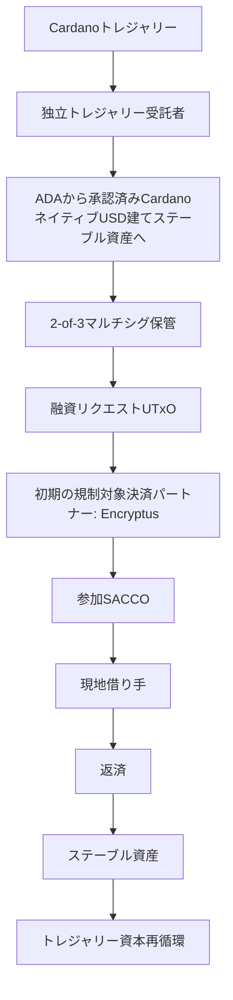

# 付録B: 段階的パイロット展開モデル

パイロットは、3つの段階的な資金投入ラウンドを通じて信用市場を検証します。目的は、最も単純な運用モデルから開始し、実世界条件下でインフラストラクチャを検証し、参加機関、インフラストラクチャ、資本提供者が成熟するにつれて、より高度な信用市場構造を段階的に評価することです。

## 資金投入ラウンド1

**パイロット資本**

**パイロット流動性配分の約30%（約USD 30,000相当を目標）**

**構造**

各参加SACCOは、単一の機関向け融資ファシリティを表す融資リクエストUTxOとして資金請求を公開します。

**目的**

以下を検証します。

* エンドツーエンドの資金提供および決済。
* メタデータ付与および証明検証。
* 資金投入および返済。
* 参加SACCOとの運用ワークフロー。
* トレジャリーガバナンスおよび資本管理。

## 資金投入ラウンド2

**パイロット資本**

追加で**パイロット流動性配分の30%（約USD 30,000相当を目標）**

**構造**

運用上適切な場合には、追加SACCOをオンボーディングし、融資プログラムUTxOやその他の中間構造を含む、より細分化された信用市場モデルを評価できます。

**目的**

以下を検証します。

* 資本再循環。
* 市場参加の拡大。
* 代替的な融資リクエストUTxOモデル。
* 運用フィードバックに基づくインフラストラクチャ改善。
* 見込み資本提供者とのエンゲージメントを通じて特定された、機関向け報告、コンプライアンス、運用要件。

## 資金投入ラウンド3

**パイロット資本**

パイロット流動性配分の100%全額、すなわち約**USD 100,000**相当に向けた資金投入。USD相当額は例示であり、転換時点のADA/USD為替レートに依存します。

**構造**

運用準備状況を条件として、融資リクエストUTxOとして表される個別事業向け融資機会を含め、段階的により細分化された融資機会を評価できます。

最終構造は、パイロット全体で得られた学びに基づいて決定されます。

**目的**

以下を検証します。

* 成熟した信用市場運用。
* 機関単位のオンチェーンレピュテーション。
* 将来の資本参加モデル。
* ステーブルコイン、ADA、Bitcoin担保資本提供者に向けたインフラストラクチャ準備状況。
* 長期的なエコシステム拡張性。

## パイロット資本フロー

パイロットは、運用上の単純性、市場効率、長期的な拡張性の間で最善のバランスを提供する信用市場構造を特定するよう設計されています。

当初から単一の市場構造を規定するのではなく、本フレームワークは実世界での資金投入、参加者フィードバック、返済実績を通じて発展します。長期的な目的は、トレジャリー資金によるパイロットを超えて民間資本提供者からの持続的参加を支援できる、再利用可能なCardanoネイティブ信用市場インフラストラクチャを検証することです。

---

[← 付録A: 検証と信頼フレームワーク](./付録A-検証と信頼フレームワーク.md) · [提案書ホーム](./README.md) · [提案書全文](./提案書全文.md)
