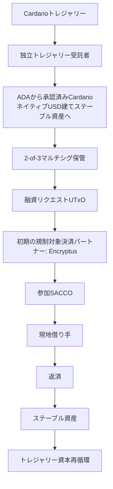

# Aurora: Cardano上の機関信用市場向けオープンインフラストラクチャ

**Cardanoトレジャリー提案**

| 項目 | 詳細 |
| --- | --- |
| **請求額** | **2,900,000 ADA** |
| **受領者** | **Fairwayが主導** |
| **パートナー** | **Fallen IcarusおよびSundial Protocol** |
| **実施期間** | **12か月** |

---

## 目次

- [1. 概要](#1-概要)
- [2. 背景と課題](#2-背景と課題)
- [3. 提案するソリューション](#3-提案するソリューション)
- [4. パイロット実施](#4-パイロット実施)
- [5. トレジャリー参加モデル](#5-トレジャリー参加モデル)
- [6. 成果物](#6-成果物)
- [7. 予算とリソース配分](#7-予算とリソース配分)
- [8. コンソーシアムと関連実績](#8-コンソーシアムと関連実績)
- [9. マイルストーンと成功基準](#9-マイルストーンと成功基準)
- [10. リスクと軽減策](#10-リスクと軽減策)
- [11. ガバナンスと監督](#11-ガバナンスと監督)
- [12. 結論](#12-結論)
- [13. ガバナンス提出要件](#13-ガバナンス提出要件)
- [付録A: 検証と信頼フレームワーク](#付録a-検証と信頼フレームワーク)
- [付録B: 段階的パイロット展開モデル](#付録b-段階的パイロット展開モデル)

---

# 1. 概要

## 提案の要点

| カテゴリ | 概要 |
| ----- | ----- |
| **トレジャリー請求額** | **2,900,000 ADA** |
| **開発予算** | **2,200,000 ADA** |
| **パイロット流動性** | **700,000 ADA**（転換時点で約USD 100,000相当を目標） |
| **実施期間** | 12か月 |
| **目的** | オープンソースの機関信用市場インフラストラクチャを構築し、トレジャリー支援SACCOパイロットを通じて検証すること |
| **主要成果物** | メタデータ標準、オフチェーン・インデクサー、開発者向けツール、dRepダッシュボード、パイロット事例研究、資本提供者準備フレームワーク |
| **資金モデル** | 開発資金はマイルストーン承認時にのみ解放されます。パイロット流動性は、資金投入の成功および返済実績に基づき、30% / 30% / 40%で段階的に解放されます。 |
| **トレジャリー保管** | 独立トレジャリー受託者が管理する独立2-of-3トレジャリーマルチシグ。開発資金とパイロット流動性は別個のガバナンスワークフローに従います。 |
| **開発資金の保管** | コンソーシアム署名者2名および独立署名者3名による独立3-of-5マルチシグ。 |
| **トレジャリー保護** | 段階的な資金投入、マイルストーンゲート、公開報告、独立監査、公開ウォレットアドレス、dRep監視ダッシュボード。 |
| **パイロット終了時** | 承認された参加フレームワークに従い、残余トレジャリー元本をトレジャリー帰属収益とともに返還します。 |
| **オープンソース** | Apache License 2.0。リポジトリ、ドキュメント、ビルド手順はM2までに公開されます。 |

## ガバナンス上の保護策

* 独立トレジャリー受託者がトレジャリー保管を管理します。
* トレジャリー資金は、承認された支出までステーク委任せず、投票については**Abstain（棄権）**に委任された状態を維持します。
* 公開マイルストーン報告および独立した財務レビューを実施します。
* 正規提案書は、不変のIPFS参照を通じて公開されます。
* 残余トレジャリー元本およびトレジャリー帰属収益は、プロジェクト完了時に返還されます。
* マイルストーンが完了しない場合、未分配の開発資金は返還されます。

## 提案の概要

CardanoのeUTxOモデルは、プール型流動性ではなく個別の融資リクエストUTxOを中心に構築される分散型信用市場を可能にします。本インフラストラクチャは、互換性のある融資機関および規制対象の決済プロバイダーが存在する場所であればどこでも機関信用市場を支えられる、再利用可能で法域非依存の公共インフラストラクチャとして設計されています。本提案は、Fairwayが主導し、Fallen IcarusおよびSundialと連携して、Cardano上にオープンでプログラム可能な信用市場を確立するために必要なインフラストラクチャと市場検証を提供します。

本プロジェクトは、相互補完的な2つのフェーズで構成されます。

## フェーズ1: オープン信用市場インフラストラクチャの構築

本プロジェクトは、基盤となるスマートコントラクトを変更することなく、本人性、コンプライアンスその他の信頼シグナルをCardanoネイティブの融資に付与できる、任意利用のメタデータおよび信頼レイヤーを確立します。

バージョン管理されたトランザクションメタデータ標準とオープンソースのオフチェーン・インデクサーにより、参加者は、基盤となる融資インフラストラクチャを完全にパーミッションレスに保ちながら、検証可能なクレデンシャルから派生したゼロ知識証明を検証できます。同じフレームワークは、KYCを超える将来の信頼、レピュテーション、検証ユースケースを支援するよう設計されています。

本インフラストラクチャは、特定の単一プロトコルから独立したまま、Pogunの信用市場アーキテクチャおよびその他の互換性あるCardano融資実装と統合されるよう設計されています。目的は、別の孤立した融資プラットフォームを作ることではなく、複数の信用市場実装が採用できる再利用可能な公共インフラストラクチャを確立することです。

## フェーズ2: 実際の融資による検証

本インフラストラクチャは、エチオピアの貯蓄信用協同組合（SACCO）とのトレジャリー支援パイロットを通じて検証されます。

パイロットの主目的は、プログラム可能な機関信用市場に対するCardanoの新しい技術的アプローチを検証することです。その結果として生じる経済的インパクト、すなわち規制対象金融機関の融資能力拡大および手頃な資本へのアクセス改善は、主要成果物そのものではなく、そのインフラストラクチャの実世界検証として位置づけられます。

運用予算に加え、トレジャリー資金引出しには、パイロット融資流動性専用に留保される700,000 ADAの配分が含まれ、引出し時点で約USD 100,000の融資資本を目標とします。引出し後、この配分はUSDM（または承認された別のCardanoネイティブUSD建てステーブル資産）に転換され、検証済みの融資機会に投入されます。参加SACCOは、既存の法務・運用フレームワークを通じて借り手オンボーディング、審査・引受、債権管理、回収を継続し、その一方でローンメタデータ、検証ステータス、資金提供イベント、返済履歴はオンチェーンに記録され、透明で検証可能な融資活動を生み出します。

パイロットは段階的な資金投入モデルに従い、SACCO単位の融資リクエストUTxOから開始し、参加機関とインフラストラクチャの成熟に応じて、より細分化された融資構造を評価します。

ローンが返済されるとパイロット流動性は再循環され、同じトレジャリー配分で複数の融資ラウンドを支えつつ、参加機関にとって初のオンチェーン信用履歴を確立できます。そのトラストレスなオンチェーン実績が存在すれば、参加SACCOは追加のトレジャリー資金を受けることなく、将来の資本を引き付け続けられます。

パイロット全体を通じて、Sundialはエコシステム上のパートナーシップと機関市場の専門性を提供し、本提案を通じて開発されるインフラストラクチャが、将来のステーブルコインプロバイダー、機関投資家、Bitcoin担保資本提供者、その他の専門的市場参加者の参加を支えられることを検証します。

パイロットの持続的価値は融資活動そのものではなく、より広範なCardanoエコシステムに残る、再利用可能なメタデータ標準、インデクサー、機関信用履歴、資本提供者フレームワークです。

## オープンエコシステムへのコミットメント

Auroraは既存のCardano融資インフラストラクチャを置き換えるのではなく、拡張します。

本プロジェクトは、既存の信用市場イニシアチブと競合するのではなく補完するよう設計されています。Pogunのようなプロトコルは、信用関係の組成と決済に重点を置きます。Auroraは、互換性ある信用市場実装全体で機関参加を可能にする、再利用可能なメタデータ、検証、発見インフラストラクチャを提供します。融資ロジックを機関向けインフラストラクチャから分離することにより、将来の開発者は、機関オンボーディング、検証、発見システムを再作成するのではなく、共通標準を共有しながら独立して革新できます。

パイロットは、Fallen Icarusが先導しPogunが実装した信用市場アーキテクチャとの互換性を維持するよう設計されています。適切な場合には、Pogunの本番インフラストラクチャと統合されることがあります。ただし、本提案の目的は単一の実装に依存しません。Pogunの本番展開が遅延または利用不能となった場合、コンソーシアムは、同じメタデータ標準、インデクサーアーキテクチャ、信用市場モデルを維持しながら、同等の監査済み融資コントラクトまたは互換性あるパートナーインフラストラクチャを利用できます。

本プロジェクトを通じて開発されるすべてのソフトウェア、標準、実装上の知見は、Apache License 2.0（または選択したライセンス）の下でオープンソースとして公開されます。公開ソースリポジトリ、ドキュメント、ビルド手順はM2完了までに公開されます。Cardanoエコシステムは、ライセンス条件に従って、得られたインフラストラクチャを将来の信用市場アプリケーションで自由に利用、監査、変更、フォーク、統合できます。

コンソーシアムは、私的な融資プラットフォームを運営するためにトレジャリー資金を求めるものではありません。コンソーシアムのいずれのメンバーも、得られたインフラストラクチャを運営または商業化する優先権を受け取りません。いかなる個人または組織も、Fairway、Sundial、Fallen Icarusまたは追加のトレジャリー資金を必要とせず、適用ライセンスの条件に従って、オープンソース成果物を利用、運営、拡張、商業化できます。

トレジャリー資金は、メタデータ標準、検証フレームワーク、インデックス化インフラストラクチャ、運用モデルを含む再利用可能なオープンインフラストラクチャを確立します。Cardano信用市場の参加者は、Fairwayまたは継続的なトレジャリー資金を必要とせずに、これを採用できます。

本提案の目的は、独自仕様の実装が登場する前に、Cardano信用市場のための**オープンでコミュニティ所有の機関向けレイヤー**を確立することです。将来のいかなる信用市場実装も、Fairway、Sundial、Fallen Icarusまたは追加のトレジャリー資金を必要とせずに、これらの標準の上に構築できます。

## コンソーシアム

* **Fairway**は、インフラストラクチャ開発、パイロット実行、機関オンボーディングを主導します。
* **Fallen Icarus**は、信用市場アーキテクチャ、技術レビュー、融資プロトコルの専門性を提供します。
* **Sundial**は、機関市場の専門性、エコシステム上の関係、資本提供者とのエンゲージメント活動を提供し、得られるインフラストラクチャが将来の民間資本提供者の運用、コンプライアンス、報告要件を満たすよう支援します。

## パイロットサービスプロバイダー

パイロットは、**トレジャリー資金の受領者ではなく**、かつ**実施コンソーシアムのメンバーでもない**独立運用サービスプロバイダーを利用します。

* **独立トレジャリー受託者（2-of-3マルチシグ保管）**は、トレジャリー配分の独立した保管およびガバナンスを提供します。受託者はトレジャリー資金を受領し、開発マイルストーン解放を承認し、ADAからステーブルコインへの転換を承認し、承認済みガバナンスフレームワークに従ってパイロット流動性を管理し、パイロット終了時に残余トレジャリー元本をトレジャリー帰属収益とともに返還します。
* **Encryptus（初期の規制対象決済パートナー）。** パイロット資本の資金投入および返済のために、Cardanoネイティブのステーブル資産と現地銀行レールを接続する、規制対象のクロスボーダー決済インフラストラクチャを提供します。

# 2. 背景と課題

伝統的な融資では、すべてのローンは、特定の当事者間における個別の合意として始まり、それぞれに固有の条件、リスクプロファイル、返済スケジュール、決済条件を持ちます。取引と同様に、各ローンは、組成、資金提供、債権管理、譲渡、決済を独立して行える個別の金融オブジェクトとして存在します。金融機関がそれらをポートフォリオ、ファンド、証券化商品へ集約するのは、ローンが作成された後です。

ほとんどのDeFi融資プロトコルは、この順序を逆転させています。資本はまず共有プールに預け入れられ、借り手は事前定義されたルールに従ってそのプールから引き出します。これは一定のユースケースには有効ですが、ほとんどの実世界の信用市場が運営される方法を反映していません。

CardanoのeUTxOアーキテクチャは、ローン起点モデルに独自に適しています。融資が通常共有流動性プールを中心に構成されるアカウントベースのDeFiとは異なり、Cardanoのトランザクションベースのアーキテクチャは、個別の金融関係を独立したオンチェーンオブジェクトとして自然に表現します。このため、個別の融資契約を中心に構築される、プログラム可能な機関信用市場に適しています。

個別ローンは、それぞれの状態とロジックを持つ独立したオンチェーンUTxOとして存在でき、より大きな信用ポートフォリオに集約される前に、独立して発見、資金提供、決済され得ます。これにより、数千の規制対象金融機関が、断片化された二者間関係ではなく共通のオープンインフラストラクチャを通じて、デジタル資本へ独立してアクセスできる共有の機関信用市場が生まれます。

現在、Cardano上で実世界の信用活動を妨げている問題は2つあります。

## 機関はKYCを必要とする一方、オンチェーン融資は仮名性を持つ

Pogunの信用市場は、すでに任意の二者がオンチェーンでローンを交渉し、資金提供できるようにしています。しかし、機関投資家、規制対象主体、専門的な資本配分者は、検証可能な本人性および適格性の確認を要求するコンプライアンスフレームワークの下で運営されています。

こうした保証をオンチェーン活動に付与する方法がなければ、これらの参加者は単に市場を利用できません。

ゼロ知識技術の進展により、機微な個人データを開示することなく、相手方が特定の要件を満たしていることを検証できます。このコンプライアンスレイヤーを、中核コントラクトの変更ではなく任意のトランザクションメタデータとして実装すれば、基盤プロトコルのパーミッションレスな性質を損なうことなく追加できます。

## SACCOは資本を必要とする一方、伝統的金融レールは高コストである

貯蓄信用協同組合（SACCO）は、地域コミュニティに貯蓄および融資サービスを提供する、規制対象の会員所有金融機関です。多くの新興市場では、商業銀行から十分なサービスを受けられない個人や中小企業にとって、主要な信用供給源となっています。本提案は、新たな融資機関を作るのではなく、借り手をすでに理解し、現地規制フレームワークの下で運営され、確立された債権管理能力を持つ信頼された金融機関とデジタル資本を接続します。

エチオピアが初期パイロット法域として選定されたのは、コンソーシアムの既存関係、経験豊富な現地パートナー、成熟した協同組合金融セクターがあるためです。インフラストラクチャ自体は**法域非依存**であり、互換性ある金融機関および規制対象決済プロバイダーが存在する場所であれば、機関信用市場を支えられるよう設計されています。

融資能力への需要は、SACCOが内部で賄える資金を大きく上回っており、従来チャネルを通じた資本コストは過大です。Fairwayの現地パートナーシップを通じて、コンソーシアムはすでにエチオピアSACCOからパイロット参加を確保しており、機関ネットワークを拡大し続けています。

この機会は、小規模なパイロットコホートをはるかに超えます。協同組合金融機関は、生産的資本を投入するための最も拡張性の高いチャネルの一つです。個別企業を一社ずつ数千件オンボーディングするのではなく、単一の機関関係により、既存の借り手、審査・引受プロセス、返済回収、現地規制遵守を備えた確立済みの融資業務へ直ちにアクセスできます。

これにより、Cardanoネイティブ資本は、既存の金融インフラストラクチャを置き換えるのではなく、それを通じて拡張できます。この機関起点のアプローチにより、エコシステム開発者は、数千の個別借り手ではなく金融機関をオンボーディングすることで信用市場を拡張でき、市場拡大のコストと複雑性を大幅に削減できます。

## 二つを結び付ける

本提案は、両方の問題に同時に対処します。すなわち、機関が参加できるようにするメタデータおよび検証インフラストラクチャを構築し、それを必要とするSACCOに実資本を投入するトレジャリー支援パイロットを通じて検証します。

その結果は単なる融資パイロットではなく、Cardanoがオープンな信用市場、任意の検証、実世界の資本形成を中心に構築される新しいカテゴリーのプログラム可能な信用市場を支援できるかどうかを試す実践的な検証です。

# 3. 提案するソリューション

本提案は、Cardano信用市場インフラストラクチャ向けに設計された任意利用のメタデータおよび信頼レイヤーを構築します。初期統合はPogunの信用市場アーキテクチャを対象としつつ、代替実装との互換性も維持します。

より広い目的は、融資機会をオープンな市場インフラストラクチャを通じて発見、評価、資金提供できるCardanoネイティブ信用市場の基盤を確立することです。本提案は意図的に、融資ロジックではなく機関向けインフラストラクチャに焦点を当てます。既存および将来のCardano信用市場実装は、共通のメタデータ、検証、発見レイヤーを共有しながら、独立して革新し続けることができます。

本ソリューションは、中核となる融資スマートコントラクトを変更しません。代わりに、Cardanoトランザクションメタデータを用いて本人性およびコンプライアンス情報をローンUTxOに付与し、オフチェーン・インデクサーでそのメタデータを読み取り、検証します。これにより、インフラストラクチャはPogunのアーキテクチャとの互換性を維持しつつ、適切な場合には代替の監査済み信用市場実装も支援できます。

## なぜスマートコントラクトロジックではなくメタデータなのか

### 効率性

ゼロ知識システムを用いた本人性、コンプライアンス、適格性証明の検証は、計算コストが高くなる可能性があります。Cardanoのオンチェーン実行予算と利用可能なPlutusプリミティブは、このワークロード向けに設計されていません。

証明検証をオフチェーン・インデクサーへ移すことで、これらの制約を完全に回避できます。インデクサーは、取引コストやスループットに影響を与えることなく、任意に複雑な検証ロジックを実行できます。

### 柔軟性

コンプライアンス要件は法域ごとに異なり、時間とともに変化します。メタデータ標準は、スマートコントラクトを再デプロイまたは移行することなく、バージョン管理および拡張が可能です。新しいクレデンシャル種別、証明システム、規制フレームワークは、融資プロトコル自体の変更ではなく、インデクサーおよびメタデータスキーマの更新を通じて支援できます。

### パーミッションレス性

中核の信用市場コントラクトは変更されず、完全にオープンなままです。いかなる参加者も、メタデータを付与せずにローンを組成、資金提供、返済できます。追加の保証を必要とする参加者は、メタデータおよび検証フレームワークを用いて機会を評価でき、それを必要としない参加者は基盤市場と直接やり取りできます。

したがって、検証はプロトコル要件ではなく、任意利用のインフラストラクチャになります。

## 仕組み

### ローン組成

SACCOまたはその他のオリジネーターは、互換性あるCardano信用市場インフラストラクチャ実装を通じて融資リクエストUTxOを作成します。初期パイロットではPogunの信用市場アーキテクチャを対象とします。

実装によって、融資リクエストUTxOは、SACCOの資金請求、融資プログラム、または個別の融資機会を表す場合があります。

任意で、オリジネーターは、Veridian SSIクレデンシャルまたはCIP-170準拠証明など、検証可能なクレデンシャルから派生したゼロ知識証明を含むトランザクションメタデータを付与できます。

### インデックス化と検証

オフチェーン・インデクサーは、ビーコントークン（CIP-89）により識別される信用市場UTxOをブロックチェーン上で監視します。

メタデータが存在する場合、インデクサーは付与された証明を関連するクレデンシャルスキーマに照らして検証し、検証ステータスを公開APIを通じて提供します。

### 発見と資金提供

資本提供者は、インデクサーに問い合わせて融資機会を発見します。

参加者は、法域、検証ステータス、その他のメタデータ属性を含め、自らの要件に従って機会をフィルタリングできます。

いかなる参加者も、基盤となる信用市場コントラクトを通じて融資機会に資金提供できます。検証メタデータは、それを必要とする参加者に対し、追加の発見およびフィルタリングメカニズムを可能にするだけです。

### 返済とレピュテーション

ローンが返済されるにつれて、返済履歴はオリジネーション主体およびその検証クレデンシャルにトラストレスに関連付けられます。

時間の経過とともに、返済履歴は、将来の資本提供者が同じオープンインフラストラクチャを通じて評価できる、ポータブルな機関信用履歴を確立します。これらの履歴は、プロトコル固有の信頼モデルではなく、プライバシーを保護する機関レピュテーションシステムの基盤となります。

### 決済

後述のパイロットでは、このインフラストラクチャを、当初Encryptusが提供する規制対象決済インフラストラクチャと組み合わせ、CardanoネイティブUSD建てステーブル資産と現地法定通貨の間の転換を支援します。運用、規制、技術上の考慮により適切と判断される場合、コンソーシアムは同等の規制対象決済プロバイダーを利用できます。

## 構築するもの

### メタデータ標準

本人性証明、検証ステータス、ローン単位のコンプライアンス情報を信用市場UTxOに付与するための、バージョン管理されたスキーマです。

この標準は、拡張可能であり、時間の経過とともに追加の信頼および検証ユースケースを支援するよう設計されています。

### オフチェーン・インデクサー

信用市場UTxOを読み取り、付与された証明を検証し、ローンライフサイクルを追跡し、発見とフィルタリングのためのクエリAPIを提供するサービスです。

両コンポーネントは、より広範なCardanoエコシステムが独立して採用、拡張、運用し、将来の信用市場アプリケーションに統合できるオープンな公共インフラストラクチャとして公開されます。オフチェーン・インデクサーは、第三者APIサービスへの依存を避けるためローカルで実行することも可能です。

*画像1. Cardano信用市場インフラストラクチャ*

# 4. パイロット実施

パイロットは、第3章で述べたメタデータおよびインデクサーインフラストラクチャを、エチオピアの貯蓄信用協同組合（SACCO）との実際の融資活動を通じて検証します。パイロット流動性として留保されたADA配分は、USDM（または承認された別のCardanoネイティブUSD建てステーブル資産）に転換され、パイロットを通じて投入されます。Encryptusは当初、オンチェーン融資活動と現地銀行レールを接続する決済インフラストラクチャを提供します。

エチオピアSACCOは、検証に適した環境を提供します。SACCOはすでにローンを組成し債権管理を行っており、確立された借り手関係を有し、融資資本に対する大きな未充足需要に直面しています。

コンソーシアムはすでにエチオピアSACCOからパイロット参加を確保しており、資金投入に備えて機関ネットワークを拡大し続けています。初期パイロットでは、運用経験とオンチェーン信用履歴が確立されるにつれて参加を段階的に拡大する前に、小規模な機関コホートでインフラストラクチャを検証します。

したがってパイロットは、トレジャリー資金を受領した後に融資パートナーを募集するのではなく、参加に原則合意済みの既存金融機関から開始します。

## 構造

パイロットは、最も単純な運用モデル、すなわち参加SACCOごとに1つの融資リクエストUTxOを用いるモデルから開始します。

各SACCOは、Pogunの信用市場コントラクト（または類似のもの）を通じて資金請求を公開し、既存の融資業務を支えるための資本を受け取ります。SACCOは確立済みの審査・引受、債権管理、返済プロセスを継続しつつ、パイロットはCardanoが資本参加と返済追跡を調整できることを検証します。このアプローチは、インフラストラクチャが新しい段階における運用上の複雑性を最小化します。

参加機関がフレームワークに習熟するにつれ、後続の資金投入ラウンドでは、融資プログラム、ローンカテゴリー、個別事業向け融資機会を表す融資リクエストUTxOなど、より細分化された構造を評価することがあります。

目的は、当初から単一の市場構造を規定することではなく、参加機関にとって実務上可能でありながら、どの粒度が最も効率的で拡張可能な信用市場を生み出すかを判断することです。

## プロセスフロー

1. **融資リクエスト。** 参加SACCOは、Pogunの信用市場コントラクト（または類似のもの）を通じて、検証メタデータを付与した融資リクエストUTxOを公開します。

2. **検証。** オフチェーン・インデクサーは、SACCOが付与した証明を検証し、発見インターフェースを通じて融資機会を公開します。

3. **資金提供。** USDMへの転換後、パイロット資本は信用市場インフラストラクチャを通じて適格な融資機会に投入されます。

4. **決済。** Encryptusは当初、USDM（または承認された別のCardanoネイティブUSD建てステーブル資産）と現地で利用可能な法定通貨との転換を支援します。パイロット資本は、資金提供済み融資リクエストUTxOから指定決済アドレスへ移転され、転換されたうえで、参加SACCOの既存銀行関係を通じて支払われます。ローン返済は逆方向の決済経路をたどり、資本再循環のため信用市場インフラストラクチャへ戻ります。運用、規制、技術上の考慮により適切と判断される場合、コンソーシアムは同等の規制対象決済プロバイダーを利用できます。

5. **債権管理。** SACCOは以下について引き続き責任を負います。

   - 借り手オンボーディング。
   - 審査・引受判断。
   - 現地コンプライアンス。
   - 返済回収。
   - 必要な場合の回収手続。
   - USDMと現地法定通貨の間の為替リスク。

   返済イベントはオンチェーンに記録され、検証可能な信用履歴および将来のレピュテーションシステムの発展に寄与します。

6. **資本再循環。** ローンが返済されると、トレジャリー資本は新たな融資機会への再投入に利用可能となります。後続の資金投入ラウンドでは、運用上のフィードバックおよびパイロット結果に基づき、追加機関および代替的な融資リクエストUTxO構造を組み込むことがあります。

## このモデルが拡張可能な理由

長期的な機会は初期パイロットをはるかに超えます。協同組合金融機関はすでに新興市場全体で大きな規模で運営されており、生産的信用を供給するための最大級かつ最も拡張可能な流通チャネルの一つを形成しています。借り手を一人ずつ融資ネットワークに組み込むのではなく、Cardanoネイティブ資本は、現地市場をすでに理解している数千の既存金融機関に到達できます。

提案モデルは、数千件の個別中小企業ローンを直接組成・管理するのではなく、グローバルなデジタル資本を、借り手関係、審査・引受専門性、返済インフラストラクチャ、規制上の地位をすでに持つ規制対象金融機関と接続します。新たな機関関係のたびに、新規借り手獲得や運用インフラストラクチャを必要とせず、直ちに融資能力が拡大します。

これにより、高度に拡張可能な流通モデルが生まれます。各新規機関関係は、エコシステムが借り手獲得、審査・引受、債権管理の能力を一から構築することを必要とせず、確立済みの融資業務へのアクセスを直ちに提供します。

各参加SACCOは、返済実績を通じて、ポータブルで検証可能なオンチェーン信用履歴を確立します。参加機関が増えるにつれ、資本提供者は各機関ごとに個別のデューデリジェンスプロセスを構築するのではなく、透明なオンチェーン実績に基づいて資金を配分できます。

インフラストラクチャがオープンかつ法域非依存であるため、同じ機関オンボーディングフレームワークを再利用し、共通のメタデータ標準、検証フレームワーク、インデックス化インフラストラクチャを用いて、異なる法域にまたがる数千の規制対象金融機関を接続できます。これにより、重複作業を減らしながら、将来のCardano信用市場実装間の相互運用性を高めます。

## リスクの抑制方法

パイロットは、コンソーシアムとすでに覚書（MOU）を締結し、融資を中核業務としてすでに行っている参加SACCOから開始します。

Cardanoは既存金融機関を置き換えるのではなく、現地専門性、借り手関係、債権管理能力をすでに備えた組織に資本とインフラストラクチャを提供します。

トレジャリー資本は、複数の参加機関に対して段階的に投入されます。後続の資本投入は、満足できる返済実績、運用上のコンプライアンス、先行する資金投入ラウンドの成功完了が実証された後にのみ行われます。

エチオピアの典型的なSACCOローンは比較的小口かつ短期であり、複数機関にまたがる意味のある融資活動を可能にしながら、パイロット期間中に反復的な返済と資本再循環を検証できます。

個別借り手ではなく規制対象金融機関を対象とすることは、運用リスクおよび通貨リスクも低減します。ローンはUSDM（または承認された別のCardanoネイティブUSD建てステーブル資産）建てですが、エチオピアBirrで実行されます。多様化されたローンポートフォリオ、確立された審査・引受実務、運用準備金を有する参加機関は、個別中小企業借り手よりも、このエクスポージャーを管理する上ではるかに適した立場にあります。

すべてのローンがUTxOとしてオンチェーンに存在するため、トレジャリー資金による活動は独立して監査可能な状態を維持します。インデクサーAPIおよびdRep監視ダッシュボードにより、オフチェーン報告のみに依拠することなく、資金投入、返済、ローン実績を透明に検証できます。

段階的な資金投入モデルは、参加拡大または資本投入増加の前に、運用プロセスを検証します。

## パイロットが証明すること

パイロットは、Cardanoネイティブ機関信用市場の完全なライフサイクルを検証します。

* メタデータ付与
* ゼロ知識証明検証
* インデックス化されたローン発見
* オンチェーン資本参加
* ステーブルコイン決済
* 実世界ローン実行
* 返済追跡
* 資本再循環
* 機関信用履歴の形成

パイロットの主目的は、プログラム可能な信用市場に対するCardanoの新しい技術的アプローチを検証することです。その結果として生じる経済的インパクト、すなわち規制対象金融機関の融資能力拡大および手頃な資本へのアクセス改善は、主要成果物そのものではなく、そのインフラストラクチャの実世界検証です。

より広くは、パイロットはCardanoのeUTxOアーキテクチャが、プログラム可能な機関信用市場を大規模に支援できるかどうかを評価します。

パイロットはまた、メタデータ標準、インデクサー、報告インフラストラクチャが、将来参加を評価する見込み資本提供者の要件を満たすかどうかも検証します。

技術そのものを超えて、パイロットは、初期コホートの参加金融機関から同じオープンインフラストラクチャを利用する数千の規制対象貸し手へと拡張できる、反復可能な機関オンボーディングモデルを検証します。

長期的な目的は、複数の法域および融資モデルにわたって、機関、ステーブルコイン、ADA、Bitcoin担保資本の参加を支援できる、オープンで法域非依存の信用市場インフラストラクチャの基盤を確立することです。

# 5. トレジャリー参加モデル

トレジャリー資金引出しは、2つの構成要素から成ります。

## ADA配分

2,200,000 ADAの配分は、トランザクションメタデータ標準、オフチェーン・インデクサー、開発者向けツール、ドキュメント、パイロット実行、エコシステム調整、公開報告を含む、本プロジェクトに関連するすべての開発および運用コストをカバーします。

## パイロット流動性

運用予算に加え、本提案は700,000 ADAをパイロット融資流動性のためだけに配分します。この配分は、引出し時点の市場状況に基づき約USD 100,000の融資資本を目標とし、運用予算から分離されます。

パイロット流動性配分は、プロジェクト運用予算とは独立して管理されます。いかなるパイロット流動性の資金投入に先立って、独立トレジャリー受託者、保管ウォレットアドレス、マルチシグポリシー、ガバナンス手続、運用フレームワークが公開されなければなりません。これらの要件は、最初のパイロット資金投入が承認される前に独立して検証されなければなりません。

独立トレジャリー受託者は、トレジャリーADA配分を受領し、市場エクスポージャーを最小化するため実務上可能な限り速やかにUSDM（または承認された別のCardanoネイティブUSD建てステーブル資産）へ転換し、リボルビング型のパイロット流動性を保有し、承認済みのパイロット資金提供・返済モデルに従って資金投入を承認し、返済済み資本を受領し、パイロット終了時に残余トレジャリー元本をトレジャリー帰属収益とともに返還する責任を負います。

**ステーブルコイン転換方針。** パイロット流動性配分は、実務上可能な場合にはUSDMに転換されます。USDMが利用不能または運用上不適切である場合、独立トレジャリー受託者は、パイロットに同等の機能を提供する、信頼性のある別のCardanoネイティブUSD建てステーブル資産を承認できます。転換は、トレジャリー資金受領後、承認された規制対象OTCまたは流動性プロバイダーを通じ、商業上合理的な市場条件の下で、市場エクスポージャーおよび不要な執行コストを最小化する目的で、合理的に実行可能な限り速やかに行われます。

深刻な流動性制約、過度なスリッページ、または選定されたステーブル資産のUSDペッグの重大な喪失を含め、市場条件が重大に不利であると判断される場合、受託者は、条件が正常化するか代替の承認済みステーブル資産が選定されるまで、転換を延期し、または追加のパイロット資金投入を停止できます。未投入のADAまたはステーブル資産は、独立トレジャリー受託者の保管下に残り、承認済みのトレジャリー保管フレームワークに従って引き続き管理されます。

ステーブルコイン流動性は支出されるものではなく、貸し付けられるものです。資本は、信用市場インフラストラクチャを通じて、検証済みSACCOが組成したローンコントラクトへ投入されます。参加SACCOがローンを返済すると、その資本は後続の融資ラウンドへ再循環され、同じパイロット配分で複数の資金投入サイクルを支援できます。

資本は一度にすべて投入されるのではなく、3つのパイロットラウンドにわたって段階的に投入されます。これにより、インフラストラクチャ、運用プロセス、市場仮説が検証される間、トレジャリーのエクスポージャーを制限します。この責任分離により、プロジェクト実施とトレジャリー流動性管理は、運用上独立し、透明で、完全に監査可能な状態を維持します。

参加SACCOは、締結済みパイロット参加契約の下でローンの組成、審査・引受、債権管理、回収を行う対価として、融資収入の合意された部分を受け取ります。独立トレジャリー受託者が承認した参加契約のみが、トレジャリー資金によるパイロット流動性を受け取る資格を有します。これらの契約は、いかなるパイロット資金投入の前にも、参加SACCOとトレジャリー資金による資本との間における融資収入の配分を定めます。

トレジャリー帰属収益は、残余トレジャリー元本に加え、承認済み決済コスト、独立監査コスト、パイロット管理コスト、承認済み損失配分を控除した後に、それらの契約に基づいてトレジャリーへ配分される金額で構成されます。

承認済みパイロット管理コストは、トレジャリー資金によるパイロット流動性の管理に直接起因する運用費に限定され、開発予算から資金提供されるコンソーシアム運用費を含みません。承認済み損失配分は、参加SACCOのデフォルト、決済不履行、その他の承認済みパイロット信用イベントから生じる実現損失に限定され、コンソーシアム運用費、予算超過、無関係な債務を含みません。

## 透明性と監査

パイロット期間中、トレジャリー資金によるパイロット流動性は完全に透明であり、独立して監査可能な状態を維持します。独立トレジャリー受託者は、最初のパイロット資金投入前にトレジャリー保管ウォレットアドレスを公開します。資本転換、資金投入、返済、残余パイロット流動性、トレジャリー返還は、オンチェーントランザクション、プロジェクトインデクサー、定期的な公開報告を通じて公に検証可能となり、コミュニティおよびdRepはパイロット全体を通じたトレジャリー資金の流れを独立して監視できます。

最初のパイロット流動性投入前に、独立財務監査人または適切な資格を有する独立レビュー担当者が任命されます。このレビューの資金は共有リソース配分に含まれます。

独立した財務照合および監査活動は、各プロジェクトマイルストーンで実施されます。レビューは、該当する場合、以下を対象とします。

* トレジャリー保管残高およびウォレット照合。
* 開発資金の支出およびマイルストーン支出。
* ADAからステーブルコインへの転換記録および保管。
* パイロット流動性の資金投入および返済。
* 資本再循環および残余トレジャリー元本。
* トレジャリー帰属収益および承認済みコスト配分。
* 承認済みガバナンスフレームワークおよびマイルストーン解放条件の遵守。

監査人の所見概要は、対応する財務照合とともに各マイルストーン報告に併せて公開されます。レビュー中に特定された重大な不一致は、後続のトレジャリー資金またはパイロット流動性が解放される前に、講じられた是正措置とともに開示されます。

## パイロット後

トレジャリーは恒久的な流動性提供者になることを意図していません。パイロットの目的は、将来のステーブルコインプロバイダー、機関投資家、ADA保有者、その他の資本源からの参加を引き付けるために必要なオンチェーン取引履歴、返済記録、機関としての実績を確立することです。

パイロット全体を通じて、Sundialは将来の市場参加に必要な運用、コンプライアンス、報告要件を検証するため、見込み資本提供者とエンゲージメントを行います。

パイロット終了時までに、参加SACCOは将来の資本形成を支える検証可能なオンチェーン融資履歴を有することになります。そのポータブルな機関信用履歴が存在すれば、参加機関は追加のトレジャリー資金を受けることなく、将来の市場参加者から資本を引き付け続けられます。将来の資本提供者は、トレジャリー参加に依存するのではなく、透明な返済履歴と実証済み実績に基づいて融資機会を評価できます。

パイロット流動性配分は、継続的な運用に資金を提供するのではなく、パイロット全体を通じて回転することを意図しています。トレジャリー資金による資本は、承認済みパイロットガバナンスフレームワークに従い、複数の融資ラウンドにわたり段階的に投入、返済、再循環されます。

パイロット終了時に、残余トレジャリー元本およびトレジャリー帰属収益は、承認済みパイロット参加フレームワークに従ってCardanoトレジャリーへ返還されます。

トレジャリー帰属収益は、事前承認済みパイロット管理コスト、規制対象決済コスト、独立監査コスト、承認済み損失配分を控除した後に、承認済みパイロット参加フレームワークの下でトレジャリーへ配分される金額で構成されます。これには、該当する融資リターン、回収額、その他のトレジャリー帰属分配が含まれます。いかなるコンソーシアムメンバーも、プロジェクト予算または承認済み参加フレームワークで明示的に承認されたコストを除き、トレジャリー帰属収益を保持できません。

承認済みパイロット債務を満たすために不要なトレジャリー元本またはトレジャリー帰属収益は、Cardanoトレジャリーへ返還されるまで独立トレジャリー受託者の保管下に留まります。パイロット完了時、トレジャリー資金による流動性は完全に解消され、トレジャリー資本に対する継続的な請求権は残りません。

## 運用リスク管理

パイロットは、段階的な資金投入および明確に定義されたリスク配分により、トレジャリーのエクスポージャーを制限するよう設計されています。

* **借り手のデフォルト。** トレジャリー資本は、個別借り手ではなく参加SACCOへ投入されます。SACCOは、既存の融資業務の下で、中小企業または個人借り手のデフォルトから生じる損失について、審査・引受、債権管理、吸収の責任を引き続き負います。
* **SACCOの実績。** 継続参加およびより大きな資本配分は、返済実績の成功に依存します。返済義務を履行しない、参加契約に重大に違反する、またはパイロット適格要件を満たさなくなったSACCOは、将来の参加を停止され、または恒久的に除外されることがあります。返済実績は当該機関のオンチェーン信用履歴に寄与し、将来の資本配分判断に情報を提供します。
* **パイロット適格性。** 参加SACCOは、合法的に運営される金融機関であり、必要なパイロット参加契約を締結し、コンソーシアムのオンボーディングおよび検証プロセスを完了し、パイロット参加に必要な運用能力を維持しなければなりません。
* **エクスポージャー制限**。トレジャリーのエクスポージャーは、段階的な資金投入により制限されます。初期パイロット配分は複数の参加SACCOに分散され、後続の資本投入は、満足できる返済実績、運用上のコンプライアンス、先行する資金投入ラウンドの成功完了を条件とします。初期資金投入では、実務上可能な場合、より短期の融資ファシリティを優先し、パイロット期間中に複数の返済および資本再循環サイクルを可能にしながら、参加SACCOが現地市場に適したローンを組成する柔軟性を維持します。
* **ステーブルコインおよび転換リスク。** パイロット流動性は、市場エクスポージャーを最小化するため、引出し後、実務上可能な限り速やかに、信頼性のあるCardanoネイティブUSD建てステーブル資産へ転換されます。許容可能な市場条件の下で転換を完了できない場合、または選定されたステーブル資産が運用上不適切となった場合、影響を受けるトランシェの資金投入は問題が解決するまで延期されることがあります。
* **決済リスク**。パイロットは当初、規制対象決済プロバイダーとしてEncryptusを利用します。運用、規制、法域上の要件が変化した場合、コンソーシアムはメタデータ標準、インデクサー、信用市場アーキテクチャに影響を与えることなく、同等の規制対象決済プロバイダーへ移行できます。

* **不正操作対策。** 参加SACCOは、完全に開示され独立して承認された場合を除き、パイロット資金がコンソーシアム、トレジャリー受託者、または開発資金署名者の関連当事者に故意に貸し付けられていないことを証明しなければなりません。循環融資、人為的な返済活動、パイロット指標を膨らませることを目的とした自己資金投入、および報告結果の操作を主目的とするその他の取決めは禁止されます。dRepダッシュボードは、客観的なオンチェーン指標を用いて、投入済み資本、返済、回収、未返済残高を区別します。禁止活動の重大な証拠が存在する場合、トレジャリー受託者は資金投入を停止または拒否できます。

* **法域上の柔軟性。** エチオピアは、Fairwayの既存機関関係および署名済み参加契約により、初期パイロット法域として選定されました。ただし、**メタデータ標準、インデクサー、パイロット運用モデルは法域非依存です**。規制、決済、通貨上の制限によりエチオピアでのパイロット実行が重大に遅延する場合、コンソーシアムは、他の対応法域における同等の規制対象金融機関を通じてパイロットを実施できます。ケニアで確立されたSACCOパートナーシップを含むEncryptusの既存決済ネットワークおよび機関関係を通じて、コンソーシアムは、トレジャリー資金によるパイロットの目的を維持しながらインフラストラクチャ検証を継続する運用経路を有します。

# 6. 成果物

## フェーズ1: インフラストラクチャ

1. **Txメタデータ標準。** 本人性証明、検証ステータス、コンプライアンス情報を信用市場UTxOに付与するための、バージョン管理されたオープンソーススキーマです。KYCを超えて拡張可能であり、将来の信頼、レピュテーション、検証ユースケースを支援するよう設計されています。
2. **オフチェーン・インデクサー。** 信用市場UTxOをチェーン上で監視し、付与されたZK証明を検証し、ローンライフサイクルを追跡し、フィルタリングされたローン発見のためのクエリAPIを提供するオープンソースサービスです。
3. **ドキュメント。** メタデータ標準上で構築したい、または自らインデクサーインフラストラクチャを運用したいオリジネーター、資本提供者、開発者向けの統合ガイドです。
4. **機関信用市場フレームワーク。** パイロット中に評価される、SACCO単位、プログラム単位、より細分化された融資構造を含む、異なる融資リクエストUTxOモデルに関する学びを文書化します。

## フェーズ2: パイロット

1. **融資。** 700,000 ADAのパイロット流動性配分を用いた実稼働の融資活動です。承認されたCardanoネイティブUSD建てステーブル資産への転換後、約USD 100,000の融資資本を目標とします。

2. **パイロット事例研究。** 実世界条件下での運用結果、返済実績、資本再循環指標、インフラストラクチャ性能を扱う公開報告です。
3. **SACCOフィードバック。** オンボーディングプロセス、運用上の摩擦、参加規模を拡大するために必要な変更について、参加SACCOから得たフィードバックを文書化します。
4. **レピュテーション・信用履歴フレームワーク。** 返済履歴を融資主体と関連付け、将来のレピュテーションおよび信頼システムの支援に利用する方法を文書化します。

5. **dRep監視ダッシュボード。** dRepが、トレジャリー資金によるローンの状態と健全性をリアルタイムで追跡できる軽量ツールです。
6. **Sundial資本提供者準備フレームワーク。** 見込みステーブルコインプロバイダー、機関投資家、マーケットメーカー、Bitcoin担保資本参加者とのエンゲージメントを通じて作成されるドキュメントです。このフレームワークは、Cardanoネイティブ信用市場へのより広範な参加に必要なコンプライアンス要件、報告期待、ワークフロー統合、運用要件、推奨されるインフラストラクチャ改善を文書化します。

すべてのインフラストラクチャはオープンソースであり、より広範なCardanoエコシステムが採用または拡張できます。

# 7. 予算とリソース配分

トレジャリー資金引出しは、2つの構成要素から成ります。

| 構成要素 | ADA | 概算USD\* | 実施範囲 | 目的 |
| ----- | ----- | ----- | ----- | ----- |
| 運用予算 | 2,200,000 | $352,000 | 12か月の多分野実施 | インフラストラクチャ開発、パイロット実行、エコシステムへの提供 |
| パイロット流動性 | 700,000 | $112,000 | トレジャリー管理のリボルビング型パイロット流動性 | トレジャリー受託者が独立して管理するリボルビング融資資本 |
| **合計** | **2,900,000** | **$464,000** | — |  |

\*参考ADA価格**US$0.16**を用いて算出した例示値です。

上記のUSD換算額は、レビュアーが提案のおおよその規模を理解するためだけに提示されています。トレジャリー資金はADAで請求されます。成果物はUSD支出額ではなく範囲により固定され、その後のADA価格変動にかかわらず変更されません。実施期間中にADAの購買力が上昇した場合、コミット済みのプロジェクト範囲を縮小することなく、実装能力が増加するか、トレジャリーの実効USDコストが低下します。

## 運用予算配分

運用予算は、個別貢献者への報酬ではなく、プロジェクト成果物を生み出す責任を反映しています。活動には、12か月の実装期間を通じて提供されるエンジニアリング、アーキテクチャ、エコシステム開発、プロジェクト管理、テスト、ドキュメント、ガバナンス、パイロット実行、外部専門サービスが含まれます。

| パートナー | ADA | 概算USD\* | 主な責任 |
| ----- | ----- | ----- | ----- |
| Fairway | **1,200,000** | **$192,000** | メタデータ標準、オフチェーン・インデクサー、検証インフラストラクチャ、SACCOオンボーディング、パイロット実行、報告、エコシステム調整 |
| Sundial | **450,000** | **$72,000** | 成果物には、見込み資本提供者とのエンゲージメントの文書化、運用・コンプライアンス・報告の準備状況を対象とする要件評価の完了、資本提供者準備フレームワークの公開、ならびにステーブルコインプロバイダー、機関投資家、ADA保有者、Bitcoin担保資本源による将来参加に向けた提言が含まれます。これらの成果物は、本パイロットの範囲を超えて、将来のCardano信用市場参加者に再利用可能な指針を提供します。 |
| Fallen Icarus | **250,000** | **$40,000** | 信用市場アーキテクチャ、UTxO融資設計レビュー、メタデータフレームワークレビュー、技術的監督 |
| 共有リソース | **300,000** | **$48,000** | 独立セキュリティ監査、外部技術レビュー、クロスボーダー融資、ステーブルコイン決済、保管取決め、適用される規制上の考慮事項を対象とする独立した法務・規制レビュー、インフラストラクチャホスティング、プロジェクト予備費。 |
| **運用予算合計** | **2,200,000** | **$352,000** |  |

## パイロット流動性（別個のトレジャリー配分）

| 配分 | ADA | 概算USD\* | 管理 |
| ----- | ----- | ----- | ----- |
| パイロット流動性 | **700,000** | **$112,000** | 独立トレジャリー受託者（2-of-3マルチシグ）が独立して管理し、承認済みパイロットガバナンスフレームワークの下で段階的な融資ラウンドを通じて投入されます。 |

## チームの責任

### Fairway

Fairwayは、以下を含む実装およびパイロット実行を主導します。

* Txメタデータ標準の開発。
* オフチェーン・インデクサーの実装。
* 検証フレームワーク統合。
* 開発者向けツールおよびドキュメント。
* SACCOオンボーディングおよび関係管理。
* Encryptusおよびその他の互換性ある規制対象決済プロバイダーとの統合。
* パイロット運営および報告。

### Sundial（エコシステムおよび資本提供者準備）

Sundialは、機関市場の専門性およびエコシステム上の関係を提供し、本提案を通じて開発されるインフラストラクチャが、専門的な資本提供者による将来参加を支えられることの検証を支援します。

**活動には以下が含まれます。**

* 見込みステーブルコインプロバイダー、機関投資家、マーケットメーカー、Bitcoin担保資本提供者とのエンゲージメント。
* 将来参加に必要な運用、コンプライアンス、報告要件の文書化。
* 機関ワークフロー内でのメタデータ標準およびインデクサー統合の検証。
* 相互運用性と市場準備状況を改善するためのエコシステムフィードバック収集。
* 文書化された要件、実装優先事項、より広範なCardanoエコシステム採用に向けた提言を含む資本提供者準備フレームワークの作成。

### Fallen Icarus

Fallen Icarusは、以下を含む信用市場アーキテクチャ上の助言を提供します。

* UTxOベースの信用市場アーキテクチャおよび融資モデル設計。
* トランザクションメタデータ標準およびインデクサーアーキテクチャのレビュー。
* プロトコル独立性を維持しながら、Pogunおよびその他の互換性あるCardano信用市場実装との互換性を確保するための技術的助言。
* 信用市場設計、ローンライフサイクルモデル、レピュテーションシステム、将来のプロトコル進化に関する継続的な相談。

### 共有リソース

共有リソースは以下を対象とします。

* 独立セキュリティ監査。
* 外部技術レビュー。
* パイロット資金投入に関するクロスボーダー融資、ステーブルコイン決済、保管取決め、適用される規制上の考慮事項を対象とする独立した法務・規制レビュー。
* インフラストラクチャホスティング。
* プロジェクト予備費。

## パイロット資本

パイロット資本は、専用の700,000 ADA配分で構成されます。引出し後、この配分はUSDM（または承認された別のCardanoネイティブUSD建てステーブル資産）に転換され、転換時点の市場状況に基づき約USD 100,000のリボルビング融資資本を目標とします。

パイロット資本は、参加SACCOが組成した適格な融資機会へ、複数の融資ラウンドにわたって段階的に投入されます。ローンが返済されると、その資本は信用市場インフラストラクチャを通じて後続の資金投入ラウンドへ再循環されます。

パイロット終了時に、残余トレジャリー元本およびトレジャリー帰属収益は、承認済み参加フレームワークに従って返還されます。

# 8. コンソーシアムと関連実績

### Fairway

Fairwayは、本人性証明、ゼロ知識検証、CardanoおよびMidnightにまたがる標準ベースの統合を通じて、機関をDeFiプロトコルへ接続する分散型コンプライアンスインフラストラクチャを構築しています。Fairwayは、本提案に必要な3つの要素を提供します。すなわち、CardanoおよびMidnight上で本人性、検証、機関向けインフラストラクチャを構築してきた経験、メタデータおよびインデクサーインフラストラクチャを構築する能力、エチオピアSACCOとの運用上の関係、ならびにエチオピアの機関パートナーシップを進めてきた過去の経験です。

関連する実績には、Catalyst資金による複数の本人性関連イニシアチブ、エチオピアのFayda国民IDシステムとCardano検証可能クレデンシャルを統合するパイロット、エチオピア高等教育機関との卒業証明VC発行が含まれます。

### Fallen Icarus

Fallen Icarus（Rusty Shapiro）は、Cardanoのp2p DeFiプロトコル群の背後にいるアーキテクトです。彼はCIP-89（ビーコントークン）を設計しました。これは、各ユーザーが自らのスマートコントラクトアドレスを持ち、完全な保管権限と委任管理を維持できる分散型dAppを可能にする標準です。CIP-89は、中央集権型インフラストラクチャなしにローンUTxOを発見しフィルタリングするインデクサーの能力を支えます。

彼は、トラストレスに交渉可能なローン条件、組み込みの信用履歴、内生的な金利発見を備えるp2p融資プロトコルであるcardano-loansを作成しました。Pogunの信用市場はこの上に構築されています。IOG自身によるPogunの説明でも、非マージン融資メカニクスに関する彼の仕事が信用市場設計を形作ったとされています。彼はまた、本提案で実装されるメタデータベースの検証アプローチにも貢献しました。コンソーシアムにおける彼の役割はアーキテクチャ面にあります。すなわち、メタデータ標準およびインデクサーが、信用市場の設計およびCardanoのeUTxOの強みに沿うことを確保します。

### Sundial

Sundial Protocolは、機関向けBitcoin利回りおよび信用インフラストラクチャに焦点を当てた、Cardano上のBitcoinネイティブ金融レイヤーです。創業者兼CEOのSheldon Huntが率いる同チームは、Paris Blockchain Weekの機関部門で1位（1,000超の応募者中総合3位）を獲得し、Hackenによる第三者セキュリティ監査を完了し、稼働中のテストネットを運用しています。

本コンソーシアムにおいて、Sundialは機関市場の専門性、資本提供者との関係、エコシステム上のパートナーシップを提供し、本提案を通じて開発されるオープンインフラストラクチャが、将来の民間資本提供者の運用、コンプライアンス、報告要件に整合することの検証を支援します。Sundialの役割は、プロトコル固有の機能を開発することではなく、エコシステムの準備状況および機関採用を支援することです。得られるインフラストラクチャは、互換性ある任意のCardano信用市場実装が採用できるオープンなものとして残ります。

Sundialは、排他的権利の受益者ではなく、エコシステム実装パートナーです。本提案を通じて開発されるインフラストラクチャはオープンソースであり、Sundial、Pogun、Fairway、または将来の任意のCardano信用市場実装が同一条件で採用できます。

### 過去の実施

コンソーシアムのメンバーは、本人性、融資、機関採用に関連するCatalyst資金イニシアチブ、オープンソースインフラストラクチャ、エコシステム統合を過去に実施しています。

本提案は、ゼロから開始するのではなく、既存の関係、インフラストラクチャ、運用経験の上に構築されます。

# 9. マイルストーンと成功基準

本プロジェクトは、2つのフェーズにまたがる5つのマイルストーンを通じて実施されます。ADAは開発および実行活動に充当されます。パイロット流動性は別個に解放され、インフラストラクチャが稼働した後にのみ解放されます。

## マイルストーンスケジュール

| マイルストーン | タイムライン | ADA解放 | パイロット流動性解放 |
| ----- | ----- | ----- | ----- |
| M1: 仕様策定と設計 | 1か月目 | 300,000 | — |
| M2: インフラストラクチャ提供 | 2-3か月目 | 500,000 | — |
| M3: パイロットラウンド1 | 4-5か月目 | 400,000 | パイロット流動性配分の約30% |
| M4: パイロットラウンド2および市場検証 | 6-8か月目 | 500,000 | パイロット流動性配分の追加約30% |
| M5: パイロットラウンド3、資本準備、エコシステム引継ぎ | 9-12か月目 | 500,000 | パイロット流動性配分の追加約40% |

**トレジャリー資金引出し総額: 2,900,000 ADA**

## フェーズ1: インフラストラクチャ

### M1: 仕様策定と設計

#### 成果物

* 本人性証明、検証ステータス、コンプライアンス情報のためのTxメタデータ標準仕様。
* インデクサーアーキテクチャ文書。
* 最初のパイロット流動性投入前に締結済み覚書（MOU）を有する確認済みSACCOコホート、およびパイロット参加契約のフレームワーク。
* 参加者の役割、決済フロー、リスクパラメータを対象とするパイロット運用モデル。

#### 成功基準

* メタデータ仕様が公開され、コミュニティレビューに開放されていること。

* インデクサー設計が、Cardano信用市場アーキテクチャ、CIP-89、およびPogun実装との互換性に沿っていることについて、Fallen Icarusによりレビューされていること。

* 少なくとも3つのSACCOがパイロット参加を確認していること。3つのエチオピアSACCOはすでにコンソーシアムと覚書（MOU）を締結しており、追加機関がオンボーディングを進めています。最初のパイロット流動性投入に先立ち、各参加機関は、資金投入、返済義務、運用責任、報告要件を規定する必要なパイロット参加契約を締結します。守秘義務が許す場合、これらの契約の編集済み写しを公開します。公開できない場合、その締結はパイロット流動性の解放前に独立して検証されます。

* パイロット運用モデルがプロジェクトパートナーにより承認されていること。

**ADA解放:** 300,000

### M2: インフラストラクチャ提供

#### 成果物

* テストネットにデプロイされた稼働中のオフチェーン・インデクサー。
* Pogunの信用市場アーキテクチャに照らして実装および検証され、代替Cardano信用市場実装との互換性を有するメタデータ標準。
* 開発者向けドキュメントおよび統合ガイド。
* テストネット上でエンドツーエンドに検証された決済ワークフロー。

#### 成功基準

* 検証メタデータを含む融資リクエストUTxOを作成し、APIを通じてインデックス化、検証、照会、フィルタリングできること。
* 第三者開発者がメタデータ標準およびインデクサーと統合するのに十分なドキュメントがあること。
* 決済ワークフローの稼働が確認されていること。
* テストネットデモが完了していること。

**ADA解放:** 500,000

## フェーズ2: パイロット

### M3: パイロットラウンド1

#### 成果物

* 検証済みSACCOとの実稼働ローンコントラクトへの最初のパイロット流動性投入。
* メインネットにデプロイされたインフラストラクチャ。
* 稼働中のdRep監視ダッシュボード。
* 最初の公開進捗報告。

#### 成功基準

* 少なくとも2つのSACCOにまたがり、最大30,000 USDMが投入されていること。
* メインネット上でエンドツーエンドのフローが検証されていること。
  * メタデータ付与、
  * 証明検証、
  * インデックス化された発見、
  * オンチェーン資金提供、
  * ETBへの決済、
  * 債権管理開始。
* dRepダッシュボードが実稼働ローン状態および資金投入指標を表示していること。
* 公開進捗報告が公開されていること。

**ADA解放:** 400,000

**パイロット流動性解放**: 約30,000 USDM相当

### M4: パイロットラウンド2および市場検証

#### 成果物

* ラウンド1返済からの再循環資本と追加の約30,000 USDMトレジャリー配分を組み込む、2回目のUSDM投入。
* 運用上のフィードバックに基づくインフラストラクチャ改善。
* 適切な場合には追加SACCOのオンボーディング。
* 融資プログラム単位および借り手単位の融資リクエストUTxOを含む、より細分化された融資モデルの評価。
* 見込みステーブルコインプロバイダー、機関投資家、マーケットメーカー、Bitcoin担保資本参加者とのSundial主導のエンゲージメント。
* 将来の資本提供者に関するコンプライアンス、報告、発見、保管、運用要件の検証。

#### 成功基準

* ラウンド1ローンからの返済活動がオンチェーンに記録されていること。
* 追加の約30,000 USDMに加え、再循環資本が投入されていること。
* 公開進捗報告が公開されていること。
* ステーブルコイン発行者、機関投資家、Bitcoin担保資本源を代表する**少なくとも5つ**の見込み資本提供者とのエンゲージメントが文書化され完了していること。
* 参加資本提供者からの運用、報告、コンプライアンス要件が文書化され、優先順位付けされていること。
* 文書化された機関要件、特定された実装優先事項、将来のCardano信用市場インフラストラクチャ採用に向けた提言を含む資本提供者準備フレームワークが公開されていること。

**ADA解放:** 500,000

**パイロット流動性解放:** 約30,000 USDM相当（ラウンド1からの返済活動の実証を条件とする）

### M5: パイロットラウンド3、資本準備、エコシステム引継ぎ

#### 成果物

* 過去の融資ラウンドからの再循環資本と最終約40,000 USDMトレジャリー配分を組み込み、約100,000 USDMパイロットを完了する最終USDM投入。
* 運用結果、返済実績、資本再循環、インフラストラクチャ性能を対象とするパイロット事例研究。
* オンボーディング、運用上の摩擦、拡張可能性に関するSACCOフィードバックの文書化。
* 見込みステーブルコインプロバイダー、機関投資家、マーケットメーカー、Bitcoin担保資本参加者から収集した要件を文書化する資本提供者準備フレームワーク（Sundialとともに開発）。
* パイロットおよび資本提供者からのフィードバックに基づく最終的なインフラストラクチャ改善。メタデータ、インデクサー、機関ワークフロー統合に関する提言を含みます。
* 将来のステーブルコイン、ADA、Bitcoin担保資本提供者の参加モデルに関するドキュメント。
* 最終公開ドキュメント、オープンソース公開、エコシステムへの引継ぎ。
* 残余トレジャリー元本およびトレジャリー帰属収益の返還。

#### 成功基準

* 3回のトレジャリー資金投入ラウンドにわたり、累計約100,000 USDMが投入されていること。
* 複数の融資および返済サイクルが完了し、オンチェーン返済履歴があること。
* トレジャリー資本再循環が成功裏に実証されていること。
* SACCOフィードバックが収集され公開されていること。
* 資本提供者準備フレームワークが完成し公開されていること。
* 機関検証に基づくインフラストラクチャ提言が最終化されていること。
* 最終ドキュメントおよびオープンソース成果物が公開されていること。
* トレジャリー元本およびトレジャリー帰属収益が、承認済みパイロット参加フレームワークに従って返還されていること。

**ADA解放:** 500,000

**パイロット流動性解放:** 約40,000 USDM相当（ラウンド2からの返済活動の実証を条件とする）

## パイロット流動性解放の原則

USDMは3つのトランシェで解放されます。最初のトランシェ後の各トランシェには、以前に投入された資本が成功裏に利用され、返済活動がオンチェーンで発生している証拠が必要です。

進捗は、オフチェーン報告のみに依拠することなく、インデクサーAPIおよびdRep監視ダッシュボードを通じて独立して検証できます。

ある資金投入ラウンドが重大に期待を下回る場合、トレジャリーは後続のUSDMトランシェを留保する能力を保持します。

パイロット終了時に、残余トレジャリー元本およびトレジャリー帰属収益は、承認済み参加フレームワークに従って返還されます。

# 10. リスクと軽減策

**Pogun実装のタイミング。** パイロットは、望ましい実装であるPogunの信用市場アーキテクチャとの互換性を前提として設計されています。ただし、資金投入はPogunの本番ローンチに依存しません。インフラストラクチャフェーズ（M1-M2）では、Fallen Icarusのcardano-loansアーキテクチャおよびその他の互換性ある開発環境に対して開発とテストを進めます。Pogunのメインネット展開が遅延する場合、パイロットは、メタデータ標準および基盤となる信用市場アーキテクチャとの互換性を維持する代替の監査済みCardano信用市場インフラストラクチャ実装を利用できます。承認済みの監査済み実装が利用可能になるまで、パイロット流動性は投入されません。また、必要なマイルストーン調整はトレジャリー管理者と調整されます。

**返済リスク。** トレジャリー資本は、個別借り手ではなく参加SACCOへ投入されます。SACCOは、既存の融資業務の下で、中小企業または個人借り手のデフォルトから生じる損失について、審査・引受、モニタリング、回収、吸収の責任を引き続き負います。

パイロットは段階的資金提供モデルを用い、資本は3つの資金投入ラウンドにわたって解放されます。継続参加およびより大きな配分は、先行ラウンドにおける返済実績の成功に依存します。返済義務を履行しないSACCOは、将来の参加を停止され、または恒久的に除外されることがあり、その返済履歴はオンチェーン機関信用記録の基礎となります。

パイロットの目的は信用リスクを消滅させることではなく、返済実績を透明に測定し、リスク管理アプローチを検証し、パイロット終了後の持続可能で市場主導の資本形成に必要な機関レピュテーションを確立することです。

**SACCO採用。** SACCOは、新しいプロセスを採用するために想定より長い時間を必要とする場合があります。パイロットは最も単純なモデル（SACCOごとに1つのローン）から開始し、機関が運用上準備できた場合にのみ、より細分化された構造へ移行します。初期SACCOコホートとのFairwayの既存関係はオンボーディング上の摩擦を低減しますが、追加機関への拡大は計画より時間を要する可能性があります。

**為替レートエクスポージャー。** ローンはUSDM建てですが、エチオピアBirrで実行されます。ローン期間中の為替変動はリスクを生みます。多様化されたポートフォリオを持つ機関であるSACCOは、個別借り手よりもこれを吸収しやすい立場にあり、これがパイロットが最終借り手ではなくSACCOを直接対象とする理由の一つです。

**決済遅延**。パイロットは当初、クロスボーダー決済にEncryptusを利用します。運用上または規制上の遅延が個別の資金投入に影響する可能性があります。資本は段階的に投入されるため、後続の資金投入ラウンド前に、小規模で決済ワークフローを検証できます。必要な場合には、同等の規制対象決済プロバイダーを採用できます。

**インフラストラクチャの反復改善。** メタデータ標準およびインデクサーは新しく、実世界での利用に基づく改善が必要になります。

# 11. ガバナンスと監督

独立トレジャリー受託者は、プロジェクト全体を通じてトレジャリー配分全額について独立した保管およびガバナンスを提供します。運用資金の分配は別個のマルチシグウォレットへ委ねられ、いかなるコンソーシアムメンバーも単独でトレジャリー資金を管理できないことを確保します。

## 独立トレジャリー受託者

本提案に基づいて受領されるすべてのトレジャリー資金は、当初、独立トレジャリー受託者が管理する専用の**2-of-3トレジャリーマルチシグウォレット**に保管されます。このウォレットは、**2,900,000 ADA**配分全額に対する唯一のトレジャリー保管口座として機能し、提案コンソーシアムから独立した状態を維持します。

開発資金とパイロット流動性は、独立トレジャリー受託者のガバナンス下に留まりつつ、別個の運用ワークフローに従います。

## 提案される独立トレジャリー受託者

| 代表者 | X |
| ----- | ----- |
| James "Blockjock" Meidinger | @blockjock2017 |
| Christian Taylor | @DeOpenSourceGuy |
| Elder Millennial | @TheElderMillenial |

独立トレジャリー受託者は、ガバナンス経験、Cardanoエコシステムへの長年の参加、コミュニティ内での評価に基づいて選定された、Cardanoエコシステムの確立された貢献者です。受託者は個人の立場で務め、提案コンソーシアムから独立しています。受託者は、パイロット融資成果または資金投入量に連動する成功報酬を受け取りません。

独立トレジャリー受託者は以下を行います。

* トレジャリー配分全額を受領する。
* プロジェクト全体を通じてすべてのトレジャリー資金を保管する。
* 開発マイルストーン完了をレビューし承認する。
* 承認済みの開発資金マイルストーン配分を開発資金マルチシグへ解放する。
* 承認された規制対象OTCまたは流動性プロバイダーを通じて、パイロット流動性配分を承認済みCardanoネイティブUSD建てステーブル資産へ転換する取引に共同署名する。
* 転換後のステーブル資産が同じトレジャリーマルチシグウォレットに戻ることを確保する。
* 承認済み30% / 30% / 40%資金投入フレームワークの下でパイロット資本投入を承認する。
* 返済取引を承認する。
* パイロット終了時に残余トレジャリー元本をトレジャリー帰属収益とともに返還する。

独立トレジャリー受託者は以下を行いません。

* プロジェクト成果物を開発する。
* パイロットを運営する。
* 借り手を選定する。
* 融資判断を行う。
* 本提案外の目的でトレジャリー資金を承認する。

転換後、承認済みCardanoネイティブUSD建てステーブル資産は、独立トレジャリー受託者の保管下で、同じ2-of-3トレジャリーマルチシグウォレット内に留まります。資金は、承認済みパイロットフレームワークに従い承認済み融資契約へ投入される場合にのみウォレットを離れ、返済を受けると同じマルチシグウォレットへ戻り、その後再投入されるか、パイロット終了時にトレジャリーへ返還されます。

1名の受託者が利用不能となった場合、残る2名は**2-of-3マルチシグポリシー**の下で運用を継続します。

## 開発資金の保管

インフラストラクチャ開発は、別個の**3-of-5開発資金マルチシグ**を通じて管理されます。

開発資金マルチシグは、トレジャリー資金を直接受領しません。代わりに、独立トレジャリー受託者による各開発マイルストーン承認後、対応するマイルストーン配分がトレジャリーマルチシグから開発資金マルチシグへ解放され、承認済み予算に従って運用分配されます。

## 提案される開発資金署名者

| 役割 | 代表者 | X |
| ----- | ----- | ----- |
| 独立ガバナンス代表 | James "Blockjock" Meidinger | @blockjock2017 |
| 独立ガバナンス代表 | Christian Taylor | @DeOpenSourceGuy |
| 独立技術レビュアー | Adrian | @PurritoGeneral |
| コンソーシアム代表（Fairway） | Henrik Metsämäki | @Henrik_met |
| コンソーシアム代表（Sundial） | Sheldon Hunt | @_MrHunt_ |

コンソーシアムは、**5つの署名鍵のうち2つ**のみを共同で管理します。これにより、独立署名者の承認なしに運用支払いが承認されないことを確保します。

独立署名者は、Cardanoエコシステムへの長年の参加、ガバナンス経験、コミュニティ内での評価に基づいて選定されました。彼らはコンソーシアムメンバーの代表者としてではなく、個人の立場で務め、プロジェクト実行全体を通じて独立した監督を提供します。

## マイルストーン承認

開発マイルストーンは、必要な成果物および補足ドキュメントの公開後、独立トレジャリー受託者によりレビューされ承認されます。

承認には、**3名の独立トレジャリー受託者のうち任意の2名**の同意が必要です。

マイルストーン承認後、対応する開発配分は、承認済み予算に従った運用分配のため、開発資金マルチシグへ解放されます。

## パイロット流動性の監督

パイロット流動性配分は、パイロット全体を通じて独立トレジャリー受託者の保管下に留まります。

パイロット流動性の資金投入は、公開済み保管ウォレットアドレス、オンチェーントランザクション、プロジェクトインデクサー、dRep監視ダッシュボードを通じて独立して監査可能です。

資本は、承認済みの**30% / 30% / 40%**資金投入フレームワークに従って段階的に投入され、第5章に記載されたガバナンス要件が満たされた後にのみ投入されます。

承認済み支出前にトレジャリーマルチシグおよび開発資金マルチシグの双方に保有されるトレジャリーADAは、別個の監査可能な口座で維持され、いかなるステークプールオペレーターにも委任されず、Cardano憲法第II条第7節に従い、事前定義された**Abstain（棄権）**投票オプションへ委任された状態を維持します。

## 運用上の責任

Fairwayは、プロジェクト実行、機関オンボーディング、運用提供を調整します。

Fairwayは、マイルストーン完了、返済活動、運用準備状況に基づき、開発資金解放およびパイロット資本投入を推奨することがあります。ただし、トレジャリー資金は引き続き独立トレジャリー受託者の専属保管下にあり、受託者は対応するマルチシグ取引を承認する前に、各提案取引が承認済みガバナンスフレームワークに準拠していることを独立して確認します。

## 返還条件

開発マイルストーンが目標日から90日以内に完了せず、独立トレジャリー受託者との間で是正計画が合意されない場合、対応する開発配分は解放されません。

プロジェクトが完了前に終了する場合、トレジャリーマルチシグに残る未分配の開発資金は30日以内にトレジャリーへ返還されます。

未投入のパイロット流動性は、プロジェクト終了時に直ちに返還されます。すでに有効な融資契約へ投入済みの流動性は、該当する参加契約およびローン契約の対象となり続け、返済を受け次第トレジャリーへ返還されます。トレジャリーの最大損失は、任意の時点で有効に投入されているパイロット流動性の額に限定され、段階的な30% / 30% / 40%解放モデルにより、現在の資金投入ラウンドで承認された額を超えることはありません。

参加SACCOは、締結済みパイロット参加契約に従い、ローンの組成、審査・引受、債権管理、回収について引き続き責任を負います。承認済み融資活動から生じる実現損失は、投入済みトレジャリーパイロット資本に限定され、コンソーシアム、独立トレジャリー受託者、またはCardanoトレジャリーに対して、投入済みパイロット配分を超える追加の財務義務を生じさせません。

## 報告

コンソーシアムは、各マイルストーンで公開進捗報告を公表します。

開発進捗、パイロット資金投入、返済、トレジャリー資金による流動性は、公開済みウォレットアドレス、インデクサーAPI、dRep監視ダッシュボードを通じて独立して検証可能な状態を維持します。

承認済みの各開発マイルストーンには、対応する開発配分が解放される前に独立トレジャリー受託者が発行する公開マイルストーン承認声明が含まれます。

# 12. 結論

本提案は2つのものに資金を提供します。第一に、パーミッションレスな中核を損なうことなく機関がCardanoの信用市場に参加できるようにするインフラストラクチャです。第二に、そのインフラストラクチャを活用し、資本を必要とするエチオピアSACCOへ供給するパイロットです。

メタデータ標準およびオフチェーン・インデクサーは、オープンソースの公共財です。パイロットは、実際の融資活動、オンチェーン返済履歴、そして初の検証可能なオンチェーン機関信用履歴を生み出します。パイロット流動性はCardanoネイティブUSD建てステーブル資産に転換され、パイロット全体を通じて貸し付けられ再循環され、残余トレジャリー元本はトレジャリー帰属収益とともに返還されます。

これが機能すれば、Cardanoはオンチェーン資本を生産的な実世界融資に接続する再現可能なモデルを持つことになり、SACCOはパイロット終了後も長期にわたり資本を引き付け続けるために必要なオンチェーンレピュテーションを得ます。

すべての成果物がオープンソースであり、プロトコル独立かつ法域非依存であるため、得られたインフラストラクチャは、追加のトレジャリー資金やコンソーシアムへの依存なしに、Pogunおよび将来のCardano信用市場インフラストラクチャ実装に採用され得ます。

# 13. ガバナンス提出要件

## 正規提案書参照

最終的なオンチェーンガバナンスアクションは、IPFSまたは同等の不変コンテンツアドレス型ストレージシステムでホストされる、本提案の不変の正規版を参照します。対応するガバナンスメタデータには、文書ハッシュ（BLAKE2b-256）、提案ハッシュ、受領者アドレス、不変コンテンツアドレスが含まれます。オンチェーンガバナンスアクションはこの正規版のみを参照し、コミュニティがレビューした提案とガバナンスに提出される提案が同一であることを確保します。

## 純変動上限（NCL）

本トレジャリー資金引出しは、請求される引出し額がCardanoオンチェーンガバナンスを通じて設定された適用可能な純変動上限（NCL）の範囲内である場合にのみ提出され、制定されます。

適用可能なNCLが請求される引出しを許容するには不十分である場合、本提案は、適切なNCLがCardanoガバナンスプロセスを通じて承認されるまで提出または制定されません。

## 過去のトレジャリー資金開示

過去24か月間に、コンソーシアムメンバーはいずれも、本プロジェクトまたは実質的に類似する範囲についてCardanoトレジャリー資金引出しによる資金提供を受けていません。個別のコンソーシアムメンバーは、Catalystおよびその他のエコシステムイニシアチブに参加したことがありますが、これらは別個の資金提供メカニズムであり、本トレジャリー資金引出しとは無関係です。

## 利益相反および関連当事者

* Fairway、Sundial、Fallen Icarusはコンソーシアムメンバーです。
* Encryptusは外部サービスプロバイダーです。Encryptusはトレジャリー運用資金の受領者ではありません。
* 受託者は独立しています。
* 開発資金署名者は、ガバナンス上の責任に関連するコンソーシアムメンバーとの重要な関係を公開開示します。
* 提案取引に関して重要な利益相反を有する受託者または開発資金署名者は、その相反を開示し、関連取引の承認を棄権しなければなりません。定足数要件が満たされる場合、残る権限ある署名者は、適用されるマルチシグポリシーの下で運用を継続できます。

# 付録A: 検証と信頼フレームワーク

信用市場フレームワークは、金融条件だけにとどまらない情報に基づいて参加者が融資機会を評価できるようにする、任意利用の検証および信頼メカニズムを支援します。

## フレームワーク原則

### 技術非依存

本フレームワークは、特定の本人性プロバイダー、クレデンシャル発行者、検証技術を必要としません。複数の検証システムが同じ市場インフラストラクチャ内で共存できます。

### 証明ベース

参加者は、中央集権的な仲介者に依存するのではなく、付与された証明および信頼シグナルに基づいて融資機会を評価します。

### プライバシー保護

機微情報はクレデンシャル発行者および参加者のもとに留まります。信用市場インフラストラクチャは、市場調整に必要な証明およびメタデータのみを参照します。

### オープン参加

信用市場はオープンインフラストラクチャであり続けます。検証フレームワークは追加の信頼シグナルおよび適格性基準を提供しますが、パーミッションレスな参加を置き換えるものではありません。

異なる融資機会は異なる参加要件を支援できるため、オープンな市場、検証済み市場、機関固有市場が共存できます。

## Midnightおよび将来の信頼インフラストラクチャ

パイロットは、時間とともに発展するよう設計された柔軟な検証フレームワークを利用します。

将来の実装では、Midnightベースの検証システム、選択的開示、検証可能な返済履歴など、プライバシー保護技術を組み込む可能性があります。

将来の実装では、検証可能なオンチェーン返済履歴から派生する機関単位のレピュテーションシステムも組み込む可能性があります。

目的は、プライバシーを維持し、オープンな市場アクセスを保ちながら、参加者が信頼を確立できるようにすることです。

## コンプライアンス上の責任

信用市場は、規制執行ではなくインフラストラクチャを提供します。

参加者は、自らのコンプライアンス義務について引き続き責任を負います。

* 資本提供者は、どの検証標準を必要とするかを判断します。
* 検証プロバイダーは、どの情報を検証するかを判断します。
* 融資機関は、自らのオンボーディング要件を判断します。
* 借り手は、どのクレデンシャルおよび証明を提示するかを選択します。

本フレームワークは、すべての参加者に単一のグローバル標準を課すことなく、コンプライアンスおよび信頼モデルを実装できるようにします。

# 付録B: 段階的パイロット展開モデル

パイロットは、3つの段階的な資金投入ラウンドを通じて信用市場を検証します。目的は、最も単純な運用モデルから開始し、実世界条件下でインフラストラクチャを検証し、参加機関、インフラストラクチャ、資本提供者が成熟するにつれて、より高度な信用市場構造を段階的に評価することです。

## 資金投入ラウンド1

**パイロット資本**

**パイロット流動性配分の約30%（約USD 30,000相当を目標）**

**構造**

各参加SACCOは、単一の機関向け融資ファシリティを表す融資リクエストUTxOとして資金請求を公開します。

**目的**

以下を検証します。

* エンドツーエンドの資金提供および決済。
* メタデータ付与および証明検証。
* 資金投入および返済。
* 参加SACCOとの運用ワークフロー。
* トレジャリーガバナンスおよび資本管理。

## 資金投入ラウンド2

**パイロット資本**

追加で**パイロット流動性配分の30%（約USD 30,000相当を目標）**

**構造**

運用上適切な場合には、追加SACCOをオンボーディングし、融資プログラムUTxOやその他の中間構造を含む、より細分化された信用市場モデルを評価できます。

**目的**

以下を検証します。

* 資本再循環。
* 市場参加の拡大。
* 代替的な融資リクエストUTxOモデル。
* 運用フィードバックに基づくインフラストラクチャ改善。
* 見込み資本提供者とのエンゲージメントを通じて特定された、機関向け報告、コンプライアンス、運用要件。

## 資金投入ラウンド3

**パイロット資本**

パイロット流動性配分の100%全額、すなわち約**USD 100,000**相当に向けた資金投入。USD相当額は例示であり、転換時点のADA/USD為替レートに依存します。

**構造**

運用準備状況を条件として、融資リクエストUTxOとして表される個別事業向け融資機会を含め、段階的により細分化された融資機会を評価できます。

最終構造は、パイロット全体で得られた学びに基づいて決定されます。

**目的**

以下を検証します。

* 成熟した信用市場運用。
* 機関単位のオンチェーンレピュテーション。
* 将来の資本参加モデル。
* ステーブルコイン、ADA、Bitcoin担保資本提供者に向けたインフラストラクチャ準備状況。
* 長期的なエコシステム拡張性。

## パイロット資本フロー

パイロットは、運用上の単純性、市場効率、長期的な拡張性の間で最善のバランスを提供する信用市場構造を特定するよう設計されています。

当初から単一の市場構造を規定するのではなく、本フレームワークは実世界での資金投入、参加者フィードバック、返済実績を通じて発展します。長期的な目的は、トレジャリー資金によるパイロットを超えて民間資本提供者からの持続的参加を支援できる、再利用可能なCardanoネイティブ信用市場インフラストラクチャを検証することです。
