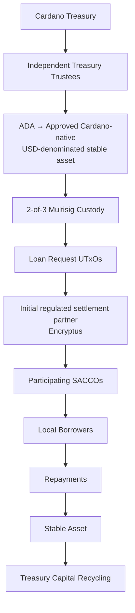

# Appendix B: Progressive Pilot Deployment Model

The pilot validates the Credit Market through three progressive deployment rounds. The objective is to begin with the simplest operational model, validate the infrastructure under real-world conditions, and gradually evaluate more advanced credit market structures as participating institutions, infrastructure and capital providers mature.

## Deployment Round 1

**Pilot Capital**

**Approximately 30% of the pilot liquidity allocation (targeting approximately USD30,000 equivalent)**

**Structure**

Each participating SACCO publishes a funding request as a Loan Request UTxO representing a single institutional lending facility.

**Objectives**

Validate:

* End-to-end funding and settlement.
* Metadata attachment and proof verification.
* Capital deployment and repayment.
* Operational workflows with participating SACCOs.
* Treasury governance and capital administration.

## Deployment Round 2

**Pilot Capital**

An additional **30% of the pilot liquidity allocation (targeting approximately USD30,000 equivalent)**

**Structure**

Additional SACCOs may be onboarded and more granular Credit Market models evaluated, including lending-program UTxOs and other intermediate structures where operationally appropriate.

**Objectives**

Validate:

* Capital recycling.
* Expanded market participation.
* Alternative Loan Request UTxO models.
* Infrastructure improvements based on operational feedback.
* Institutional reporting, compliance and operational requirements identified through engagement with prospective capital providers.

## Deployment Round 3

**Pilot Capital**

Deployment toward the full 100% of the pilot liquidity allocation equivalent to approximately **USD 100,000**. The USD equivalent is illustrative and depends on the ADA/USD exchange rate at the time of conversion.

**Structure**

Subject to operational readiness, progressively more granular lending opportunities may be evaluated, including individual business lending opportunities represented as Loan Request UTxOs.

The final structure will be determined based on lessons learned throughout the pilot.

**Objectives**

Validate:

* Mature Credit Market operations.
* Institution-level on-chain reputation.
* Future capital participation models.
* Infrastructure readiness for stablecoin, ADA and Bitcoin-backed capital providers.
* Long-term ecosystem scalability.

## Pilot Capital Flow

The pilot is designed to identify the Credit Market structures that provide the best balance between operational simplicity, market efficiency and long-term scalability.

Rather than prescribing a single market structure from the outset, the framework evolves through real-world deployment, participant feedback and repayment performance. The long-term objective is to validate reusable Cardano-native credit market infrastructure capable of supporting sustainable participation from private capital providers beyond the Treasury-funded pilot.

---

[← Appendix A: Verification & Trust Framework](appendix-a-verification-and-trust-framework.md) · [Table of Contents](../README.md)
