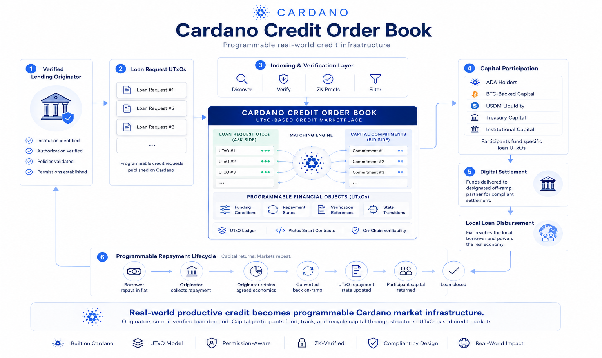

# 3. 提案された解決策

この提案は、Cardano クレジット市場インフラストラクチャ用に設計されたオプションのメタデータと信頼層を構築し、代替実装との互換性を維持しながら、Pogun のクレジット市場アーキテクチャをターゲットにした初期統合を行います。

より広範な目的は、オープン市場インフラを通じて融資機会を発見、評価、資金調達できる、Cardano ネイティブの信用市場の基盤を確立することです。この提案は、融資のロジックではなく、制度上のインフラに意図的に焦点を当てています。既存および将来の Cardano クレジット市場の実装は、共通のメタデータ、検証および検出レイヤーを共有しながら、引き続き自由に独自に革新できます。

このソリューションは、コアの融資スマート コントラクトを変更しません。代わりに、Cardano トランザクション メタデータを使用して ID およびコンプライアンス情報を添付して UTxO を貸し出し、オフチェーン インデクサーを使用してそのメタデータを読み取って検証します。これにより、インフラストラクチャは Pogun のアーキテクチャとの互換性を維持しながら、必要に応じて代替の監査済み信用市場実装もサポートできます。

## スマート コントラクト ロジックではなくメタデータを使用する理由は何ですか?

### 効率

ゼロ知識システムを使用した身元証明、コンプライアンス証明、資格証明の検証は、計算コストが高くなる可能性があります。 Cardano のオンチェーン実行バジェットと利用可能な Plutus プリミティブは、このワークロード向けに設計されていません。

証明の検証をオフチェーン インデクサーに移行することで、これらの制約を完全に回避します。インデクサーは、トランザクション コストやスループットに影響を与えることなく、任意の複雑な検証ロジックを実行できます。

### 柔軟性

コンプライアンス要件は管轄区域によって異なり、時間の経過とともに進化します。メタデータ標準は、スマート コントラクトを再展開または移行することなく、バージョン管理および拡張できます。新しい資格情報の種類、証明システム、規制フレームワークは、融資プロトコル自体を変更するのではなく、インデクサーとメタデータ スキーマを更新することでサポートできます。

### 権限の無さ

中核的なクレジット市場契約は手つかずで完全にオープンなままです。すべての参加者は、メタデータを添付しなくても、ローンを作成、資金提供、または返済することができます。追加の保証を必要とする参加者は、メタデータと検証フレームワークを使用して機会を評価できますが、それらを必要としない参加者は、基礎となる市場と直接対話できます。

したがって、検証はプロトコル要件ではなく、オプションのインフラストラクチャになります。

## 仕組み

### ローンの組成

SACCO またはその他のオリジネーターは、互換性のある Cardano クレジット市場インフラストラクチャ実装を通じて融資リクエスト UTxO を作成し、最初のパイロットは Pogun のクレジット市場アーキテクチャをターゲットとします。

実装に応じて、融資要求 UTxO は、SACCO 資金要求、融資プログラム、または個別の融資機会を表す場合があります。
オプションで、発信者は、Veridian SSI 資格証明や CIP-170 整合証明などの検証可能な資格証明から導出されたゼロ知識証明を含むトランザクション メタデータを添付できます。

### インデックス作成と検証

オフチェーン インデクサーは、ビーコン トークン (CIP-89) によって識別されるクレジット市場 UTxO のブロックチェーンを監視します。

メタデータが存在する場合、インデクサーは添付された証明を関連する資格情報スキーマと照合して検証し、パブリック API を通じて検証ステータスを公開します。

### 発掘と資金調達

資本プロバイダーは、融資の機会を見つけるためにインデクサーにクエリを実行します。

参加者は、管轄区域、検証ステータス、その他のメタデータ属性などの独自の要件に従って機会をフィルタリングできます。

参加者は誰でも、基礎となる信用市場契約を通じて融資機会に資金を提供できます。検証メタデータは、それらを必要とする参加者に対して追加の検出およびフィルタリング メカニズムを有効にするだけです。

### 返済と評判

ローンが返済されると、返済履歴が元のエンティティとその検証資格情報にトラストレスに関連付けられます。

時間の経過とともに、返済履歴によりポータブルな機関信用履歴が確立され、将来の資本提供者が同じオープン インフラストラクチャを通じて評価できるようになります。これらの履歴は、プロトコル固有の信頼モデルではなく、プライバシーを保護する機関の評判システムの基礎を形成します。

### 決済

後で説明するパイロットでは、このインフラストラクチャと、最初は Encryptus を通じて提供されていた規制された決済インフラストラクチャを組み合わせて、Cardano ネイティブの USD 建ての安定資産と現地法定通貨間の交換をサポートします。コンソーシアムは、運用上、規制上、または技術上の考慮事項が適切である場合、同等の規制対象決済プロバイダーを利用することがあります。

## 私たちが構築するもの

### メタデータ標準

アイデンティティ証明、検証ステータス、ローンレベルのコンプライアンス情報をクレジット市場の UTxO に添付するためのバージョン化されたスキーマ。

この標準は拡張可能であり、時間の経過とともに追加の信頼および検証のユースケースをサポートするように設計されています。

### オフチェーンインデクサー

信用市場の UTxO を読み取り、添付された証明を検証し、ローンのライフサイクルを追跡し、検出とフィルタリングのためにクエリ API を公開するサービス。

どちらのコンポーネントも、より広範な Cardano エコシステムが独立して採用、拡張、運用し、将来のクレジット市場アプリケーションに統合するためのオープン パブリック インフラストラクチャとしてリリースされます。オフチェーン インデクサーは、サードパーティの API サービスへの依存を避けるためにローカルで実行できます。

*画像1\。 	Cardano クレジット市場インフラ*

---

[← 2. 動機](./02-motivation.md) · [提案書ホーム](./README.md) · [提案書全文](./proposal.md) · [4.パイロット実装→](./04-pilot-implementation.md)
