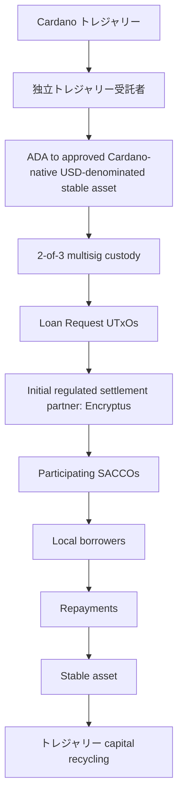

# 付録 B: 段階的なパイロット導入モデル

パイロットでは、3 つの段階的な導入ラウンドを通じてクレジット市場を検証します。目的は、最も単純な運用モデルから始めて、現実世界の条件下でインフラストラクチャを検証し、参加機関、インフラストラクチャ、資本プロバイダーが成熟するにつれて、より高度な信用市場構造を徐々に評価することです。

## 導入ラウンド 1

**パイロット キャピタル**

**パイロット流動性割り当ての約 30% (約 USD 30,000 相当が対象)**

**構造**

参加している各 SACCO は、単一の機関融資施設を表す融資リクエスト UTxO として資金リクエストを公開します。

**目的**

検証:

*エンドツーエンドの資金調達と決済。
* メタデータの添付と証明の検証。
* 資本の投入と返済。
* SACCOs が参加する運用ワークフロー。
* トレジャリー ガバナンスおよび資本管理。

## 導入ラウンド 2

**パイロット キャピタル**

追加 **パイロット流動性割り当ての 30% (約 USD 30,000 相当を目標)**

**構造**

追加の SACCOs をオンボードし、運用上適切な場合には融資プログラム UTxO やその他の中間構造を含む、より詳細な信用市場モデルを評価することができます。

**目的**

検証:

* 資本のリサイクル。
* 市場参加の拡大。
* 代替ローンリクエスト UTxO モデル。
* 運用上のフィードバックに基づいたインフラストラクチャの改善。
* 将来の資本提供者との連携を通じて特定された機関報告、コンプライアンス、運用要件。

## 導入ラウンド 3

**パイロット キャピタル**

約 **USD 100,000** に相当するパイロット流動性割り当ての完全 100% に向けた展開。 USD 相当品は例示であり、換算時の ADA/USD 為替レートによって異なります。

**構造**

運用の準備状況に応じて、融資要求 UTxO として表される個別のビジネス融資機会を含め、徐々により詳細な融資機会が評価される可能性があります。

最終的な構造は、パイロットを通じて学んだ教訓に基づいて決定されます。

**目的**

検証:

* 成熟した信用市場運営。
* 機関レベルのオンチェーン評判。
*将来の資本参加モデル。
* ステーブルコイン、ADA、およびビットコインに裏付けられた資本プロバイダーのインフラストラクチャの準備。
* 長期的なエコシステムのスケーラビリティ。

## 資本の流れを試行する

このパイロットは、運用の簡素化、市場の効率性、長期的な拡張性の間で最適なバランスを提供するクレジット市場の構造を特定するように設計されています。

最初から単一の市場構造を規定するのではなく、このフレームワークは実際の展開、参加者のフィードバック、返済実績を通じて進化します。長期的な目標は、トレジャリー が資金提供するパイロットを超えて、民間資本提供者の持続可能な参加をサポートできる、再利用可能な Cardano ネイティブのクレジット市場インフラストラクチャを検証することです。

---

[← 付録 A: 検証と信頼のフレームワーク](./appendix-a-verification-and-trust-framework.md) · [提案ホーム](./README.md) · [完全な提案](./proposal.md)
