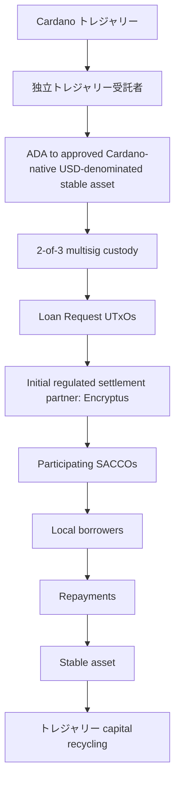

# Aurora: Cardano の機関信用市場向けのオープン インフラストラクチャ

**Cardano トレジャリー提案**

| フィールド | 詳細 |
| --- | --- |
| **要求金額** | **2,900,000 ADA** |
| **受信者** | **Fairway が主導** |
| **パートナー** | **Fallen Icarus および Sundial プロトコル** |
| **納期** | **12ヶ月** |

---

## 目次

- [1. 概要](./01-summary.md)
- [2. 背景と課題](./02-motivation.md)
- [3. 提案するソリューション](./03-proposed-solution.md)
- [4. パイロット実施](./04-pilot-implementation.md)
- [5. トレジャリー参加モデル](./05-treasury-participation-model.md)
- [6. 成果物](./06-deliverables.md)
- [7. 予算とリソース配分](./07-budget-and-resource-allocation.md)
- [8. コンソーシアムと関連実績](./08-consortium-and-relevant-experience.md)
- [9. マイルストーンと成功基準](./09-milestones-and-success-criteria.md)
- [10. リスクと軽減策](./10-risks-and-mitigation.md)
- [11. ガバナンスと監督](./11-governance-and-oversight.md)
- [12. 結論](./12-conclusion.md)
- [13. ガバナンス提出要件](./13-governance-submission-requirements.md)
- [付録A: 検証と信頼フレームワーク](./appendix-a-verification-and-trust-framework.md)
- [付録B: 段階的パイロット展開モデル](./appendix-b-progressive-pilot-deployment-model.md)

# 1. まとめ

## 提案の概要

| カテゴリ | 概要 |
| ----- | ----- |
| **トレジャリー リクエスト** | **2,900,000 ADA** |
| **開発予算** | **2,200,000 ADA** |
| **パイロット流動性** | **700,000 ADA** (転換時約 USD 100,000 相当を目標) |
| **納期** | 12ヶ月 |
| **目的** | オープンソースの機関信用市場インフラを構築し、トレジャリー が支援する SACCO パイロットを通じて検証します。 |
| **主要な成果物** | メタデータ標準、オフチェーン インデクサー、開発者ツール、dRep ダッシュボード、パイロット ケース スタディ、資本提供者対応フレームワーク |
| **資金モデル** | 開発資金はマイルストーンの承認時にのみリリースされます。導入の成功と返済実績に基づいて、パイロット流動性が段階的に解放されます (30% / 30% / 40%)。 |
| **トレジャリー カストディ** | 独立トレジャリー受託者 によって管理される独立した 2-of-3 トレジャリー マルチシグネチャ。開発とパイロットの流動性は別個のガバナンス ワークフローに従います。 |
| **開発管理** | 2 人のコンソーシアム署名者と 3 人の独立した署名者による独立した 3-of-5 マルチ署名。 |
| **トレジャリー 保護** | プログレッシブ展開、マイルストーン ゲーティング、公開レポート、独立した監査、公開ウォレット アドレス、および dRep 監視ダッシュボード。 |
| **パイロットの終了** | 残りの トレジャリー 元本と トレジャリー 権利付き収益は、承認された参加枠組みに従って返還されます。 |
| **オープンソース** | Apache License 2.0;リポジトリ、ドキュメント、ビルド手順は M2 までに公開されます。 |

## ガバナンスの保護措置

*独立トレジャリー受託者はトレジャリー保管品です。
* トレジャリー 資金は委任されず、支出が承認されるまで **棄権** に委任されます。
* マイルストーンの公開レポートと独立した財務レビュー。
* 不変の IPFS 参照を通じて公開された正規の提案。
* 残りの トレジャリー 元本および トレジャリー 権利付き収益はプロジェクト完了時に返還されます。
* マイルストーンが完了しない場合、未分配の開発資金は返金されます。

## 提案の概要

Cardano の eUTxO モデルは、プールされた流動性ではなく、個々のローンリクエスト UTxO を中心に構築された分散型クレジット市場を可能にします。このインフラストラクチャは、再利用可能で管轄区域にとらわれない公共インフラストラクチャとして設計されており、互換性のある融資機関や規制された決済プロバイダーが存在する場合はどこでも機関信用市場をサポートできます。この提案は、Fairway が Fallen Icarus および Sundial と協力して主導し、Cardano でオープンでプログラム可能なクレジット市場を確立するために必要なインフラストラクチャと市場検証を提供します。

プロジェクトは 2 つの補完的なフェーズで構成されます。

## フェーズ 1: オープン クレジット市場インフラの構築

このプロジェクトは、基礎となるスマート コントラクトを変更することなく、ID、コンプライアンス、その他の信頼シグナルを Cardano ネイティブの融資に付加できるようにする、オプションのメタデータと信頼レイヤーを確立します。

バージョン管理されたトランザクション メタデータ標準とオープンソースのオフチェーン インデクサーにより、参加者は、基盤となる融資インフラストラクチャを完全にパーミッションレスに保ちながら、検証可能な資格情報から派生したゼロ知識証明を検証できます。同じフレームワークは、KYC を超えた将来の信頼、評判、検証のユースケースをサポートするように設計されています。

このインフラストラクチャは、単一のプロトコルから独立した状態を維持しながら、Pogun の信用市場アーキテクチャおよび他の互換性のある Cardano 融資実装と統合するように設計されています。目的は、別の独立した融資プラットフォームを作成するのではなく、複数の信用市場実装で採用できる再利用可能な公共インフラストラクチャを確立することです。

## フェーズ 2: 実際の融資による検証

このインフラストラクチャは、トレジャリー が支援するエチオピア貯蓄信用協同組合組織 (SACCOs) によるパイロットを通じて検証されています。

パイロットの主な目的は、プログラム可能な機関信用市場に対する Cardano の新しい技術的アプローチを検証することです。その結果として生じる経済効果、規制された金融機関の融資能力の拡大、手頃な資金へのアクセスの改善は、主要な成果物そのものではなく、そのインフラストラクチャの現実世界での検証として機能します。
運営予算に加えて、トレジャリー引き出し にはパイロット融資の流動性専用に予約された 700,000 ADA の割り当てが含まれており、撤退時の融資資本の約 USD 100,000 を目標としています。引き出し後、この割り当ては USDM (または承認された別の Cardano ネイティブ USD 建ての安定資産) に変換され、検証済みの融資機会に展開されます。参加しているSACCOsは、既存の法的および運営上の枠組みを通じて借り手のオンボーディング、引受業務、ローンの返済と回収を継続的に実行する一方、ローンのメタデータ、検証ステータス、資金調達イベント、返済履歴はオンチェーンで記録され、透明性と検証可能な融資活動を生み出します。

このパイロットでは、SACCO レベルの融資リクエスト UTxO から始まり、参加機関やインフラストラクチャが成熟するにつれてより詳細な融資構造を評価する段階的な展開モデルに従います。

ローン返済時にパイロット流動性がリサイクルされるため、参加機関に最初のオンチェーン信用履歴を確立しながら、同じ トレジャリー 割り当てで複数の融資ラウンドをサポートできるようになります。信頼できるオンチェーンの実績が存在すれば、参加している SACCOs は、さらなる トレジャリー 資金調達なしで将来の資本を引き付け続けることができます。

パイロットを通じて、Sundial はエコシステム パートナーシップと機関市場の専門知識に貢献し、この提案を通じて開発されたインフラストラクチャがステーブルコイン プロバイダー、機関投資家、ビットコイン支援資本プロバイダー、その他の専門的な市場参加者による将来の参加をサポートできることを検証します。

このパイロットの永続的な価値は、融資活動そのものではなく、より広範な Cardano エコシステムで利用可能な再利用可能なメタデータ標準、インデクサー、機関信用履歴、資本プロバイダーのフレームワークです。

## オープンエコシステムへの取り組み

Aurora は、既存の Cardano 融資インフラストラクチャを置き換えるのではなく、拡張します。

このプロジェクトは、既存のクレジット市場の取り組みと競合するのではなく、それを補完するように設計されています。 Pogun などのプロトコルは、信用関係の開始と決済に重点を置いています。 Aurora は、互換性のあるクレジット市場実装全体にわたる機関の参加を可能にする、再利用可能なメタデータ、検証および検出インフラストラクチャを提供します。融資ロジックを機関のインフラストラクチャから分離することで、将来の建設業者は、機関のオンボーディング、検証、検出システムを再作成するのではなく、共通の標準を共有しながら独立して革新できるようになります。
このパイロットは、Fallen Icarus によって開拓され、Pogun によって実装されたクレジット市場アーキテクチャとの互換性を維持するように設計されています。必要に応じて、Pogun の実稼働インフラストラクチャと統合する場合があります。ただし、この提案の目的は、単一の実装に依存するものではありません。 Pogun の実稼働展開が遅れたり利用できなくなった場合、コンソーシアムは、同じメタデータ標準、インデクサー アーキテクチャ、信用市場モデルを維持しながら、同等の監査済み貸付契約または互換性のあるパートナー インフラストラクチャを利用できます。

プロジェクトを通じて開発されたすべてのソフトウェア、標準、および実装の学習は、Apache License 2.0 (または選択したライセンス) に基づいてオープン ソースとしてリリースされます。公開ソース リポジトリ、ドキュメント、およびビルド手順は、M2 の完成までに公開される予定です。 Cardano エコシステムは、ライセンス条項に従って、結果として得られるインフラストラクチャを自由に使用、監査、変更、フォークし、将来のクレジット市場アプリケーションに統合することができます。

コンソーシアムは民間融資プラットフォームを運営するためのトレジャリー資金提供を求めていません。コンソーシアムのメンバーは、結果として得られるインフラストラクチャを運用または商業化する優先権を受け取りません。どの個人または組織も、Fairway、Sundial、Fallen Icarus、または追加の トレジャリー 資金を必要とせずに、該当するライセンスの条件に基づいてオープンソースの出力を使用、操作、拡張、または商品化することができます。

トレジャリー 資金提供は、メタデータ標準、検証フレームワーク、インデックス作成インフラストラクチャ、運用モデルを含む、再利用可能なオープン インフラストラクチャを確立します。Cardano クレジット市場参加者は、Fairway または継続的な トレジャリー 資金提供を必要とせずに、これらを採用できます。

この提案の目的は、独自の実装が出現する前に、Cardano クレジット市場向けに**オープンなコミュニティ所有の制度層**を確立することです。将来のクレジット市場の実装は、Fairway、Sundial、Fallen Icarus、または追加の トレジャリー 資金を必要とせずに、これらの基準に基づいて構築される可能性があります。

## コンソーシアム

* **Fairway** は、インフラストラクチャ開発、パイロット実施、および組織内のオンボーディングを主導します。
* **Fallen Icarus** は、クレジット市場のアーキテクチャ、技術レビュー、融資プロトコルの専門知識を提供します。
* **Sundial** は、機関市場の専門知識、エコシステム関係、資本プロバイダーの関与活動に貢献し、結果として得られるインフラストラクチャーが将来の民間資本プロバイダーの運用、コンプライアンス、報告要件を確実に満たせるように支援します。

## パイロットサービスプロバイダー

このパイロットでは、**トレジャリー の資金提供を受けていない**、**配信コンソーシアムのメンバーでもない**独立した運用サービス プロバイダーを利用します。
* **独立トレジャリー受託者 (2-of-3 マルチ署名保管)** は、トレジャリー 割り当ての独立した保管とガバナンスを提供します。彼らは、トレジャリー 資金を受け取り、開発マイルストーン リリースを承認し、ADA からステーブルコインへの変換を承認し、承認されたガバナンス フレームワークに従ってパイロット流動性を管理し、パイロット終了時に残りの トレジャリー 元本を トレジャリー 権利付き収益とともに返還します。
* **Encryptus (最初の規制された決済パートナー)。** パイロット資本の導入と返済のために、Cardano ネイティブの安定した資産を地元の銀行レールに接続する規制された国境を越えた決済インフラストラクチャを提供します。

# 2. モチベーション

従来の融資では、すべての融資は、独自の条件、リスクプロファイル、返済スケジュール、および決済条件を備えた特定の当事者間の個別の契約として開始されます。取引と同様に、各ローンは個別の金融オブジェクトとして存在し、独立して組成、資金提供、サービス提供、移転、決済が可能です。金融機関はローンが作成されて初めて、ローンをポートフォリオ、ファンド、または証券化商品に集約します。

ほとんどの DeFi 融資プロトコルは、このプロセスを逆にします。資本はまず共有プールに預けられ、借り手は事前に定義されたルールに従ってそのプールから資金を引き出します。このモデルは特定のユースケースでは効果的ですが、現実世界の信用市場のほとんどがどのように運営されているかを反映していません。

Cardano の eUTxO アーキテクチャは、ローンファースト モデルに独特に適しています。通常、共有流動性プールを中心に融資が組織されるアカウントベースの DeFi とは異なり、Cardano のトランザクションベースのアーキテクチャは、個々の金融関係を個別のオンチェーン オブジェクトとして自然に表現します。このため、個別の融資契約を中心に構築されたプログラム可能な機関信用市場に最適です。

個々のローンは、独自の状態とロジックを持つ個別のオンチェーン UTxO として存在でき、より大きな信用ポートフォリオに集約される前に、独立して発見、資金提供、決済が可能になります。これにより、数千の規制対象金融機関が、分断された二国間関係ではなく、共通のオープンインフラを通じてデジタル資本に独立してアクセスできる、共有の機関信用市場が形成されます。

現在、Cardano における現実世界の信用活動は 2 つの問題によって妨げられています。

## 機関には KYC が必要ですが、オンチェーン融資は匿名です。

Pogun の信用市場では、すでに任意の二者がオンチェーンで交渉し、融資に資金を提供することができます。しかし、機関投資家、規制対象機関、専門的な資本配分者は、検証可能な身元と適格性のチェックを必要とするコンプライアンスの枠組みの下で業務を行っています。

これらの保証をオンチェーン活動に結び付ける方法がなければ、これらの参加者は市場を利用することができません。
ゼロ知識テクノロジーの進歩により、機密の個人データを公開することなく、取引相手が特定の要件を満たしていることを検証できるようになります。このコンプライアンス層は、コア コントラクトを変更するのではなく、オプションのトランザクション メタデータとして実装されるため、基礎となるプロトコルのパーミッションレスな性質を損なうことなく追加できます。

## SACCOs には資本が必要ですが、従来の金融レールは高価すぎます。

Savings and Credit Cooperative Organisation (SACCOs) は、地域社会に貯蓄と融資のサービスを提供する、規制された会員所有の金融機関です。多くの新興市場では、商業銀行のサービスが十分に受けられていない個人や中小企業の主な信用源となっています。この提案は、新たな融資機関を創設するのではなく、すでに借り手を理解し、現地の規制枠組み内で運営され、融資返済能力を確立している信頼できる金融機関とデジタル資本を結びつけるものです。

エチオピアが最初のパイロット管轄区域として選ばれたのは、確立されたコンソーシアム関係、経験豊富な現地パートナー、成熟した協同組合金融セクターがあるためです。インフラストラクチャ自体は**管轄区域にとらわれない**であり、互換性のある金融機関や規制された決済プロバイダーが存在する場合はどこでも、機関信用市場をサポートするように設計されています。

融資能力に対する需要は内部で資金を供給できる額をはるかに超えており、従来のルートを通じた資本コストは法外に高額です。 Fairway の現地パートナーシップを通じて、このコンソーシアムはすでにエチオピアの SACCOs からのパイロット参加を確保しており、組織ネットワークを拡大し続けています。

この機会は、小規模なパイロット集団をはるかに超えて広がります。協同組合金融機関は、生産的な資本を展開するための最も拡張性の高いチャネルの 1 つです。何千もの個別のビジネスを 1 つずつオンボーディングするのではなく、単一の制度上の関係により、既存の借り手との確立された融資業務、引受プロセス、返済回収、および現地の規制遵守へのアクセスがすぐに提供されます。

これにより、Cardano ネイティブ資本は、既存の金融インフラを置き換えるのではなく、既存の金融インフラを通じて拡大することができます。この制度ファーストのアプローチにより、エコシステム構築者は数千の個人借り手ではなく金融機関をオンボーディングすることでクレジット市場を拡大することができ、市場拡大のコストと複雑さを劇的に軽減できます。

## 2 つを結び付ける

この提案は両方の問題を一緒に解決するもので、機関が参加できるメタデータと検証インフラストラクチャを構築し、それを必要とする SACCOs に実際の資本を投入する トレジャリー が支援するパイロットを通じてそれを検証します。

その結果は、単なる融資パイロットではなく、Cardano が、オープンなクレジット市場、オプションの検証、および現実世界の資本形成を中心に構築された新しいカテゴリーのプログラム可能なクレジット市場をサポートできるかどうかの実践的なテストになります。

# 3. 提案された解決策
この提案は、Cardano クレジット市場インフラストラクチャ用に設計されたオプションのメタデータおよび信頼層を構築し、初期統合は Pogun のクレジット市場アーキテクチャをターゲットにしつつ、代替実装との互換性を維持します。

より広範な目的は、オープン市場インフラを通じて融資機会を発見、評価、資金提供できる、Cardano ネイティブの信用市場の基盤を確立することです。この提案は、融資のロジックではなく、制度上のインフラに意図的に焦点を当てています。既存および将来の Cardano クレジット市場の実装は、共通のメタデータ、検証および検出レイヤーを共有しながら、引き続き自由に独自に革新できます。

このソリューションは、コアの融資スマート コントラクトを変更しません。代わりに、Cardano トランザクション メタデータを使用して ID およびコンプライアンス情報を添付して UTxO を貸し出し、オフチェーン インデクサーを使用してそのメタデータを読み取って検証します。これにより、インフラストラクチャは Pogun のアーキテクチャとの互換性を維持しながら、必要に応じて代替の監査済み信用市場実装もサポートできます。

## スマート コントラクト ロジックではなくメタデータを使用する理由は何ですか?

### 効率

ゼロ知識システムを使用した身元証明、コンプライアンス証明、資格証明の検証は、計算コストが高くなる可能性があります。 Cardano のオンチェーン実行バジェットと利用可能な Plutus プリミティブは、このワークロード向けに設計されていません。

証明の検証をオフチェーン インデクサーに移行することで、これらの制約を完全に回避します。インデクサーは、トランザクション コストやスループットに影響を与えることなく、任意の複雑な検証ロジックを実行できます。

### 柔軟性

コンプライアンス要件は管轄区域によって異なり、時間の経過とともに進化します。メタデータ標準は、スマート コントラクトを再展開または移行することなく、バージョン管理および拡張できます。新しい資格情報の種類、証明システム、規制フレームワークは、融資プロトコル自体を変更するのではなく、インデクサーとメタデータ スキーマを更新することでサポートできます。

### 権限の無さ

中核的なクレジット市場契約は手つかずで完全にオープンなままです。すべての参加者は、メタデータを添付しなくても、ローンを作成、資金提供、または返済することができます。追加の保証を必要とする参加者は、メタデータと検証フレームワークを使用して機会を評価できますが、それらを必要としない参加者は、基礎となる市場と直接対話できます。

したがって、検証はプロトコル要件ではなく、オプションのインフラストラクチャになります。

## 仕組み

### ローンの組成

SACCO または他のオリジネーターは、互換性のある Cardano クレジット市場インフラストラクチャ実装を通じて融資リクエスト UTxO を作成し、最初のパイロットは Pogun のクレジット市場アーキテクチャをターゲットとします。

実装に応じて、融資要求 UTxO は、SACCO 資金要求、融資プログラム、または個別の融資機会を表す場合があります。
オプションで、発信者は、Veridian SSI 資格証明や CIP-170 整合証明などの検証可能な資格証明から導出されたゼロ知識証明を含むトランザクション メタデータを添付できます。

### インデックス作成と検証

オフチェーン インデクサーは、ビーコン トークン (CIP-89) によって識別されるクレジット市場 UTxO のブロックチェーンを監視します。

メタデータが存在する場合、インデクサーは添付された証明を関連する資格情報スキーマと照合して検証し、パブリック API を通じて検証ステータスを公開します。

### 発掘と資金調達

資本プロバイダーは、融資の機会を見つけるためにインデクサーにクエリを実行します。

参加者は、管轄区域、検証ステータス、その他のメタデータ属性などの独自の要件に従って機会をフィルタリングできます。

参加者は誰でも、基礎となる信用市場契約を通じて融資機会に資金を提供できます。検証メタデータは、それらを必要とする参加者に対して追加の検出およびフィルタリング メカニズムを有効にするだけです。

### 返済と評判

ローンが返済されると、返済履歴が元のエンティティとその検証資格情報にトラストレスに関連付けられます。

時間の経過とともに、返済履歴によりポータブルな機関信用履歴が確立され、将来の資本提供者が同じオープン インフラストラクチャを通じて評価できるようになります。これらの履歴は、プロトコル固有の信頼モデルではなく、プライバシーを保護する機関の評判システムの基礎を形成します。

### 決済

後で説明するパイロットでは、このインフラストラクチャと、最初は Encryptus を通じて提供されていた規制された決済インフラストラクチャを組み合わせて、Cardano ネイティブの USD 建ての安定資産と現地法定通貨間の交換をサポートします。コンソーシアムは、運用上、規制上、または技術上の考慮事項が適切である場合、同等の規制対象決済プロバイダーを利用することがあります。

## 私たちが構築するもの

### メタデータ標準

アイデンティティ証明、検証ステータス、ローンレベルのコンプライアンス情報をクレジット市場の UTxO に添付するためのバージョン化されたスキーマ。

この標準は拡張可能であり、時間の経過とともに追加の信頼および検証のユースケースをサポートするように設計されています。

### オフチェーンインデクサー

信用市場の UTxO を読み取り、添付された証明を検証し、ローンのライフサイクルを追跡し、検出とフィルタリングのためにクエリ API を公開するサービス。

どちらのコンポーネントも、より広範な Cardano エコシステムが独立して採用、拡張、運用し、将来のクレジット市場アプリケーションに統合するためのオープン パブリック インフラストラクチャとしてリリースされます。オフチェーン インデクサーは、サードパーティの API サービスへの依存を避けるためにローカルで実行できます。

*画像1\。 	Cardano クレジット市場インフラ*

# 4. パイロット実装
このパイロットでは、エチオピア貯蓄信用協同組合組織 (SACCOs) との実際の融資活動を通じて、セクション 3 で説明されているメタデータとインデクサーのインフラストラクチャを検証します。パイロット流動性のために予約された ADA 割り当ては、USDM (または承認された別の Cardano ネイティブ USD 建ての安定資産) に変換され、パイロットを通じて展開されます。 Encryptus は当初、オンチェーンの融資活動とローカル バンキング レールを接続する決済インフラストラクチャを提供します。

エチオピアの SACCOs は、検証のための魅力的な環境を提供します。彼らはすでにローンを組成し、サービスを提供しており、確立された借り手関係を持っており、満たされていない貸付資本の大きな需要に直面しています。

このコンソーシアムはすでにエチオピアのSACCOsからのパイロット参加を確保しており、展開に備えて組織ネットワークの拡大を続けています。最初のパイロットでは、小規模な機関を対象にインフラストラクチャを検証した後、運用経験とオンチェーン信用履歴が確立されるにつれて参加者を徐々に拡大していきます。

したがって、パイロットは、トレジャリーの資金調達後にコンソーシアムに融資パートナーを募集することを要求するのではなく、すでに参加することに原則的に同意している既存の金融機関から開始されます。

## 構造

パイロットは、参加している SACCO ごとに 1 つのローン要求 UTxO という最も単純な運用モデルから開始します。

各 SACCO は、Pogun の信用市場契約 (または同様のもの) を通じて資金調達リクエストを発行し、既存の融資業務をサポートするための資金を受け取ります。 SACCO は確立された引受、サービス、返済プロセスを引き続き使用し、パイロットでは Cardano の資本参加と返済追跡を調整する能力を検証します。このアプローチにより、インフラストラクチャが新しい一方で、運用の複雑さが最小限に抑えられます。

参加機関がフレームワークに慣れるにつれて、その後の展開ラウンドでは、融資プログラム、融資カテゴリー、または個別のビジネス融資機会を表す融資リクエスト UTxO など、より詳細な構造を評価する可能性があります。

目的は、最初から単一の市場構造を規定することではなく、参加機関にとって実用的でありながら、どの粒度レベルが最も効率的で拡張性のある信用市場を生み出すかを決定することです。

## プロセスの流れ

1. **ローン リクエスト。** 参加している SACCO は、検証メタデータが添付された Pogun のクレジット マーケット契約 (または同様のもの) を通じてローン リクエスト UTxO を発行します。

2. **検証。** オフチェーン インデクサーは、SACCO に添付された証拠を検証し、ディスカバリー インターフェイスを通じて融資の機会を公開します。

3. **資金調達** USDM への変換後、パイロット資本はクレジット市場インフラを通じて適格な融資機会に展開されます。
4. **決済。** Encryptus は当初、USDM (または他の承認された Cardano ネイティブ USD 建ての安定資産) とローカルでアクセス可能な法定通貨との間の変換をサポートします。パイロット資本は、資金提供されたローンリクエスト UTxO から指定された決済アドレスに転送され、既存の銀行関係を通じて参加している SACCOs に変換されて支払われます。ローンの返済はリバース決済パスに従い、資本リサイクルのためにクレジット市場インフラに戻ります。コンソーシアムは、運用上、規制上、または技術上の考慮事項が適切である場合、同等の規制対象決済プロバイダーを利用することがあります。

5. **サービス。** SACCOs は引き続き以下の責任を負います。

   - 借り手のオンボーディング。
   - 引受決定。
   - 現地のコンプライアンス。
   - 返済の回収。
   - 必要に応じて回復プロセス。
   - USDM と現地法定通貨間の為替リスク。

   返済イベントはオンチェーンで記録され、検証可能な信用履歴と将来の評判システムの開発に貢献します。

6. **資本のリサイクル** 融資が返済されると、トレジャリー の資本は新しい融資の機会に再活用できるようになります。その後の展開ラウンドでは、運用上のフィードバックとパイロットの結果に基づいて、追加の機関と代替の融資要求 UTxO 構造が組み込まれる可能性があります。

## このモデルが拡張できる理由

長期的なチャンスは、最初の試験運用をはるかに超えて広がります。協同組合金融機関はすでに新興市場全体で大規模な事業を展開しており、生産的な信用のための最大かつ最も拡張性のある流通チャネルの 1 つを構築しています。借り手ごとに融資ネットワークを構築するのではなく、Cardano ネイティブの資金を、すでに地元市場を理解している何千もの既存の金融機関に届けることができます。

提案されたモデルは、何千もの個別のSMEローンを直接組成してサービスを提供するのではなく、すでに借り手との関係、引受専門知識、返済インフラストラクチャ、規制上の地位を備えている規制対象金融機関と世界のデジタル資本を結びつけます。新しい制度上の関係が生まれるたびに、新たな借り手の獲得や運用インフラストラクチャを必要とせずに、融資能力が即座に拡大します。

これにより、拡張性の高い分散モデルが作成されます。新しい制度上の関係はそれぞれ、エコシステムに新しい借り手の獲得、引受、サービス機能をゼロから構築することを要求するのではなく、確立された融資業務へのアクセスを即座に提供します。

参加している各 SACCO は、返済実績を通じて、ポータブルで検証可能なオンチェーン信用履歴を確立します。参加する機関が増えれば増えるほど、資本提供者は機関ごとに個別のデューデリジェンスプロセスを構築するのではなく、透明性のあるオンチェーンパフォーマンスに基づいて資金を割り当てることができるようになります。
このインフラストラクチャはオープンで管轄区域にとらわれないため、同じ機関のオンボーディング フレームワークを再利用して、共通のメタデータ標準、検証フレームワーク、インデックス作成インフラストラクチャを使用して、異なる管轄区域にまたがる数千の規制対象金融機関を接続できます。これにより、重複した作業が削減され、将来の Cardano クレジット市場実装全体での相互運用性が向上します。

## リスクをどのように抑えるか

このパイロットは、すでにコンソーシアムと覚書を締結し、すでに中核事業として融資を行っている参加企業 SACCOs で開始されます。

Cardano は、既存の金融機関を置き換えるのではなく、すでに地元の専門知識、借り手との関係、サービス能力を備えている組織に資本とインフラストラクチャを供給します。

トレジャリー 資本は、複数の参加機関に段階的に展開されます。その後の資本展開は、満足のいく返済実績、業務コンプライアンス、および初期の展開ラウンドの正常な完了が実証された後にのみ行われます。

エチオピアの一般的な SACCO 融資は比較的小規模で期間が短いため、パイロット期間中に繰り返しの返済と資本リサイクルを検証しながら、複数の機関にわたる有意義な融資活動が可能になります。

個人の借り手ではなく規制対象の金融機関をターゲットにすることで、運用リスクや為替リスクも軽減されます。ローンは USDM (または承認された Cardano ネイティブ USD 建ての安定資産) 建てですが、実行はエチオピア ブルで行われます。参加機関は、多様な融資ポートフォリオ、確立された引受実務および運用準備金を備えており、SME の個人借り手よりもこのエクスポージャーを管理するのにはるかに有利な立場にあります。

すべてのローンは UTxO としてオンチェーンに存在するため、トレジャリー が資金提供するアクティビティは独立して監査可能です。インデクサー API および dRep モニタリング ダッシュボードを使用すると、オフチェーン レポートのみに依存せずに、資本の展開、返済、ローンのパフォーマンスを透過的に検証できます。

段階的導入モデルでは、参加を拡大したり資本導入を増やしたりする前に、運用プロセスを検証します。

## パイロットが証明したこと

パイロットでは、Cardano ネイティブの機関信用市場の完全なライフサイクルを検証します。

* メタデータの添付
* ゼロ知識証明検証
* インデックス付きローンの発見
* オンチェーン資本参加
*ステーブルコイン決済
* 現実世界の融資実行
* 返済追跡
*キャピタルリサイクル
* 機関による信用履歴の形成

パイロットの主な目的は、プログラム可能なクレジット市場に対する Cardano の新しい技術的アプローチを検証することです。その結果として生じる経済的影響、規制された金融機関の融資能力の拡大、手頃な資金へのアクセスの改善は、主要な成果物そのものではなく、そのインフラストラクチャの現実世界での検証となります。
より広範には、パイロットでは、Cardano の eUTxO アーキテクチャがプログラム可能な機関信用市場を大規模にサポートできるかどうかを評価します。

このパイロットでは、メタデータ標準、インデクサー、およびレポート インフラストラクチャが、将来の参加を評価する将来の資本提供者の要件を満たしているかどうかも検証します。

このパイロットでは、テクノロジー自体を超えて、同じオープン インフラストラクチャを使用して、参加金融機関の初期コホートから数千の規制対象金融機関まで拡張できる、再現可能な機関投資家向けオンボーディング モデルを検証します。

長期的な目標は、複数の管轄区域および融資モデルにわたって機関投資家、ステーブルコイン、ADA、およびビットコインに裏付けられた資本参加をサポートできる、オープンで管轄区域にとらわれない信用市場インフラの基盤を確立することです。

# 5.トレジャリー参加モデル

トレジャリー の撤退は 2 つの要素で構成されます。

## ADA 割り当て

2,200,000 ADA の割り当ては、トランザクション メタデータ標準、オフチェーン インデクサー、開発者ツール、ドキュメント、パイロットの実行、エコシステムの調整、パブリック レポートなど、プロジェクトに関連するすべての開発コストと運用コストをカバーします。

## パイロット流動性

この提案では、運営予算に加えて、700,000 ADA がパイロット融資の流動性専用に割り当てられています。この配分は、撤退時の市場状況に基づいて約 USD 100,000 の融資資金を目標にしており、営業予算とは切り離されています。

パイロット流動性の割り当ては、プロジェクトの運営予算とは独立して管理されます。パイロット流動性を展開する前に、独立トレジャリー受託者 をカストディウォレットのアドレス、マルチシグネチャポリシー、ガバナンス手順、運用フレームワークとともに公的に識別する必要があります。これらの要件は、最初のパイロット展開が承認される前に、個別に検証する必要があります。

独立トレジャリー受託者 は、トレジャリー ADA の割り当てを受け取り、市場エクスポージャーを最小限に抑えるために可能な限り速やかにそれを USDM (または承認された Cardano ネイティブ USD 建ての安定資産) に変換し、回転パイロットの流動性を保持し、承認されたパイロットの資金調達と返済モデルに従って展開を承認し、返済された資本を受け取り、残りの トレジャリー 元本を返還する責任があります。パイロットの終了時に トレジャリー の権利が付与されます。
**ステーブルコイン変換ポリシー** パイロット流動性の割り当ては、可能な場合には USDM に変換されます。 USDM が利用できない、または運用上不適切な場合、独立トレジャリー受託者 は、パイロットに同等の機能を提供する、評判の良い Cardano ネイティブの USD と名付けられた別の安定資産を承認することがあります。転換は、市場エクスポージャーと不必要な実行コストを最小限に抑えることを目的として、商業的に合理的な市場条件の下で、承認された規制対象OTCまたは流動性プロバイダーを通じてトレジャリー資金を受領した後、合理的に実行可能な限り速やかに実行されます。

厳しい流動性制約、過剰なスリッページ、または選択された安定資産のUSDペッグの重大な損失など、市場の状況が著しく不利であると判断された場合、管理委員会は、条件が正常化するか代替の承認された安定資産が選択されるまで、転換を遅らせたり、さらなるパイロット展開を一時停止したりすることがあります。 ADA またはまだ展開されていない安定した資産は 独立トレジャリー受託者 の管理下に残り、引き続き承認された トレジャリー 管理フレームワークに基づいて管理されます。

ステーブルコインの流動性は消費されません。それは貸し出されています。資本は、クレジット市場インフラを通じて、検証された SACCOs によって組成されたローン契約に投入されます。参加している SACCOs が融資を返済すると、その資金はその後の融資ラウンドにリサイクルされ、同じパイロット割り当てで複数の展開サイクルをサポートできるようになります。

資本は一度にすべてではなく 3 つのパイロットラウンドにわたって段階的に投入され、インフラストラクチャ、運用プロセス、市場の前提条件が検証されている間、トレジャリー のエクスポージャを制限します。この責任の分離により、プロジェクトの実施と トレジャリー の流動性管理が運営上独立しており、透明性があり、完全に監査可能であることが保証されます。

参加するSACCOsは、締結されたパイロット参加契約に基づくローンの組成、引受、サービス提供、回収と引き換えに、融資収入の合意部分を受け取ります。 独立トレジャリー受託者 によって承認された参加契約のみが、トレジャリー が資金提供するパイロット流動性を受け取る資格があります。これらの協定は、パイロット展開が行われる前に、参加する SACCOs と トレジャリー が資金提供する資本の間の貸付収入の配分を定義します。

トレジャリー の権利を有する収益は、承認された和解費用、独立監査費用、パイロット管理費用および承認された損失配分を差し引いた後の、残りの トレジャリー 元本と、これらの契約に基づいて トレジャリー に割り当てられた金額から構成されます。
承認されたパイロット管理コストは、トレジャリー が資金提供するパイロット流動性の管理に直接起因する運営費用に限定されており、開発予算を通じて資金提供されたコンソーシアムの運営費用は含まれません。承認された損失配分は、参加しているSACCOの債務不履行、決済失敗、またはその他の承認されたパイロットクレジットイベントから生じる実現損失に限定されており、コンソーシアムの運営コスト、予算超過、または無関係な負債は含まれません。

## 透明性と監査

パイロット期間中、トレジャリー が資金提供するパイロット流動性は完全に透明であり、独立して監査可能です。 独立トレジャリー受託者 は、最初のパイロット展開の前に トレジャリー カストディ ウォレット アドレスを公開します。資本変換、展開、返済、パイロットの残りの流動性、トレジャリー のリターンは、オンチェーン トランザクション、プロジェクト インデクサー、定期的な公開レポートを通じて公的に検証可能となり、コミュニティと dRep がパイロット全体にわたる トレジャリー 資金の流れを独立して監視できるようになります。

最初の試験的な流動性展開の前に、独立した財務監査人または適切な資格を持つ独立した審査員が任命されます。このレビューの資金は共有リソースの割り当てに含まれています。

独立した財務調整と監査活動がプロジェクトの各マイルストーンで実行されます。レビューでは、該当する場合、次の内容が取り上げられます。

* トレジャリー の保管残高とウォレットの照合。
* 開発資金の支出とマイルストーン支出。
* ADA からステーブルコインへの変換記録と保管。
* 流動性の展開と返済を試験的に実施します。
* キャピタルリサイクルと残りの トレジャリー 元本。
* トレジャリー の権利を有する収益と承認されたコスト配分。
* 承認されたガバナンス フレームワークおよびマイルストーン リリース条件への準拠。

監査人の調査結果の概要は、対応する財務調整とともに、各マイルストーンレポートとともに発行されます。レビュー中に特定された重大な矛盾は、その後のトレジャリーファンドまたはパイロット流動性がリリースされる前に、講じられた是正措置とともに開示されます。

## パイロットの後

トレジャリー は、恒久的な流動性プロバイダーとなることを目的としたものではありません。パイロットの目的は、ステーブルコインプロバイダー、機関投資家、ADA保有者、その他の資金源からの将来の参加を呼び込むために必要なオンチェーン取引履歴、返済記録、機関の実績を確立することです。

パイロット期間中、Sundial は将来の資本提供者と協力して、将来の市場参加に必要な運用、コンプライアンス、報告要件を検証します。
試験運用が終了するまでに、参加しているSACCOsは将来の資本形成をサポートする検証可能なオンチェーン融資履歴を持つことになる。ポータブルな機関信用履歴が存在すると、参加機関は追加の トレジャリー 資金を提供することなく、将来の市場参加者から資金を引き込み続けることができます。将来の資本提供者は、トレジャリー への参加に依存するのではなく、透明性のある返済履歴と実績に基づいて融資の機会を評価できます。

パイロット流動性の割り当ては、進行中のオペレーションに資金を提供するのではなく、パイロット全体を通じて展開されることを目的としています。 トレジャリー が資金提供した資本は、承認されたパイロットガバナンスフレームワークに従って、複数の融資ラウンドにわたって段階的に展開され、返済され、リサイクルされます。

パイロットの終了時には、承認されたパイロット参加フレームワークに従って、残りの トレジャリー 元金と トレジャリー の権利を有する収益が Cardano トレジャリー に返還されます。

トレジャリー の権利を有する収益は、事前承認されたパイロット管理コスト、規制された決済コスト、独立した監査費用、および承認された損失配分を差し引いた後の、該当する貸付収益、回収およびその他の トレジャリー の権利を有する分配を含む、承認されたパイロット参加フレームワークに基づいて トレジャリー に割り当てられた金額で構成されます。コンソーシアムのメンバーは、プロジェクト予算または承認された参加枠組み内で明示的に承認された費用を除き、トレジャリー の権利を有する収益を保持することはできません。

承認されたパイロット義務を果たすために必要とされない トレジャリー の元金または トレジャリー 権利付き収益は、Cardano トレジャリー に返還されるまで 独立トレジャリー受託者 の管理下に留まるものとします。試験運用が完了すると、トレジャリー が資金提供した流動性は完全に解消され、トレジャリー の資本に対する継続的な請求権は残りません。

## オペレーショナルリスク管理

このパイロットは、漸進的な資本展開と明確に定義されたリスク配分を通じて、トレジャリー のエクスポージャーを制限するように設計されています。

* **借り手のデフォルト。** トレジャリー の資本は、個々の借り手ではなく、参加している SACCOs に分配されます。 SACCOs は引受、サービス、および SME または既存の融資業務に基づく個々の借り手の債務不履行から生じる損失の吸収について引き続き責任を負います。
* **SACCO のパフォーマンス。** 継続的な参加とより大きな資本配分は、返済実績に依存します。返済義務を履行できない、参加契約に重大な違反をした、またはパイロット資格要件を満たさなくなった SACCO は、将来の参加が停止されるか、永久に除外される場合があります。返済実績は金融機関のオンチェーン信用履歴に寄与し、将来の資本配分の決定に影響を与えます。
* **パイロットの資格。** 参加する SACCOs は、合法的に運営されている金融機関であり、必要なパイロット参加契約を締結し、コンソーシアムのオンボーディングおよび検証プロセスを完了し、パイロットに参加するために必要な運営能力を維持している必要があります。
* **露出制限**。 トレジャリー の露出は、段階的な展開により制限されます。初期のパイロット割り当ては、参加する複数の SACCOs に分散され、その後の資本展開は、満足のいく返済実績、運用上のコンプライアンス、および初期の展開ラウンドの正常な完了を条件とします。初期導入では、実用的であれば短期間の融資制度を優先し、パイロット期間中に複数回の返済と資本リサイクルのサイクルを可能にし、参加するSACCOsが地元市場に適した融資を組成できる柔軟性を維持します。
* **ステーブルコインと変換リスク** パイロット流動性は、市場エクスポージャーを最小限に抑えるため、引き出し後できるだけ早く、信頼できる Cardano ネイティブ USD 建ての安定資産に変換されます。許容可能な市場条件の下で変換を完了できない場合、または選択した安定資産が運用上不適切になった場合、問題が解決されるまで影響を受けるトランシェの展開が遅れる可能性があります。
* **決済リスク**。パイロットでは当初、規制対象の決済プロバイダーとして Encryptus を利用します。運営上、規制上、または管轄上の要件が変更された場合、コンソーシアムは、メタデータ標準、インデクサー、またはクレジット市場アーキテクチャに影響を与えることなく、同等の規制下にある決済プロバイダーに移行する可能性があります。

* **反ゲーミング。** 参加する SACCOs は、完全に開示され独立して承認された場合を除き、パイロット資金がコンソーシアムの関連当事者、トレジャリー 理事、または開発基金の署名者に故意に貸与されていないことを証明する必要があります。循環融資、人為的な返済活動、パイロット指標を膨らませるために設計された自己資金調達、および主に報告された結果を操作することを目的としたその他の取り決めは禁止されています。 dRep ダッシュボードは、客観的なオンチェーン指標を使用して、導入された資本、返済、回収、未払い残高を区別します。 トレジャリー 管理委員会は、禁止された活動の重大な証拠が存在する場合、配備を一時停止または拒否することができます。
* **管轄区域の柔軟性。** Fairway の既存の組織的関係と署名された参加協定により、エチオピアが最初のパイロット管轄区域として選択されました。ただし、**メタデータ標準、インデクサー、パイロット運用モデルは管轄区域に依存しません**。規制、決済、または通貨の制限により、エチオピアでのパイロット実施が大幅に遅れた場合、コンソーシアムは、サポートされている他の管轄区域の同等の規制対象金融機関を通じてパイロットを展開する可能性があります。 Encryptus の既存の決済ネットワークと、ケニアで確立された SACCO パートナーシップを含む制度上の関係を通じて、コンソーシアムは、トレジャリー が資金を提供するパイロットの目的を維持しながら、インフラストラクチャの検証を継続する運用経路を持っています。

# 6. 成果物

## フェーズ 1: インフラストラクチャ

1. **Tx メタデータ標準。** 信用市場の UTxO に ID 証明、検証ステータス、コンプライアンス情報を添付するための、バージョン化されたオープンソース スキーマ。 KYC を超えて拡張可能であり、将来の信頼、評判、検証のユースケースをサポートするように設計されています。
2. **オフチェーン インデクサー。** 信用市場の UTxO のチェーンを監視し、添付された ZK プルーフを検証し、ローンのライフサイクルを追跡し、フィルター処理されたローン検出用のクエリ API を公開するオープンソース サービス。
3. **ドキュメント。** メタデータ標準に基づいて構築したい、または独自のインデクサー インフラストラクチャを運用したいと考えているオリジネーター、資本プロバイダー、および開発者向けの統合ガイド。
4. **機関信用市場フレームワーク。** パイロット中に評価された SACCO レベル、プログラム レベル、およびより詳細な融資構造を含む、さまざまな融資要求 UTxO モデルに関して学んだ教訓の文書化。

## フェーズ 2: パイロット

1. **融資**。 700,000 ADA のパイロット流動性割り当てを使用したライブ融資活動。承認された Cardano ネイティブ USD 建ての安定資産への転換後の融資資本の約 USD 100,000 を対象とします。

2. **パイロットケーススタディ。** 実際の状況下での運用結果、返済実績、資本リサイクル指標、インフラストラクチャパフォーマンスを網羅する公開レポート。
3. **SACCO のフィードバック** 参加中の SACCOs からの、オンボーディング プロセス、運用上の摩擦、参加を拡大するために何を変更する必要があるかに関する文書化されたフィードバック。
4. **評判と信用履歴のフレームワーク。** 返済履歴を融資事業体にどのように関連付け、将来の評判や信頼のシステムをサポートするために使用できるかについての文書。

5. **dRep モニタリング ダッシュボード。** dReps が トレジャリー が資金提供するローンのステータスと健全性をリアルタイムで追跡できる軽量ツール。
6. **Sundial キャピタルプロバイダー準備フレームワーク。** 将来のステーブルコインプロバイダー、機関投資家、マーケットメーカー、ビットコイン支援資本参加者との連携を通じて作成された文書。このフレームワークには、コンプライアンス要件、レポートの期待事項、ワークフローの統合、運用要件、Cardano ネイティブのクレジット市場への広範な参加に必要な推奨されるインフラストラクチャの改善が文書化されています。

すべてのインフラストラクチャはオープンソースであり、より広範な Cardano エコシステムで採用または拡張できます。

# 7. 予算とリソースの割り当て

トレジャリー の撤退は 2 つの要素で構成されます。

| コンポーネント | ADA | USD\* | 納入範囲 | 目的 |
| ----- | ----- | ----- | ----- | ----- |
| 運用予算 | 2,200,000 | $352,000 | 12 か月の学際的な提供 | インフラストラクチャ開発、パイロット実施、エコシステムの提供 |
| パイロット流動性 | 700,000 | $112,000 | トレジャリー が管理するリボルビング・パイロット流動性 | トレジャリー 管理委員会によって独立して管理されるリボルビング貸付資本 |
| **合計** | **2,900,000** | **$464,000** | — | |

\*例示的な値は、ADA の参考価格 **0.16 ドル** を使用して計算されました。

上記の USD 値は、レビュー担当者が提案のおおよその規模を理解するのを助けるためにのみ提供されています。 トレジャリー の資金は ADA でリクエストされます。成果物は USD の支出ではなく範囲によって固定され、その後の ADA の価格変動に関係なく変更されません。納入期間中に ADA の購買力が増加すると、コミットされたプロジェクトの範囲を縮小することなく、実装能力が向上するか、トレジャリー の実効 USD コストが削減されます。

## 運営予算の割り当て

運営予算には、個々の貢献者の報酬ではなく、プロジェクトの成果物を作成する責任が反映されます。活動には、エンジニアリング、アーキテクチャ、エコシステム開発、プロジェクト管理、テスト、文書化、ガバナンス、パイロット実施、および 12 か月の実装期間を通じて提供される外部プロフェッショナル サービスが含まれます。

| パートナー | ADA | USD\* | 主な責任 |
| ----- | ----- | ----- | ----- |
| Fairway | **1,200,000** | **$192,000** | メタデータ標準、オフチェーン インデクサー、検証インフラストラクチャ、SACCO オンボーディング、パイロット実行、レポートおよびエコシステム調整 |
| Sundial | **450,000** | **$72,000** | 成果物には、将来の資本提供者との文書化された関与、運用、コンプライアンス、報告の準備を含む完了した要件評価、資本提供者準備フレームワークの発行、およびステーブルコイン提供者、機関投資家、ADA 保有者および投資家による将来の参加に関する推奨事項が含まれます。ビットコインに裏付けられた資本源。これらの出力は、このパイロットの範囲を超えて、将来の Cardano クレジット市場参加者に再利用可能なガイダンスを提供します。 |
| Fallen Icarus | **250,000** | **$40,000** | クレジット市場アーキテクチャ、UTxO 融資設計レビュー、メタデータ フレームワーク レビューおよび技術監視 |
| 共有リソース | **300,000** | **$48,000** | 独立したセキュリティ監査、外部の技術レビュー、国境を越えた融資、ステーブルコイン決済、保管協定と適用される規制上の考慮事項、インフラストラクチャのホスティング、およびプロジェクトの緊急事態をカバーする独立した法律および規制のレビュー。 |
| **運営予算合計** | **2,200,000** | **$352,000** | |

## パイロット流動性 (個別の トレジャリー 割り当て)

| 割り当て | ADA | USD\* | 管理 |
| ----- | ----- | ----- | ----- |
| パイロット流動性 | **700,000** | **$112,000** | 独立トレジャリー受託者（2-of-3 マルチシグ）が管理し、承認済みパイロット・ガバナンス・フレームワークに基づく段階的な融資ラウンドで展開 |

## チームの責任

### Fairway

Fairway は、以下を含む実装とパイロットの実行を主導します。

* 送信メタデータ標準の開発。
* オフチェーンインデクサーの実装。
* 検証フレームワークの統合。
* 開発者ツールとドキュメント。
* SACCO のオンボーディングと関係管理。
* Encryptus およびその他の互換性のある規制された決済プロバイダーとの統合。
* パイロット操作とレポート。

### Sundial (エコシステムおよび資本プロバイダーの準備)

Sundial は、機関市場の専門知識とエコシステムとの関係に貢献し、この提案を通じて開発されたインフラストラクチャがプロの資本プロバイダーによる将来の参加をサポートすることを検証します。

**アクティビティには以下が含まれます:**

* 将来のステーブルコインプロバイダー、機関投資家、マーケットメーカー、ビットコイン支援の資本プロバイダーとの関わり。
* 将来の参加に向けて、運用、コンプライアンス、および報告要件を文書化します。
* 機関のワークフロー内でのメタデータ標準とインデクサーの統合を検証します。
* エコシステムのフィードバックを収集して、相互運用性と市場への対応力を向上させます。
* 文書化された要件、実装の優先順位、および広範な Cardano エコシステム導入のための推奨事項を含むキャピタル プロバイダーの準備フレームワークを作成します。

### Fallen Icarus

Fallen Icarus は、以下を含むクレジット市場アーキテクチャのガイダンスを提供します。

* UTxO ベースの信用市場アーキテクチャと融資モデル設計。
* トランザクション メタデータ標準とインデクサー アーキテクチャのレビュー。
* プロトコルの独立性を維持しながら、Pogun およびその他の互換性のある Cardano クレジット マーケット実装との互換性を保証する技術ガイダンス。
* 信用市場の設計、ローンのライフサイクル モデル、評判システム、将来のプロトコルの進化に関する継続的なコンサルティング。

### 共有リソース

共有リソースの内容は次のとおりです。

* 独立したセキュリティ監査。
* 外部の技術レビュー。
* 国境を越えた融資、ステーブルコイン決済、保管体制、およびパイロット展開に適用される規制上の考慮事項を対象とした独立した法規制のレビュー。
* インフラストラクチャホスティング。
* プロジェクトの偶発的な事態。

## パイロットキャピタル

パイロット資本は、専用の 700,000 ADA 割り当てで構成されます。引き出し後、割り当ては USDM (または別の承認された Cardano ネイティブ USD 建ての安定資産) に変換され、変換時の市場状況に基づいて約 USD 100,000 の回転貸付資本を目標とします。

パイロット資本は、参加している SACCOs が開始した適格な融資機会に、複数の融資ラウンドにわたって段階的に展開されます。ローンが返済されると、資本はクレジット市場インフラを通じてその後の展開ラウンドにリサイクルされます。

パイロットの終了時に、承認された参加フレームワークに従って、残りの トレジャリー の元本と トレジャリー の権利を持つ収益が返還されます。

# 8. コンソーシアムと関連する経験

### Fairway

Fairway は、身元証明、ゼロ知識検証、Cardano と Midnight にわたる標準ベースの統合を通じて、機関を DeFi プロトコルに接続する分散型コンプライアンス インフラストラクチャを構築します。彼らは、この提案に必要な 3 つのことをもたらします。それは、メタデータとインデクサーのインフラストラクチャを構築するための Cardano および Midnight でのアイデンティティ、検証および制度的インフラストラクチャの構築の経験、エチオピアの SACCOs との運用関係、およびエチオピアの制度的パートナーシップをナビゲートした以前の経験です。

関連する提供には、Catalyst が資金提供する複数の ID イニシアチブ、エチオピアの Fayda 国民 ID システムと Cardano 検証可能な資格情報を統合するパイロット、エチオピアの高等教育機関との卒業証明 VC の発行が含まれます。

### Fallen Icarus

Fallen Icarus (Rusty Shapiro) は、Cardano の p2p DeFi プロトコル ファミリの背後にあるアーキテクトです。彼は、すべてのユーザーが独自のスマート コントラクト アドレスを取得し、完全な管理と委任制御を維持する分散型 dApps を可能にする標準である CIP-89 (ビーコン トークン) を設計しました。 CIP-89 は、一元化されたインフラストラクチャを使用せずにローン UTxO を検出してフィルタリングするインデクサーの機能を支えます。

彼は、トラストレスで交渉可能なローン条件、組み込みの信用履歴、Pogun のクレジット市場の基盤となる内生金利発見を備えた P2P 融資プロトコルである Cardano-loans を作成しました。 IOG 自身の Pogun の説明では、信用市場の設計を形成したのは証拠金なし融資の仕組みに関する彼の研究であるとされています。彼は、この提案によって実装されたメタデータベースの検証アプローチにも貢献しました。コンソーシアムにおける彼の役割はアーキテクチャに関するもので、メタデータ標準とインデクサーがクレジット市場の設計と Cardano の eUTxO の強みに確実に適合するようにすることです。

### Sundial

Sundial プロトコルは、機関投資家のビットコイン利回りと信用インフラストラクチャに焦点を当てた、Cardano 上のビットコインネイティブの金融レイヤーです。創設者兼 CEO のシェルドン ハントが率いるこのチームは、パリ ブロックチェーン ウィークの機関トラックで 1 位 (参加者 1,000 名以上中全体で 3 位) を獲得し、Hacken によるサードパーティのセキュリティ監査を完了し、ライブ テストネットを運営しています。
このコンソーシアム内で、Sundial は機関市場の専門知識、資本プロバイダーとの関係、エコシステム パートナーシップに貢献し、この提案を通じて開発されたオープン インフラストラクチャが将来の民間資本プロバイダーの運用、コンプライアンス、報告要件に適合していることを検証します。 Sundial の役割は、プロトコル固有の機能を開発するのではなく、エコシステムの準備と制度的導入をサポートすることであり、その結果として得られるインフラストラクチャは、互換性のある Cardano クレジット市場実装での採用に向けてオープンなままです。

Sundial は、独占的権利の受益者ではなく、エコシステム実装パートナーです。この提案を通じて開発されたインフラストラクチャはオープンソースであり、Sundial、Pogun、Fairway、または将来の Cardano クレジット市場の実装によって同等の条件で採用される可能性があります。

### 前回の納品

コンソーシアムのメンバーは、これまでに、Catalyst が資金提供したイニシアチブ、オープンソース インフラストラクチャ、アイデンティティ、融資、機関導入に関連するエコシステムの統合を提供してきました。

この提案は、グリーンフィールドの立場から始めるのではなく、既存の関係、インフラストラクチャ、運用経験に基づいて構築されています。

# 9. マイルストーンと成功基準

このプロジェクトは、2 つのフェーズにわたる 5 つのマイルストーンを通じて実施されます。 ADA は開発と実行活動に資金を提供します。パイロット流動性は、インフラストラクチャが運用開始された後にのみ個別にリリースされます。

## マイルストーンのスケジュール

| マイルストーン | タイムライン | ADA リリース | パイロット流動性リリース |
| ----- | ----- | ----- | ----- |
| M1: 仕様と設計 | 月 1 | 300,000 | — |
| M2: インフラストラクチャ配信 | 2 ～ 3 か月 | 500,000 | — |
| M3: パイロットラウンド 1 | 4～5 か月 | 400,000 | パイロット流動性割り当ての約 30% |
| M4: パイロットラウンド 2 および市場検証 | 6 ～ 8 か月 | 500,000 | パイロット流動性割り当ての約 30% を追加 |
| M5: パイロットラウンド 3、資本の準備とエコシステムの引き継ぎ | 9 ～ 12 か月 | 500,000 | パイロット流動性割り当ての約 40% を追加 |

**合計 トレジャリー引き出し: 2,900,000 ADA**

## フェーズ 1: インフラストラクチャ

### M1: 仕様と設計

#### 成果物

* 身元証明、検証ステータス、コンプライアンス情報の送信メタデータ標準仕様。
* インデクサーのアーキテクチャに関するドキュメント。
*最初のパイロット流動性展開の前に、締結された覚書とパイロット参加協定の枠組みを持つSACCOコホートを確認しました。
* 参加者の役割、決済フロー、リスクパラメーターをカバーするパイロット運用モデル。

#### 成功基準

* メタデータ仕様が公開され、コミュニティのレビューのために公開されています。

* インデクサーの設計は、Cardano クレジット マーケット アーキテクチャ、CIP-89 との整合性、および Pogun の実装との互換性のために Fallen Icarus によってレビューされました。
* パイロット参加として少なくとも 3 人の SACCOs が確認されました。 3つのエチオピアのSACCOsはすでにコンソーシアムと覚書を締結しており、追加の機関もオンボーディングを進めている。最初の試験的な流動性導入に先立って、各参加機関は、資本の導入、返済義務、運営上の責任、報告要件を規定する必要な試験的参加契約を締結します。機密保持が許可される場合、これらの契約の編集されたコピーが公開されます。公開が不可能な場合は、パイロット流動性がリリースされる前に、その実行が独立して検証されます。

* プロジェクト パートナーによって承認されたパイロット運用モデル。

**ADA リリース:** 300,000

### M2: インフラストラクチャの配信

#### 成果物

* テストネットにデプロイされた動作するオフチェーン インデクサー。
* メタデータ標準は、Pogun のクレジット市場アーキテクチャに対して実装および検証されており、代替の Cardano クレジット市場実装との互換性があります。
* 開発者向けドキュメントと統合ガイド。
* 決済ワークフローはテストネットでエンドツーエンドで検証されました。

#### 成功基準

* 検証メタデータを含むローンリクエスト UTxO は、API を通じて作成、インデックス付け、検証、クエリ、およびフィルタリングできます。
* ドキュメントは、サードパーティ開発者がメタデータ標準およびインデクサーと統合するのに十分です。
*決済ワークフローは動作確認済みです。
*テストネットのデモが完了しました。

**ADA リリース:** 500,000

## フェーズ 2: パイロット

### M3: パイロットラウンド 1

#### 成果物

* 検証済みの SACCOs を使用したライブ ローン契約への最初のパイロット流動性導入。
* インフラストラクチャがメインネットにデプロイされます。
* dRep 監視ダッシュボードが動作します。
* 初めて公開される進捗レポート。

#### 成功基準

* 少なくとも 2 台の SACCOs に最大 30,000 台の USDM を配備。
* メインネット上で検証されたエンドツーエンドのフロー:
  * メタデータの添付ファイル、
  * 証拠の確認、
  * インデックス付きディスカバリー、
  * オンチェーン資金調達、
  * ETBへの決済、
  *ローン返済中です。
* dRep ダッシュボードには、現在のローン ステータスと導入メトリクスが表示されます。
*公開進捗レポートが公開されました。

**ADA リリース:** 400,000

**パイロット流動性リリース**: 約 30,000 USDM 相当

### M4: パイロットラウンド 2 と市場検証

#### 成果物

* 2 番目の USDM 展開には、ラウンド 1 の返済からのリサイクル資本と、追加の約 30,000 USDM トレジャリー 割り当てが組み込まれています。
* 運用上のフィードバックに基づいたインフラストラクチャの改善。
* 必要に応じて、追加の SACCOs が搭載されています。
* 融資プログラムおよび借り手レベルの融資要求 UTxO を含む、より詳細な融資モデルの評価。
* Sundial 主導による、将来のステーブルコインプロバイダー、機関投資家、マーケットメーカー、ビットコイン支援資本参加者との取り組み。
* 将来の資本提供者に対するコンプライアンス、報告、証拠開示、保管および運用要件の検証。

#### 成功基準

* ラウンド 1 ローンからの返済活動がオンチェーンで記録されます。
* 追加で ≈ 30,000 USDM が展開され、さらにリサイクルされた資本が追加されます。
*公開進捗レポートが公開されました。
* ステーブルコイン発行者、機関投資家、およびビットコインに裏付けられた資金源を代表する **少なくとも 5 社** の将来的な資金提供者との文書化された契約が完了しました。
* 参加資本提供者からの運用、報告、コンプライアンスの要件が文書化され、優先順位が付けられます。
* 文書化された制度的要件、特定された実装の優先事項、将来の Cardano クレジット市場インフラストラクチャの採用に関する推奨事項を含む資本プロバイダーの準備フレームワークが公開されました。

**ADA リリース:** 500,000

**パイロット流動性リリース:** 約 30,000 USDM 相当 (ラウンド 1 で実証された返済活動を条件とする)

### M5: パイロットラウンド 3、資本の準備とエコシステムの引き継ぎ

#### 成果物

* 最終的な USDM 導入には、過去の融資ラウンドからのリサイクル資本と、最終的な約 40,000 USDM トレジャリー の割り当てが組み込まれ、約 100,000 USDM のパイロットが完了します。
* 運用成果、返済実績、資本リサイクル、インフラストラクチャーパフォーマンスをカバーするパイロットケーススタディ。
* オンボーディング、運用上の摩擦、拡張性に関する SACCO のフィードバックを文書化。
* 資本提供者対応フレームワーク (Sundial で開発) は、将来のステーブルコイン プロバイダー、機関投資家、マーケット メーカー、ビットコイン支援の資本参加者から収集した要件を文書化します。
* メタデータ、インデクサー、機関ワークフローの統合に関する推奨事項を含む、パイロットおよび資本プロバイダーのフィードバックに基づいた最終的なインフラストラクチャの改良。
* 将来のステーブルコイン、ADA、およびビットコインに裏付けされた資本プロバイダーの参加モデルの文書化。
* 最終的な公開ドキュメント、オープンソースのリリース、およびエコシステムの引き継ぎ。
* 残りの トレジャリー 元本および トレジャリー 権利付き収益の返還。

#### 成功基準

* 3 回の トレジャリー 配備ラウンドで累計約 100,000 台の USDM が配備されました。
* 複数の融資と返済サイクルがオンチェーンの返済履歴で完了します。
* トレジャリー キャピタルリサイクルが実証されました。
* SACCO のフィードバックを収集して公開しました。
* 資本プロバイダーの準備フレームワークが完成し、公開されました。
* インフラストラクチャの推奨事項は機関の検証に基づいて最終化されます。
* 最終ドキュメントとオープンソース成果物が公開されました。
* トレジャリー の本人および トレジャリー の権利を有する収益は、承認されたパイロット参加フレームワークに従って返還されます。

**ADA リリース:** 500,000

**パイロット流動性リリース:** ≈ 40,000 USDM 相当 (ラウンド 2 で実証された返済活動を条件とする)

## パイロット流動性解放原則

USDMは3回に分けてリリースされます。最初のトランシェ以降の各トランシェでは、以前に展開された資本が正常に活用され、返済活動がオンチェーンで行われていることの証拠が必要です。
進行状況は、オフチェーンのレポートだけに依存することなく、インデクサー API および dRep モニタリング ダッシュボードを通じて個別に検証できます。

展開ラウンドのパフォーマンスが著しく低い場合、トレジャリー は後続の USDM トランシェを保留する能力を保持します。

パイロットの終了時に、承認された参加フレームワークに従って、残りの トレジャリー 元本および トレジャリー 権利付き収益が返還されます。

# 10. リスクと緩和策

**Pogun の実装タイミング** パイロットは、Pogun の信用市場アーキテクチャとの互換性を考慮して設計されており、引き続き推奨される実装です。ただし、展開は Pogun の量産開始には依存しません。インフラストラクチャ フェーズ (ZZT1​​7ZZ ～ M2) では、Fallen Icarus のカルダノ ローン アーキテクチャおよびその他の互換性のある開発環境に対して開発とテストが進められます。 Pogun のメインネット展開が遅れた場合、パイロットでは代わりに、メタデータ標準および基盤となるクレジット市場アーキテクチャとの互換性を維持する、監査済みの代替 Cardano クレジット市場インフラストラクチャ実装を利用する可能性があります。パイロット流動性は、承認された監査済みの実装が利用可能になるまで展開されず、必要なマイルストーン調整は トレジャリー 管理者と調整されます。

**返済リスク** トレジャリー の資本は、個々の借り手ではなく、参加している SACCOs に配分されます。 SACCOs は引き続き、SME または既存の融資業務に基づく個々の借り手の債務不履行から生じる損失の引受、監視、回収および吸収を担当します。

このパイロットでは、3 つの導入ラウンドにわたって資本が放出される、漸進的な資金調達モデルが使用されています。継続的な参加とより大きな割り当ては、初期のラウンドでの返済実績に依存します。返済義務を履行できないSACCOは、返済履歴がオンチェーンの機関信用記録の基礎を形成し、将来の参加が停止または永久に除外される可能性があります。

試験運用の目的は、信用リスクを排除することではなく、試験終了後に返済実績を透過的に測定し、リスク管理アプローチを検証し、持続可能な市場主導型の資本形成に必要な機関の評判を確立することです。

**SACCO の採用** SACCOs は、新しいプロセスの採用に予想よりも時間がかかる可能性があります。試験運用は最も単純なモデル (SACCO ごとに 1 つのローン) から開始され、金融機関の運用準備が整った場合にのみ、より詳細な構造に移行します。 Fairway と最初の SACCO コホートとの既存の関係により、新人研修の摩擦は軽減されますが、追加の機関への拡大には計画よりも時間がかかる可能性があります。

**為替レートの影響** 融資は USDM 建てですが、実行はエチオピア ブルで行われます。融資期間中の為替変動によりリスクが生じます。 SACCOs は、多様なポートフォリオを持つ金融機関として、個人の借り手よりもこの問題を吸収しやすい立場にあります。これが、パイロットが最終借り手を直接ターゲットにするのではなく、SACCOs をターゲットにする理由の 1 つです。
**決済の遅延**。パイロットでは当初、国境を越えた決済に Encryptus を使用します。運用上または規制上の遅延により、個々の導入に影響が出る可能性があります。資本は段階的に導入されるため、後続の導入ラウンドの前に決済ワークフローを小規模で検証できます。必要に応じて、同等の規制された決済プロバイダーが採用される場合があります。

**インフラストラクチャの反復。** メタデータ標準とインデクサーは新しいため、実際の使用状況に基づいて改良する必要があります。

# 11. ガバナンスと監視

独立トレジャリー受託者 は、プロジェクト全体にわたる完全な トレジャリー 割り当てに対して独立した管理とガバナンスを提供します。運用資金の分配は個別のマルチシグネチャウォレットに委任され、コンソーシアムメンバーが一方的にトレジャリー資金を制御できないようにします。

## 独立トレジャリー受託者

この提案に基づいて受け取ったすべての トレジャリー 資金は、当初、独立トレジャリー受託者 によって管理される専用の **2-of-3 トレジャリー マルチシグネチャ ウォレット**に保管されます。このウォレットは、**2,900,000 ADA** 割り当て全体に対する唯一の トレジャリー 保管アカウントとして機能し、提案コンソーシアムからは独立しています。

開発資金とパイロットの流動性は、独立トレジャリー受託者 のガバナンス下にありながら、別個の運用ワークフローに従います。

## 提案された 独立トレジャリー受託者

| 代表 | X |
| ----- | ----- |
| ジェームズ "ブロックジョック" マイディンガー | @blockjock2017 |
| クリスチャン・テイラー | @DeOpenSourceGuy |
| Elder Millennial | @TheElderMillenial |

独立トレジャリー受託者 は、ガバナンスの経験、Cardano エコシステムへの長年の参加、コミュニティ内での評判に基づいて選ばれた、確立された Cardano エコシステムの貢献者です。彼らは個人の立場で活動し、提案しているコンソーシアムからは独立しています。管財人は、試験的融資の成果や展開量に関連する業績ベースの報酬を受け取りません。

独立トレジャリー受託者:

* 完全な トレジャリー 割り当てを受け取ります。
* プロジェクト全体を通じてすべての トレジャリー 資金を保管します。
* 開発マイルストーンの完了をレビューおよび承認します。
* 承認された開発基金のマイルストーン割り当てを開発基金のマルチ署名にリリースします。
* 承認された規制対象 OTC または流動性プロバイダーを通じて、パイロット流動性割り当てを承認された Cardano ネイティブ USD 建ての安定資産に変換することに共同署名します。
* 変換された安定した資産が同じ トレジャリー マルチシグネチャ ウォレットに返されることを確認します。
* 承認された 30% / 30% / 40% の展開フレームワークに基づいてパイロット資本の展開を承認します。
* 返済取引を承認します。そして
* パイロットの終了時に、残りの トレジャリー の元本を トレジャリー 権利付き収益とともに返します。

独立トレジャリー受託者 は**しません**:

* プロジェクトの成果物を開発する。
* パイロットを操作します。
* 借り手を選択します。
* 融資の決定を行う。または
* この提案以外の目的で トレジャリー 資金を認可すること。
変換後、承認された Cardano ネイティブ USD 建ての安定資産は、独立トレジャリー受託者 の管理下で同じ 2-of-3 トレジャリー マルチシグネチャ ウォレット内に残ります。資金は、承認されたパイロットフレームワークに従って承認された融資契約に展開された場合にのみウォレットから出て、返済が受け取られると同じマルチシグネチャウォレットに戻り、その後再展開されるか、パイロットの終了時にトレジャリーに返されます。

1 人のトラスティが利用できなくなった場合でも、残りの 2 人は **2-of-3 マルチシグネチャ ポリシー** に基づいて動作を継続します。

## 開発基金の保管

インフラ開発は、別の **3-of-5 開発基金のマルチシグネチャ** を通じて管理されます。

開発基金マルチシグネチャーは、トレジャリー 資金を直接受け取りません。代わりに、独立トレジャリー受託者 による各開発マイルストーンの承認に続いて、対応するマイルストーン割り当てが、承認された予算に従って運営上の配分のために トレジャリー マルチ署名から開発基金マルチ署名にリリースされます。

## 提案された開発基金署名者

| 役割 | 代表者 | X |
| ----- | ----- | ----- |
| 独立ガバナンス代表 | ジェームズ "ブロックジョック" マイディンガー | @blockjock2017 |
| 独立ガバナンス代表 | クリスチャン・テイラー | @DeOpenSourceGuy |
| 独立技術評論家 | Adrian | @PurritoGeneral |
| コンソーシアム代表 (Fairway) | ヘンリック・メツァマキ | @Henrik_met |
| コンソーシアム代表 (Sundial) | シェルドン・ハント | @_MrHunt_ |

コンソーシアムは、**5 つの署名キーのうち 2 つ**のみを集合的に管理し、独立した署名者の承認なしに運用上の支払いが承認されないようにします。

独立した署名者は、Cardano エコシステムへの長年の参加、ガバナンスの経験、コミュニティ内での評判に基づいて選ばれました。彼らはコンソーシアムメンバーの代表としてではなく、個人の立場で活動し、プロジェクトの実行全体を通じて独立した監督を提供します。

## マイルストーンの承認

開発マイルストーンは、必要な成果物とサポート文書の公開後、独立トレジャリー受託者 によってレビューおよび承認されます。

承認には **3 つの 独立トレジャリー受託者** のうちのいずれか 2 つからの同意が必要です。

マイルストーンが承認されると、対応する開発割り当てが、承認された予算に従って運営上の配分のために開発基金のマルチ署名にリリースされます。

## パイロット流動性監視

パイロット流動性の割り当ては、パイロット中ずっと 独立トレジャリー受託者 の管理下にあります。

パイロット流動性導入は、公開されたカストディ ウォレット アドレス、オンチェーン トランザクション、プロジェクト インデクサー、dRep モニタリング ダッシュボードを通じて個別に監査可能です。
資本は承認された **30% / 30% / 40%** 展開フレームワークに従って、セクション 5 で説明されているガバナンス要件が満たされた後にのみ段階的に展開されます。

承認された支出前に トレジャリー マルチ署名と開発基金マルチ署名の両方が保有していた トレジャリー ADA は、別個の監査可能なアカウントに維持され、どのステークプール運営者にも委任されず、Cardano 憲法第 2 条第 7 項に従って、事前に定義された **棄権** 投票オプションに委任されたままになります。

## 運営上の責任

Fairway は、プロジェクトの実行、組織内の新人研修、および運用の実施を調整します。

Fairway は、マイルストーンの完了、返済活動、運用準備状況に基づいて、開発リリースとパイロット資本の導入を推奨する場合があります。ただし、トレジャリー の資金は 独立トレジャリー受託者 の独占的な管理下にあり、対応するマルチシグネチャ取引を承認する前に、提案された各取引が承認されたガバナンスの枠組みに準拠していることを独自に確認します。

## 返金条件

開発マイルストーンが目標日から 90 日以内に完了せず、修正計画が 独立トレジャリー受託者 と合意されなかった場合、対応する開発割り当てはリリースされません。

プロジェクトが完了前に終了した場合、トレジャリー マルチシグネチャに残っている未分配の開発資金は 30 日以内に トレジャリー に返還されます。

まだ導入されていないパイロット流動性は、プロジェクト終了時に直ちに返還されます。すでにアクティブな融資契約に導入されている流動性は、引き続き該当する参加契約および融資契約の対象となり、返済が受領されると トレジャリー に返還されます。 トレジャリー の最大損失は、任意の時点でアクティブに展開されたパイロット流動性の量に制限され、段階的な 30% / 30% / 40% リリース モデルを通じて、現在の展開ラウンドで承認された金額を超えることはできません。

参加する SACCOs は、締結されたパイロット参加契約に従って、ローンの組成、引受、サービスおよび回収を引き続き担当します。承認された融資活動から生じる実現損失は、導入された トレジャリー パイロット資本に限定され、コンソーシアム、独立トレジャリー受託者 または Cardano トレジャリー に対して、導入されたパイロット割り当てを超える追加の財務義務が生じることはありません。

## レポート

コンソーシアムは、マイルストーンごとに進捗レポートを公開します。

開発の進捗状況、パイロット展開、返済、トレジャリー が資金提供した流動性は、公開されたウォレット アドレス、インデクサー API および dRep モニタリング ダッシュボードを通じて個別に検証できます。

承認された各開発マイルストーンには、対応する開発割り当てがリリースされる前に 独立トレジャリー受託者 によって発行される公開マイルストーン承認声明が含まれます。

# 12. 結論
この提案は 2 つのことに資金を提供します。1 つはパーミッションレスなコアを損なうことなく機関が Cardano の信用市場に参加できるようにするインフラストラクチャと、そのインフラを稼働させて資金を必要とするエチオピアの SACCOs に資本を供給するパイロットです。

メタデータ標準とオフチェーン インデクサーは、オープンソースの公共財です。このパイロットでは、実際の融資活動、オンチェーンの返済履歴、および最初の検証可能なオンチェーンの機関信用履歴が生成されます。パイロットの流動性は、Cardano ネイティブの USD 建ての安定資産に変換され、パイロット全体で貸し出されてリサイクルされ、残りの トレジャリー 元本は トレジャリー 権利付き収益とともに返還されます。

それがうまくいけば、Cardano はオンチェーン資本を現実世界の生産的な融資に結びつけるための再現可能なモデルを手に入れ、SACCOs はパイロット終了後もずっと資本を呼び込み続けるために必要なオンチェーン上の評判を残して去ります。

すべての成果物はオープンソースであり、プロトコルに依存せず、管轄区域にとらわれないため、結果として得られるインフラストラクチャは、トレジャリー へのさらなる資金提供やコンソーシアムへの依存なしに、Pogun および将来の Cardano クレジット市場インフラストラクチャ実装で採用できます。

#

# 13. ガバナンス提出要件

## 正規の提案リファレンス

最終的なオンチェーン ガバナンス アクションは、IPFS または同等の不変コンテンツ アドレス ストレージ システムを介してホストされるこの提案の不変正規バージョンを参照します。対応するガバナンス メタデータには、ドキュメント ハッシュ (BLAKE2b-256)、提案ハッシュ、受信者アドレス、および不変コンテンツ アドレスが含まれます。オンチェーン ガバナンス アクションは、この正規バージョンのみを参照し、コミュニティによってレビューされた提案がガバナンスのために提出された提案と同一であることを保証します。

## 正味変更制限 (NCL)

この トレジャリー引き出し は、要求された出金金額が Cardano オンチェーン ガバナンスを通じて確立された適用される純変更制限 (NCL) 以内である場合にのみ提出され、制定されるものとします。

該当する NCL が要求された撤回を許可するには不十分な場合、適切な NCL が Cardano ガバナンス プロセスを通じて承認されるまで、この提案は提出または制定されません。

## トレジャリー の資金調達に関する以前の開示

過去 24 か月間、コンソーシアム メンバーの中に、このプロジェクトまたは実質的に同様の範囲に対する Cardano トレジャリー引き出し の資金提供を受けた者はいません。個々のコンソーシアム メンバーは Catalyst やその他のエコシステム イニシアチブに参加していますが、これらは別の資金調達メカニズムであり、この トレジャリー引き出し とは無関係です。

## 紛争と関連当事者

*Fairway、Sundial、Fallen Icarusはコンソーシアム会員です。
*Encryptusは外部サービスプロバイダーです。 Encryptus は トレジャリー の運営資金の受取人ではありません。
*評議員は独立しています。
* 開発基金の署名者は、ガバナンス責任に関連するコンソーシアムメンバーとの重要な関係を公的に開示します。
* 提案された取引に関して重大な利益相反がある受託者または開発基金の署名者は、その矛盾を開示し、関連する取引の承認を控えるものとします。残りの承認された署名者は、クォーラム要件が満たされている場合、該当するマルチ署名ポリシーに基づいて操作を続けることができます。

# 付録 A: 検証と信頼のフレームワーク

クレジット市場フレームワークは、参加者が金銭的条件のみを超えた情報に基づいて融資の機会を評価できるようにする、オプションの検証および信頼メカニズムをサポートしています。

## フレームワークの原則

### テクノロジーに依存しない

このフレームワークには、特定の ID プロバイダー、資格情報の発行者、または検証テクノロジは必要ありません。複数の検証システムが同じ市場インフラ内に共存する場合があります。

### 証拠に基づく

参加者は、中央集権的な仲介者に依存するのではなく、添付された証拠と信頼シグナルに基づいて融資の機会を評価します。

### プライバシーの保護

機密情報は資格情報の発行者と参加者に残ります。クレジット市場インフラストラクチャは、市場調整に必要な証明とメタデータのみを参照します。

### 自由参加

クレジット市場は依然としてオープンなインフラストラクチャです。検証フレームワークは追加の信頼シグナルと資格基準を提供しますが、許可のない参加に代わるものではありません。

異なる融資機会が異なる参加要件をサポートする可能性があり、オープンで検証された金融機関固有の市場が共存できるようになります。

## 深夜および将来の信頼インフラストラクチャ

このパイロットでは、時間の経過とともに進化するように設計された柔軟な検証フレームワークが利用されています。

将来の実装には、深夜ベースの検証システム、選択的開示、検証可能な返済履歴などのプライバシー保護テクノロジーが組み込まれる可能性があります。

将来の実装には、検証可能なオンチェーン返済履歴から得られる機関レベルの評判システムも組み込まれる可能性があります。

その目的は、プライバシーを維持し、オープンな市場アクセスを維持しながら、参加者が信頼を確立できるようにすることです。

## コンプライアンスの責任

クレジット市場は、規制の執行ではなくインフラストラクチャを提供します。

参加者は引き続き自身のコンプライアンス義務に対して責任を負います。

* 資本プロバイダーは、必要な検証基準を決定します。
* 検証プロバイダーは、検証する情報を決定します。
* 融資機関がオンボーディング要件を決定します。
* 借り手は、提示する資格情報と証明を選択します。

このフレームワークにより、すべての参加者に単一の世界標準を課すことなく、コンプライアンスと信頼のモデルを実装できます。

# 付録 B: 段階的なパイロット導入モデル
パイロットでは、3 つの段階的な導入ラウンドを通じてクレジット市場を検証します。目的は、最も単純な運用モデルから始めて、現実世界の条件下でインフラストラクチャを検証し、参加機関、インフラストラクチャ、資本プロバイダーが成熟するにつれて、より高度な信用市場構造を徐々に評価することです。

## 導入ラウンド 1

**パイロット キャピタル**

**パイロット流動性割り当ての約 30% (約 USD 30,000 相当が対象)**

**構造**

参加している各 SACCO は、単一の機関融資施設を表す融資リクエスト UTxO として資金リクエストを発行します。

**目的**

検証:

*エンドツーエンドの資金調達と決済。
* メタデータの添付と証明の検証。
* 資本の投入と返済。
* SACCOs が参加する運用ワークフロー。
* トレジャリー ガバナンスおよび資本管理。

## 導入ラウンド 2

**パイロット キャピタル**

追加 **パイロット流動性割り当ての 30% (約 USD 30,000 相当を目標)**

**構造**

追加の SACCOs をオンボードし、運用上適切な場合には融資プログラム UTxO やその他の中間構造を含む、より詳細な信用市場モデルを評価することができます。

**目的**

検証:

* 資本のリサイクル。
* 市場参加の拡大。
* 代替ローンリクエスト UTxO モデル。
* 運用上のフィードバックに基づいたインフラストラクチャの改善。
* 将来の資本提供者との連携を通じて特定された機関報告、コンプライアンス、運用要件。

## 導入ラウンド 3

**パイロット キャピタル**

約 **USD 100,000** に相当するパイロット流動性割り当ての完全 100% に向けた展開。 USD 相当品は例示であり、変換時の ADA/USD 為替レートによって異なります。

**構造**

運用の準備状況に応じて、融資要求 UTxO として表される個別のビジネス融資機会を含め、徐々により詳細な融資機会が評価される可能性があります。

最終的な構造は、パイロットを通じて学んだ教訓に基づいて決定されます。

**目的**

検証:

* 成熟した信用市場運営。
* 機関レベルのオンチェーン評判。
*将来の資本参加モデル。
* ステーブルコイン、ADA、およびビットコインに裏付けられた資本プロバイダーのインフラストラクチャの準備。
* 長期的なエコシステムのスケーラビリティ。

## 資本の流れを試行する

このパイロットは、運用の簡素化、市場の効率性、長期的な拡張性の間で最適なバランスを提供するクレジット市場の構造を特定するように設計されています。

最初から単一の市場構造を規定するのではなく、このフレームワークは実際の展開、参加者のフィードバック、返済実績を通じて進化します。長期的な目標は、トレジャリー が資金提供するパイロットを超えて、民間資本提供者の持続可能な参加をサポートできる、再利用可能な Cardano ネイティブのクレジット市場インフラストラクチャを検証することです。
