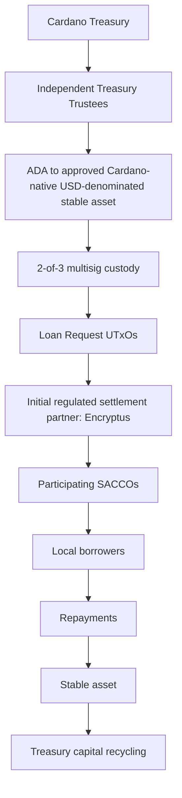

# Aurora: Open Infrastructure for Institutional Credit Markets on Cardano

**Cardano Treasury Proposal**

| Field | Detail |
| --- | --- |
| **Amount Requested** | **2,900,000 ADA** |
| **Recipient** | **Led by Fairway** |
| **Partners** | **Fallen Icarus and Sundial Protocol** |
| **Delivery Period** | **12 months** |

---

## Contents

- [1. Summary](#1-summary)
- [2. Motivation](#2-motivation)
- [3. Proposed Solution](#3-proposed-solution)
- [4. Pilot Implementation](#4-pilot-implementation)
- [5. Treasury Participation Model](#5-treasury-participation-model)
- [6. Deliverables](#6-deliverables)
- [7. Budget and Resource Allocation](#7-budget-and-resource-allocation)
- [8. Consortium and Relevant Experience](#8-consortium-and-relevant-experience)
- [9. Milestones and Success Criteria](#9-milestones-and-success-criteria)
- [10. Risks and Mitigation](#10-risks-and-mitigation)
- [11. Governance and Oversight](#11-governance-and-oversight)
- [12. Conclusion](#12-conclusion)
- [13. Governance Submission Requirements](#13-governance-submission-requirements)
- [Appendix A: Verification & Trust Framework](#appendix-a-verification--trust-framework)
- [Appendix B: Progressive Pilot Deployment Model](#appendix-b-progressive-pilot-deployment-model)

---

# 1. Summary

## Proposal at a Glance

| Category | Summary |
| ----- | ----- |
| **Treasury Request** | **2,900,000 ADA** |
| **Development Budget** | **2,200,000 ADA** |
| **Pilot Liquidity** | **700,000 ADA** (targeting approximately USD 100,000 equivalent at conversion) |
| **Delivery Period** | 12 months |
| **Purpose** | Build open-source institutional credit market infrastructure and validate it through a Treasury-backed SACCO pilot |
| **Primary Deliverables** | Metadata standard, off-chain indexer, developer tooling, dRep dashboard, pilot case study, Capital Provider Readiness Framework |
| **Funding Model** | Development funding released only upon milestone approval. Pilot liquidity released progressively (30% / 30% / 40%) based on successful deployment and repayment performance. |
| **Treasury Custody** | Independent 2-of-3 Treasury multisignature administered by Independent Treasury Trustees. Development and pilot liquidity follow separate governance workflows. |
| **Development Custody** | Independent 3-of-5 multisignature with two consortium signers and three independent signers. |
| **Treasury Protection** | Progressive deployments, milestone gating, public reporting, independent audits, published wallet addresses, and dRep monitoring dashboard. |
| **End of Pilot** | Remaining Treasury principal together with Treasury-entitled proceeds returned according to the approved participation framework. |
| **Open Source** | Apache License 2.0; repositories, documentation and build instructions published no later than M2. |

## Governance Safeguards

* Independent Treasury Trustees control Treasury custody.
* Treasury funds remain undelegated and delegated to **Abstain** until approved disbursement.
* Public milestone reporting and independent financial review.
* Canonical proposal published through immutable IPFS reference.
* Remaining Treasury principal and Treasury-entitled proceeds returned at project completion.
* Undistributed development funds refunded if milestones are not completed.

## Proposal Summary

Cardano's eUTxO model enables decentralized credit markets built around individual Loan Request UTxOs rather than pooled liquidity. The infrastructure is designed as reusable, jurisdiction-agnostic public infrastructure that can support institutional credit markets wherever compatible lending institutions and regulated settlement providers exist. This proposal, led by Fairway in collaboration with Fallen Icarus and Sundial, delivers the infrastructure and market validation required to establish open, programmable credit markets on Cardano.

The project consists of two complementary phases.

## Phase 1: Build Open Credit Market Infrastructure

The project establishes an optional metadata and trust layer that enables identity, compliance and other trust signals to be attached to Cardano-native lending without modifying the underlying smart contracts.

A versioned transaction metadata standard and open-source off-chain indexer allow participants to verify zero-knowledge proofs derived from verifiable credentials while keeping the underlying lending infrastructure fully permissionless. The same framework is designed to support future trust, reputation and verification use cases beyond KYC.

The infrastructure is designed to integrate with Pogun's credit market architecture and other compatible Cardano lending implementations while remaining independent of any single protocol. The objective is to establish reusable public infrastructure that multiple credit market implementations can adopt rather than creating another isolated lending platform.

## Phase 2: Validate Through Real Lending

The infrastructure is validated through a Treasury-backed pilot with Ethiopian Savings and Credit Cooperative Organizations (SACCOs).

The primary objective of the pilot is to validate Cardano's novel technical approach to programmable institutional credit markets. The resulting economic impact, expanding lending capacity for regulated financial institutions and improving access to affordable capital, serves as the real-world validation of that infrastructure rather than the primary deliverable itself.

In addition to the operating budget, the Treasury Withdrawal includes a 700,000 ADA allocation reserved exclusively for pilot lending liquidity, targeting approximately USD 100,000 of lending capital at the time of withdrawal. Following withdrawal, this allocation is converted into USDM (or another approved Cardano-native USD-denominated stable asset) and deployed into verified lending opportunities. Participating SACCOs continue performing borrower onboarding, underwriting, loan servicing and collections through their existing legal and operational frameworks, while loan metadata, verification status, funding events and repayment history are recorded on-chain, creating transparent and verifiable lending activity.

The pilot follows a phased deployment model, beginning with SACCO-level Loan Request UTxOs and evaluating more granular lending structures as participating institutions and infrastructure mature.

Pilot liquidity is recycled as loans are repaid, allowing the same Treasury allocation to support multiple lending rounds while establishing the first on-chain credit histories for participating institutions. Once that trustless on-chain track record exists, participating SACCOs can continue attracting future capital without further Treasury funding.

Throughout the pilot, Sundial contributes ecosystem partnerships and institutional market expertise to validate that the infrastructure developed through this proposal can support future participation by stablecoin providers, institutional allocators, Bitcoin-backed capital providers and other professional market participants.

The pilot's lasting value is not the lending activity itself, but the reusable metadata standard, indexer, institutional credit histories and capital-provider framework that remain available to the broader Cardano ecosystem.

## Open Ecosystem Commitment

Aurora extends existing Cardano lending infrastructure rather than replacing it.

The project is designed to complement existing credit market initiatives rather than compete with them. Protocols such as Pogun focus on originating and settling credit relationships. Aurora provides reusable metadata, verification and discovery infrastructure that enables institutional participation across compatible credit market implementations. By separating lending logic from institutional infrastructure, future builders can innovate independently while sharing common standards rather than recreating institutional onboarding, verification and discovery systems.

The pilot is designed to remain compatible with the credit market architecture pioneered by Fallen Icarus and implemented by Pogun. Where appropriate, it may integrate with Pogun's production infrastructure. However, the objectives of this proposal do not depend on any single implementation. Should Pogun's production deployment be delayed or unavailable, the consortium may utilize equivalent audited lending contracts or compatible partner infrastructure while preserving the same metadata standard, indexer architecture and credit market model.

All software, standards and implementation learnings developed through the project will be released as open source under the Apache License 2.0 (or your chosen license). Public source repositories, documentation and build instructions will be published no later than completion of M2. The Cardano ecosystem may freely use, audit, modify, fork and integrate the resulting infrastructure into future credit market applications in accordance with the license terms.

The consortium does not seek Treasury funding to operate a private lending platform. No consortium member receives preferential rights to operate or commercialize the resulting infrastructure. Any individual or organization may use, operate, extend or commercialize the open-source outputs under the terms of the applicable license without requiring Fairway, Sundial, Fallen Icarus or further Treasury funding.

Treasury funding establishes reusable open infrastructure, including metadata standards, verification frameworks, indexing infrastructure and operational models, that any Cardano credit market participant may adopt without requiring Fairway or continued Treasury funding.

The purpose of this proposal is to establish an **open, community-owned institutional layer** for Cardano credit markets before proprietary implementations emerge. Any future credit market implementation may build upon these standards without requiring Fairway, Sundial, Fallen Icarus or additional Treasury funding.

## Consortium

* **Fairway** leads infrastructure development, pilot execution and institutional onboarding.
* **Fallen Icarus** provides credit market architecture, technical review and lending protocol expertise.
* **Sundial** contributes institutional market expertise, ecosystem relationships and capital-provider engagement activities that help ensure the resulting infrastructure meets the operational, compliance and reporting requirements of future private capital providers.

## Pilot Service Providers

The pilot utilizes independent operational service providers that are **not recipients of Treasury funding** and are **not members of the delivery consortium**.

* **Independent Treasury Trustees (2-of-3 multisignature custody)** provide independent custody and governance of the Treasury allocation. They receive Treasury funds, approve development milestone releases, authorize the ADA-to-stablecoin conversion, administer pilot liquidity according to the approved governance framework and return the remaining Treasury principal together with Treasury-entitled proceeds at the conclusion of the pilot.
* **Encryptus (Initial regulated settlement partner).** Provides regulated cross-border settlement infrastructure connecting Cardano-native stable assets with local banking rails for pilot capital deployment and repayment.

# 2. Motivation

In traditional lending, every loan begins as an individual agreement between specific parties with its own terms, risk profile, repayment schedule, and settlement conditions. Much like a transaction, each loan exists as a discrete financial object that can be originated, funded, serviced, transferred, and settled independently. Only after loans are created do financial institutions aggregate them into portfolios, funds, or securitized products.

Most DeFi lending protocols reverse this process. Capital is first deposited into a shared pool, and borrowers draw from that pool according to predefined rules. While effective for certain use cases, this model does not reflect how most real-world credit markets operate.

Cardano's eUTxO architecture is uniquely suited to the loan-first model. Unlike account-based DeFi, where lending is typically organized around shared liquidity pools, Cardano's transaction-based architecture naturally represents individual financial relationships as distinct on-chain objects. This makes it well suited for programmable institutional credit markets built around discrete lending agreements.

Individual loans can exist as distinct on-chain UTxOs with their own state and logic, allowing them to be independently discovered, funded, and settled before being aggregated into larger credit portfolios. This creates a shared institutional credit market where thousands of regulated financial institutions can independently access digital capital through common open infrastructure rather than fragmented bilateral relationships.

Two problems block real-world credit activity on Cardano today.

## Institutions need KYC, but on-chain lending is pseudonymous.

Pogun's credit market already lets any two parties negotiate and fund a loan on-chain. But institutional lenders, regulated entities, and professional capital allocators operate under compliance frameworks that require verifiable identity and eligibility checks.

Without a way to attach those assurances to on-chain activity, these participants simply cannot use the market.

Advances in zero-knowledge technologies make it possible to verify that a counterparty satisfies specific requirements without exposing sensitive personal data. Implemented as optional transaction metadata rather than changes to the core contracts, this compliance layer can be added without compromising the permissionless nature of the underlying protocol.

## SACCOs need capital, but traditional finance rails are too expensive.

Savings and Credit Cooperative Organizations (SACCOs) are regulated, member-owned financial institutions that provide savings and lending services to their local communities. In many emerging markets they form the primary source of credit for individuals and SMEs underserved by commercial banks. Rather than creating new lending institutions, this proposal connects digital capital with trusted financial institutions that already understand their borrowers, operate within local regulatory frameworks and have established loan servicing capabilities.

Ethiopia was selected as the initial pilot jurisdiction because of established consortium relationships, experienced local partners and a mature cooperative financial sector. The infrastructure itself remains **jurisdiction agnostic** and is designed to support institutional credit markets wherever compatible financial institutions and regulated settlement providers exist.

Demand for lending capacity far exceeds what they can fund internally, and the cost of capital through conventional channels is prohibitive. Through Fairway's local partnerships, the consortium has already secured pilot participation from Ethiopian SACCOs and continues expanding its institutional network.

The opportunity extends far beyond a small pilot cohort. Cooperative financial institutions are among the most scalable channels for deploying productive capital. Rather than onboarding thousands of individual businesses one by one, a single institutional relationship immediately provides access to an established lending operation with existing borrowers, underwriting processes, repayment collection and local regulatory compliance.

This allows Cardano-native capital to scale through existing financial infrastructure rather than replacing it. This institutional-first approach enables ecosystem builders to scale credit markets by onboarding financial institutions rather than thousands of individual borrowers, dramatically reducing the cost and complexity of market expansion.

## Bringing the Two Together

This proposal addresses both problems together: build the metadata and verification infrastructure that lets institutions participate, then validate it through a Treasury-backed pilot that puts real capital to work for SACCOs that need it.

The result is not simply a lending pilot, but a practical test of whether Cardano can support a new category of programmable credit markets built around open Credit Markets, optional verification, and real-world capital formation.

# 3. Proposed Solution

This proposal builds an optional metadata and trust layer designed for Cardano credit market infrastructure, with initial integration targeting Pogun's credit market architecture while remaining compatible with alternative implementations.

The broader objective is to establish the foundations of a Cardano-native credit market, where lending opportunities can be discovered, evaluated and funded through open market infrastructure. The proposal intentionally focuses on institutional infrastructure rather than lending logic. Existing and future Cardano credit market implementations remain free to innovate independently while sharing a common metadata, verification and discovery layer.

The solution does not modify core lending smart contracts. Instead, it uses Cardano transaction metadata to attach identity and compliance information to loan UTxOs, and an off-chain indexer to read and verify that metadata. This allows the infrastructure to remain compatible with Pogun's architecture while also supporting alternative audited credit market implementations where appropriate.

## Why metadata instead of smart contract logic?

### Efficiency

Verification of identity, compliance and eligibility proofs using zero-knowledge systems can be computationally expensive. Cardano's on-chain execution budgets and available Plutus primitives are not designed for this workload.

By moving proof verification to the off-chain indexer, we avoid these constraints entirely. The indexer can execute arbitrarily complex verification logic without affecting transaction costs or throughput.

### Flexibility

Compliance requirements differ across jurisdictions and evolve over time. A metadata standard can be versioned and extended without redeploying or migrating smart contracts. New credential types, proof systems and regulatory frameworks can be supported through updates to the indexer and metadata schema rather than changes to the lending protocol itself.

### Permissionlessness

The core credit market contracts remain untouched and fully open. Any participant can still originate, fund or repay a loan without metadata attached. Participants who require additional assurances can use metadata and verification frameworks to evaluate opportunities, while participants who do not require them can interact directly with the underlying market.

Verification therefore becomes optional infrastructure rather than a protocol requirement.

## How It Works

### Loan Origination

A SACCO or other originator creates a Loan Request UTxO through a compatible Cardano credit market infrastructure implementation, with the initial pilot targeting Pogun's credit market architecture.

Depending on the implementation, a Loan Request UTxO may represent a SACCO funding request, a lending program, or an individual lending opportunity.

Optionally, the originator may attach transaction metadata containing a zero-knowledge proof derived from a verifiable credential, such as a Veridian SSI credential or CIP-170 aligned proof.

### Indexing and Verification

The off-chain indexer monitors the blockchain for credit market UTxOs which are identified by their beacon tokens (CIP-89).

When metadata is present, the indexer verifies the attached proof against the relevant credential schema and exposes the verification status through a public API.

### Discovery and Funding

Capital providers query the indexer to discover lending opportunities.

Participants may filter opportunities according to their own requirements, including jurisdiction, verification status or other metadata attributes.

Any participant may fund a lending opportunity through the underlying credit market contracts. Verification metadata simply enables additional discovery and filtering mechanisms for participants who require them.

### Repayment and Reputation

As loans are repaid, repayment history is trustlessly associated with the originating entity and its verification credentials.

Over time, repayment history establishes portable institutional credit histories that future capital providers can evaluate through the same open infrastructure. These histories form the basis for privacy-preserving institutional reputation systems rather than protocol-specific trust models.

### Settlement

The pilot described later combines this infrastructure with regulated settlement infrastructure, initially provided through Encryptus, to support conversion between Cardano-native USD-denominated stable assets and local fiat currencies. The consortium may utilize equivalent regulated settlement providers where operational, regulatory or technical considerations make this appropriate.

## What We Build

### Metadata Standard

A versioned schema for attaching identity proofs, verification status and loan-level compliance information to credit market UTxOs.

The standard is designed to be extensible and support additional trust and verification use cases over time.

### Off-Chain Indexer

A service that reads credit market UTxOs, verifies attached proofs, tracks loan lifecycles and exposes a query API for discovery and filtering.

Both components will be released as open public infrastructure for the broader Cardano ecosystem to adopt, extend and operate independently and to integrate into future credit market applications. The off-chain indexer could be run locally to avoid dependence on a third-party API service.

*Image 1\. 	Cardano Credit market infrastructure*

# 4. Pilot Implementation

The pilot validates the metadata and indexer infrastructure described in Section 3 through real lending activity with Ethiopian Savings and Credit Cooperative Organizations (SACCOs). An ADA allocation reserved for pilot liquidity is converted into USDM (or another approved Cardano-native USD-denominated stable asset) and deployed through the pilot. Encryptus initially provides the settlement infrastructure connecting on-chain lending activity with local banking rails.

Ethiopian SACCOs provide an attractive environment for validation. They already originate and service loans, possess established borrower relationships, and face significant unmet demand for lending capital.

The consortium has already secured pilot participation from Ethiopian SACCOs and continues expanding its institutional network in preparation for deployment. The initial pilot validates the infrastructure with a small cohort of institutions before progressively expanding participation as operational experience and on-chain credit histories are established.

The pilot therefore begins with existing financial institutions that have already agreed in principle to participate, rather than requiring the consortium to recruit lending partners after Treasury funding is received.

## Structure

The pilot begins with the simplest operational model: one Loan Request UTxO per participating SACCO.

Each SACCO publishes a funding request through Pogun's credit market contracts (or similar) and receives capital to support its existing lending operations. The SACCO continues using its established underwriting, servicing and repayment processes while the pilot validates Cardano's ability to coordinate capital participation and repayment tracking. This approach minimizes operational complexity while the infrastructure is new.

As participating institutions become familiar with the framework, subsequent deployment rounds may evaluate more granular structures, including Loan Request UTxOs representing lending programs, loan categories or individual business lending opportunities.

The objective is not to prescribe a single market structure from the outset, but to determine which levels of granularity create the most efficient and scalable credit market while remaining practical for participating institutions.

## Process Flow

1. **Loan Request.** A participating SACCO publishes a Loan Request UTxO through Pogun's credit market contracts (or similar) with verification metadata attached.

2. **Verification.** The off-chain indexer verifies the SACCO's attached proof and exposes the lending opportunity through the discovery interface.

3. **Funding.** Following conversion into USDM, pilot capital is deployed into eligible lending opportunities through the credit market infrastructure.

4. **Settlement.** Encryptus initially supports conversion between USDM (or another approved Cardano-native USD-denominated stable asset) and locally accessible fiat currency. Pilot capital is transferred from funded Loan Request UTxOs to the designated settlement address, converted and paid to participating SACCOs through their existing banking relationships. Loan repayments follow the reverse settlement path and return to the credit market infrastructure for capital recycling. The consortium may utilize equivalent regulated settlement providers where operational, regulatory or technical considerations make this appropriate.

5. **Servicing.** SACCOs remain responsible for:

   - Borrower onboarding.
   - Underwriting decisions.
   - Local compliance.
   - Repayment collection.
   - Recovery processes where required.
   - Exchange rate risk between USDM and the local fiat currency.

   Repayment events are recorded on-chain and contribute to the development of verifiable credit histories and future reputation systems.

6. **Capital Recycling.** As loans are repaid, Treasury capital becomes available for redeployment into new lending opportunities. Subsequent deployment rounds may incorporate additional institutions and alternative Loan Request UTxO structures based on operational feedback and pilot outcomes.

## Why This Model Scales

The long-term opportunity extends far beyond the initial pilot. Cooperative financial institutions already operate at significant scale across emerging markets, creating one of the largest and most scalable distribution channels for productive credit. Rather than building a lending network borrower by borrower, Cardano-native capital can reach thousands of existing financial institutions that already understand their local markets.

Rather than originating and servicing thousands of individual SME loans directly, the proposed model connects global digital capital with regulated financial institutions that already possess borrower relationships, underwriting expertise, repayment infrastructure and regulatory standing. Every new institutional relationship immediately expands lending capacity without requiring new borrower acquisition or operational infrastructure.

This creates a highly scalable distribution model. Each new institutional relationship immediately provides access to an established lending operation rather than requiring the ecosystem to build new borrower acquisition, underwriting and servicing capabilities from scratch.

Each participating SACCO establishes a portable, verifiable on-chain credit history through its repayment performance. As more institutions participate, capital providers can allocate funds based on transparent on-chain performance rather than building separate due diligence processes for every institution.

Because the infrastructure is open and jurisdiction agnostic, the same institutional onboarding framework can be reused to connect thousands of regulated financial institutions across different jurisdictions using a common metadata standard, verification framework and indexing infrastructure. This reduces duplicated effort while increasing interoperability across future Cardano credit market implementations.

## How Risk Is Contained

The pilot launches with participating SACCOs that have already executed Memorandums of Understanding with the consortium and already perform lending as their core business.

Rather than replacing existing financial institutions, Cardano supplies capital and infrastructure to organizations that already possess local expertise, borrower relationships and servicing capabilities.

Treasury capital is deployed progressively across multiple participating institutions. Subsequent capital deployments occur only after satisfactory repayment performance, operational compliance and successful completion of earlier deployment rounds have been demonstrated.

Typical SACCO loans in Ethiopia are relatively small and short-duration, allowing meaningful lending activity across multiple institutions while validating repeated repayment and capital recycling during the pilot.

Targeting regulated financial institutions rather than individual borrowers also reduces operational and currency risk. Loans are denominated in USDM (or another approved Cardano-native USD-denominated stable asset) but disbursed in Ethiopian Birr. Participating institutions, with diversified loan portfolios, established underwriting practices and operational reserves, are significantly better positioned to manage this exposure than individual SME borrowers.

Because all loans exist on-chain as UTxOs, Treasury-funded activity remains independently auditable. The indexer API and dRep monitoring dashboard enable transparent verification of capital deployment, repayments and loan performance without relying solely on off-chain reporting.

The phased deployment model validates operational processes before expanding participation or increasing capital deployment.

## What the Pilot Proves

The pilot validates the complete lifecycle of a Cardano-native institutional credit market:

* Metadata attachment
* Zero-knowledge proof verification
* Indexed loan discovery
* On-chain capital participation
* Stablecoin settlement
* Real-world loan disbursement
* Repayment tracking
* Capital recycling
* Institutional credit history formation

The primary objective of the pilot is to validate Cardano's novel technical approach to programmable credit markets. The resulting economic impact, expanding lending capacity for regulated financial institutions and improving access to affordable capital, is the real-world validation of that infrastructure rather than the primary deliverable itself.

More broadly, the pilot evaluates whether Cardano's eUTxO architecture can support programmable institutional credit markets at scale.

The pilot also validates whether the metadata standard, indexer and reporting infrastructure satisfy the requirements of prospective capital providers evaluating future participation.

Beyond the technology itself, the pilot validates a repeatable institutional onboarding model capable of scaling from an initial cohort of participating financial institutions to thousands of regulated lenders using the same open infrastructure.

The long-term objective is to establish the foundations for open, jurisdiction-agnostic credit market infrastructure capable of supporting institutional, stablecoin, ADA and Bitcoin-backed capital participation across multiple jurisdictions and lending models.

# 5. Treasury Participation Model

The Treasury withdrawal consists of two components:

## ADA Allocation

The 2,200,000 ADA allocation covers all development and operational costs associated with the project, including the transaction metadata standard, off-chain indexer, developer tooling, documentation, pilot execution, ecosystem coordination and public reporting.

## Pilot Liquidity

In addition to the operating budget, the proposal allocates 700,000 ADA exclusively for pilot lending liquidity. This allocation targets approximately USD 100,000 of lending capital based on market conditions at the time of withdrawal and remains separate from the operating budget.

The pilot liquidity allocation is administered independently from the project operating budget. Prior to deployment of any pilot liquidity, the Independent Treasury Trustees must be publicly identified together with the custody wallet addresses, multisignature policy, governance procedures and operating framework. These requirements must be independently verified before the first pilot deployment is authorized.

The Independent Treasury Trustees are responsible for receiving the Treasury ADA allocation, converting it into USDM (or another approved Cardano-native USD-denominated stable asset) as soon as practicable to minimize market exposure, holding the revolving pilot liquidity, authorizing deployments according to the approved pilot funding and repayment model, receiving repaid capital, and returning the remaining Treasury principal together with Treasury-entitled proceeds at the conclusion of the pilot.

**Stablecoin Conversion Policy.** The Pilot Liquidity allocation will be converted into USDM where practicable. If USDM is unavailable or operationally unsuitable, the Independent Treasury Trustees may approve another reputable Cardano-native USD-denominated stable asset that provides equivalent functionality for the pilot. Conversion will be executed as soon as reasonably practicable following receipt of Treasury funds through an approved regulated OTC or liquidity provider under commercially reasonable market conditions, with the objective of minimizing market exposure and unnecessary execution costs.

If market conditions are judged to be materially unfavorable, including severe liquidity constraints, excessive slippage, or a material loss of the selected stable asset's USD peg, the Trustees may delay conversion or suspend further pilot deployments until conditions have normalized or an alternative approved stable asset has been selected. Any ADA or stable assets not yet deployed remain under the custody of the Independent Treasury Trustees and continue to be governed under the approved Treasury custody framework.

The stablecoin liquidity is not spent; it is lent. Capital is deployed into loan contracts originated by verified SACCOs through the credit market infrastructure. As participating SACCOs repay their loans, the capital is recycled into subsequent lending rounds, allowing the same pilot allocation to support multiple deployment cycles.

Capital is deployed progressively across three pilot rounds rather than all at once, limiting Treasury exposure while the infrastructure, operational processes and market assumptions are validated. This separation of responsibilities ensures that project implementation and Treasury liquidity administration remain operationally independent, transparent and fully auditable.

Participating SACCOs receive an agreed portion of lending income in exchange for originating, underwriting, servicing and collecting loans under the executed pilot participation agreements. Only participation agreements approved by the Independent Treasury Trustees are eligible to receive Treasury-funded pilot liquidity. These agreements define the allocation of lending income between participating SACCOs and Treasury-funded capital before any pilot deployment occurs.

Treasury-entitled proceeds comprise the remaining Treasury principal together with any amounts allocated to the Treasury under those agreements after deduction of approved settlement costs, independent audit costs, pilot administration costs and approved loss allocations.

Approved pilot administration costs are limited to operational expenses directly attributable to administering the Treasury-funded pilot liquidity and do not include consortium operating expenses funded through the Development Budget. Approved loss allocations are limited to realized losses arising from participating SACCO defaults, settlement failures or other approved pilot credit events, and do not include consortium operating costs, budget overruns or unrelated liabilities.

## Transparency and Audit

Throughout the pilot, Treasury-funded pilot liquidity will remain fully transparent and independently auditable. The Independent Treasury Trustees will publish the Treasury custody wallet addresses before the first pilot deployment. Capital conversions, deployments, repayments, remaining pilot liquidity and Treasury returns will be publicly verifiable through on-chain transactions, the project indexer and periodic public reports, enabling the community and dReps to independently monitor the flow of Treasury funds throughout the pilot.

An independent financial auditor or suitably qualified independent reviewer will be appointed before the first pilot liquidity deployment. Funding for this review is included within the Shared Resources allocation.

Independent financial reconciliation and audit activities will be performed at each project milestone. The review will cover, where applicable:

* Treasury custody balances and wallet reconciliation.
* Development fund disbursements and milestone spending.
* ADA-to-stablecoin conversion records and custody.
* Pilot liquidity deployments and repayments.
* Capital recycling and remaining Treasury principal.
* Treasury-entitled proceeds and approved cost allocations.
* Compliance with the approved governance framework and milestone release conditions.

A summary of the auditor's findings, together with the corresponding financial reconciliation, will be published alongside each milestone report. Any material discrepancies identified during the review will be disclosed together with the corrective actions taken before subsequent Treasury funds or pilot liquidity are released.

## After the pilot

The Treasury is not intended to become a permanent liquidity provider. The purpose of the pilot is to establish the on-chain transaction history, repayment records and institutional track record required to attract future participation from stablecoin providers, institutional allocators, ADA holders and other capital sources.

Throughout the pilot, Sundial will engage prospective capital providers to validate the operational, compliance and reporting requirements necessary for future market participation.

By the end of the pilot, participating SACCOs will have verifiable on-chain lending histories that support future capital formation. Once that portable institutional credit history exists, participating institutions can continue attracting capital from future market participants without additional Treasury funding. Future capital providers can evaluate lending opportunities based on transparent repayment history and demonstrated performance rather than relying on Treasury participation.

The Pilot Liquidity allocation is intended to revolve throughout the pilot rather than fund ongoing operations. Treasury-funded capital will be progressively deployed, repaid and recycled across multiple lending rounds in accordance with the approved pilot governance framework.

At the conclusion of the pilot, the remaining Treasury principal together with any Treasury-entitled proceeds will be returned to the Cardano Treasury in accordance with the approved pilot participation framework.

Treasury-entitled proceeds consist of any amounts allocated to the Treasury under the approved pilot participation framework, including applicable lending returns, recoveries and other Treasury-entitled distributions, after deduction of pre-approved pilot administration costs, regulated settlement costs, independent audit costs and approved loss allocations. No consortium member may retain Treasury-entitled proceeds except for costs explicitly approved within the project budget or the approved participation framework.

Any Treasury principal or Treasury-entitled proceeds not required to satisfy approved pilot obligations shall remain under the custody of the Independent Treasury Trustees until returned to the Cardano Treasury. Upon completion of the pilot, the Treasury-funded liquidity is fully unwound and no continuing claim on Treasury capital remains.

## Operational Risk Management

The pilot is designed to limit Treasury exposure through progressive capital deployment and clearly defined risk allocation.

* **Borrower defaults.** Treasury capital is deployed to participating SACCOs rather than individual borrowers. SACCOs remain responsible for underwriting, servicing and absorbing losses arising from SME or individual borrower defaults under their existing lending operations.
* **SACCO performance.** Continued participation and larger capital allocations depend upon successful repayment performance. A SACCO that fails to meet its repayment obligations, materially breaches the participation agreement or no longer satisfies the pilot eligibility requirements may be suspended or permanently excluded from future participation. Repayment performance contributes to the institution's on-chain credit history and informs future capital allocation decisions.
* **Pilot eligibility.** Participating SACCOs must be legally operating financial institutions, execute the required pilot participation agreements, complete the consortium's onboarding and verification process, and maintain the operational capabilities necessary to participate in the pilot.
* **Exposure limits**. Treasury exposure is limited through progressive deployment. Initial pilot allocations are distributed across multiple participating SACCOs, with subsequent capital deployments contingent upon satisfactory repayment performance, operational compliance and successful completion of earlier deployment rounds. Initial deployments will prioritize shorter-duration lending facilities where practical, enabling multiple repayment and capital recycling cycles during the pilot while preserving flexibility for participating SACCOs to originate loans appropriate to their local markets.
* **Stablecoin and conversion risk.** Pilot liquidity will be converted into a reputable Cardano-native USD-denominated stable asset as soon as practicable following withdrawal to minimize market exposure. If conversion cannot be completed under acceptable market conditions, or if the selected stable asset becomes operationally unsuitable, deployment of the affected tranche may be delayed until the issue is resolved.
* **Settlement risk**. The pilot initially utilizes Encryptus as its regulated settlement provider. Should operational, regulatory or jurisdictional requirements change, the consortium may transition to an equivalent regulated settlement provider without affecting the metadata standard, indexer or credit market architecture.

* **Anti-gaming.** Participating SACCOs must certify that pilot funds are not knowingly lent to related parties of the consortium, Treasury Trustees or Development Fund signers except where fully disclosed and independently approved. Circular lending, artificial repayment activity, self-funding designed to inflate pilot metrics and other arrangements intended primarily to manipulate reported outcomes are prohibited. The dRep dashboard will distinguish deployed capital, repayments, recoveries and outstanding balances using objective on-chain metrics. Treasury Trustees may suspend or reject deployments where material evidence of prohibited activity exists.

* **Jurisdictional flexibility.** Ethiopia has been selected as the initial pilot jurisdiction due to Fairway's existing institutional relationships and signed participation agreements. However, **the metadata standard, indexer and pilot operating model are jurisdiction agnostic**. Should regulatory, settlement or currency restrictions materially delay pilot execution in Ethiopia, the consortium may deploy the pilot through equivalent regulated financial institutions in other supported jurisdictions. Through Encryptus' existing settlement network and institutional relationships, including established SACCO partnerships in Kenya, the consortium has an operational pathway to continue validating the infrastructure while preserving the objectives of the Treasury-funded pilot.

# 6. Deliverables

## Phase 1: Infrastructure

1. **Tx metadata standard.** A versioned, open-source schema for attaching identity proofs, verification status, and compliance information to credit market UTxOs. Designed to be extensible beyond KYC and support future trust, reputation and verification use cases.
2. **Off-chain indexer.** An open-source service that monitors the chain for credit market UTxOs, verifies attached ZK proofs, tracks loan lifecycles, and exposes a query API for filtered loan discovery.
3. **Documentation.** Integration guides for originators, capital providers, and developers who want to build on the metadata standard or operate their own indexer infrastructure.
4. **Institutional Credit Market Framework.** Documentation of lessons learned regarding different Loan Request UTxO models, including SACCO-level, program-level and more granular lending structures evaluated during the pilot.

## Phase 2: Pilot

1. **Lending**. Live lending activity using the 700,000 ADA pilot liquidity allocation, targeting approximately USD 100,000 of lending capital following conversion into an approved Cardano-native USD-denominated stable asset.

2. **Pilot case study.** A public report covering operational outcomes, repayment performance, capital recycling metrics, and infrastructure performance under real-world conditions.
3. **SACCO feedback.** Documented feedback from participating SACCOs on the onboarding process, operational friction, and what would need to change for them to scale their participation.
4. **Reputation and Credit History Framework.** Documentation of how repayment history can be associated with lending entities and used to support future reputation and trust systems.

5. **dRep monitoring dashboard.** A lightweight tool allowing dReps to track the status and health of Treasury-funded loans in real time.
6. **Sundial Capital Provider Readiness Framework.** Documentation produced through engagement with prospective stablecoin providers, institutional allocators, market makers and Bitcoin-backed capital participants. The framework documents compliance requirements, reporting expectations, workflow integration, operational requirements and recommended infrastructure improvements required for broader participation in Cardano-native credit markets.

All infrastructure is open-source and available for the broader Cardano ecosystem to adopt or extend.

# 7. Budget and Resource Allocation

The Treasury withdrawal consists of two components.

| Component | ADA | Approx. USD\* | Delivery Scope | Purpose |
| ----- | ----- | ----- | ----- | ----- |
| Operating Budget | 2,200,000 | $352,000 | 12-month multidisciplinary delivery | Infrastructure development, pilot execution and ecosystem delivery |
| Pilot Liquidity | 700,000 | $112,000 | Treasury-managed revolving pilot liquidity | Revolving lending capital administered independently by Treasury Trustees |
| **Total** | **2,900,000** | **$464,000** | — |  |

\*Illustrative values calculated using a reference ADA price of **US$0.16**.

The USD values above are provided solely to assist reviewers in understanding the approximate scale of the proposal. Treasury funding is requested in ADA. Deliverables are fixed by scope rather than USD expenditure and remain unchanged regardless of subsequent ADA price movements. Any increase in ADA purchasing power during the delivery period increases implementation capacity or reduces the Treasury's effective USD cost without reducing the committed project scope.

## Operating Budget Allocation

The operating budget reflects responsibility for producing project deliverables rather than compensation of individual contributors. Activities include engineering, architecture, ecosystem development, project management, testing, documentation, governance, pilot execution and external professional services delivered throughout the 12-month implementation period.

| Partner | ADA | Approx. USD\* | Primary Responsibilities |
| ----- | ----- | ----- | ----- |
| Fairway | **1,200,000** | **$192,000** | Metadata standard, off-chain indexer, verification infrastructure, SACCO onboarding, pilot execution, reporting and ecosystem coordination |
| Sundial | **450,000** | **$72,000** | Deliverables include documented engagement with prospective capital providers, completed requirements assessments covering operational, compliance and reporting readiness, publication of a Capital Provider Readiness Framework, and recommendations for future participation by stablecoin providers, institutional allocators, ADA holders and Bitcoin-backed capital sources. These outputs provide reusable guidance for future Cardano credit market participants beyond the scope of this pilot. |
| Fallen Icarus | **250,000** | **$40,000** | Credit market architecture, UTxO lending design review, metadata framework review and technical oversight |
| Shared Resources | **300,000** | **$48,000** | Independent security audits, external technical reviews, independent legal and regulatory review covering cross-border lending, stablecoin settlement, custody arrangements and applicable regulatory considerations, infrastructure hosting, and project contingency. |
| **Operating Budget Total** | **2,200,000** | **$352,000** |  |

## Pilot Liquidity (Separate Treasury Allocation)

| Allocation | ADA | Approx. USD\* | Administration |
| ----- | ----- | ----- | ----- |
| Pilot Liquidity | **700,000** | **$112,000** | Administered independently by the Independent Treasury Trustees (2-of-3 multisig) and deployed through progressive lending rounds under the approved pilot governance framework |

## Team Responsibilities

### Fairway

Fairway leads implementation and pilot execution, including:

* Tx metadata standard development.
* Off-chain indexer implementation.
* Verification framework integrations.
* Developer tooling and documentation.
* SACCO onboarding and relationship management.
* Integration with Encryptus and other compatible regulated settlement providers.
* Pilot operations and reporting.

### Sundial (Ecosystem & Capital Provider Readiness)

Sundial contributes institutional market expertise and ecosystem relationships to help validate that the infrastructure developed through this proposal supports future participation by professional capital providers.

**Activities include:**

* Engaging prospective stablecoin providers, institutional allocators, market makers and Bitcoin-backed capital providers.
* Documenting operational, compliance and reporting requirements for future participation.
* Validating integration of the metadata standard and indexer within institutional workflows.
* Gathering ecosystem feedback to improve interoperability and market readiness.
* Producing the Capital Provider Readiness Framework, including documented requirements, implementation priorities and recommendations for broader Cardano ecosystem adoption.

### Fallen Icarus

Fallen Icarus provides credit market architecture guidance, including:

* UTxO-based credit market architecture and lending model design.
* Review of the transaction metadata standard and indexer architecture.
* Technical guidance ensuring compatibility with Pogun and other compatible Cardano credit market implementations while preserving protocol independence.
* Ongoing consultation on credit market design, loan lifecycle models, reputation systems and future protocol evolution.

### Shared Resources

Shared resources cover:

* Independent security audits.
* External technical reviews.
* Independent legal and regulatory review covering cross-border lending, stablecoin settlement, custody arrangements and applicable regulatory considerations for pilot deployment.
* Infrastructure hosting.
* Project contingency.

## Pilot Capital

The pilot capital consists of a dedicated 700,000 ADA allocation. Following withdrawal, the allocation is converted into USDM (or another approved Cardano-native USD-denominated stable asset), targeting approximately USD 100,000 of revolving lending capital based on market conditions at the time of conversion.

Pilot capital is deployed progressively across multiple lending rounds into eligible lending opportunities originated by participating SACCOs. As loans are repaid, the capital is recycled into subsequent deployment rounds through the credit market infrastructure.

At the conclusion of the pilot, the remaining Treasury principal together with any Treasury-entitled proceeds is returned according to the approved participation framework.

# 8. Consortium and Relevant Experience

### Fairway

Fairway builds decentralized compliance infrastructure connecting institutions to DeFi protocols through identity proofs, zero-knowledge verification, and standards-based integrations across Cardano and Midnight. They bring three things this proposal needs: experience building identity, verification and institutional infrastructure on Cardano and Midnight to build the metadata and indexer infrastructure, operational relationships with Ethiopian SACCOs, and prior experience navigating Ethiopian institutional partnerships.

Relevant delivery includes multiple Catalyst-funded identity initiatives, a pilot integrating Ethiopia's Fayda National ID system with Cardano verifiable credentials, and issuance of proof-of-graduation VCs with Ethiopian higher education institutions.

### Fallen Icarus

Fallen Icarus (Rusty Shapiro) is the architect behind Cardano's p2p DeFi protocol family. He designed CIP-89 (Beacon Tokens), the standard that enables distributed dApps where every user gets their own smart contract address, maintaining full custody and delegation control. CIP-89 underpins the indexer's ability to discover and filter loan UTxOs without centralized infrastructure.

He authored cardano-loans, the p2p lending protocol with trustlessly negotiable loan terms, built-in credit histories, and endogenous interest rate discovery that Pogun's credit market is built on. IOG's own description of Pogun credits his work on non-margin lending mechanics as shaping the credit market's design. He also contributed to the metadata-based verification approach implemented by this proposal. His role in the consortium is architectural: ensuring the metadata standard and indexer align with the credit market's design and Cardano's eUTxO strengths.

### Sundial

Sundial Protocol is a Bitcoin-native finance layer on Cardano focused on institutional Bitcoin yield and credit infrastructure. Led by founder and CEO Sheldon Hunt, the team placed 1st in the Institutional Track at Paris Blockchain Week (3rd overall out of 1,000+ entrants), completed a third-party security audit with Hacken, and operates a live testnet.

Within this consortium, Sundial contributes institutional market expertise, capital-provider relationships and ecosystem partnerships to help validate that the open infrastructure developed through this proposal aligns with the operational, compliance and reporting requirements of future private capital providers. Sundial's role is to support ecosystem readiness and institutional adoption rather than develop protocol-specific functionality, and the resulting infrastructure remains open for adoption by any compatible Cardano credit market implementation.

Sundial is an ecosystem implementation partner rather than the beneficiary of exclusive rights. The infrastructure developed through this proposal is open source and may be adopted by Sundial, Pogun, Fairway or any future Cardano credit market implementation on equal terms.

### Previous Delivery

Members of the consortium have previously delivered Catalyst-funded initiatives, open-source infrastructure and ecosystem integrations relevant to identity, lending and institutional adoption.

The proposal builds upon existing relationships, infrastructure and operational experience rather than beginning from a greenfield position.

# 9. Milestones and Success Criteria

The project is delivered through five milestones across two phases. ADA funds development and execution activities. Pilot Liquidity is released separately and only after the infrastructure is operational.

## Milestone Schedule

| Milestone | Timeline | ADA Release | Pilot Liquidity Release |
| ----- | ----- | ----- | ----- |
| M1: Specification and Design | Month 1 | 300,000 | — |
| M2: Infrastructure Delivery | Months 2-3 | 500,000 | — |
| M3: Pilot Round 1 | Months 4-5 | 400,000 | Approximately 30% of the pilot liquidity allocation |
| M4: Pilot Round 2 and Market Validation | Months 6-8 | 500,000 | Approximately additional 30% of the pilot liquidity allocation |
| M5: Pilot Round 3, Capital Readiness and Ecosystem Handover | Months 9-12 | 500,000 | Approximately additional 40% of the pilot liquidity allocation |

**Total Treasury Withdrawal: 2,900,000 ADA**

## Phase 1: Infrastructure

### M1: Specification and Design

#### Deliverables

* Tx metadata standard specification for identity proofs, verification status and compliance information.
* Indexer architecture document.
* Confirmed SACCO cohort with executed Memorandums of Understanding and a framework for pilot participation agreements prior to the first pilot liquidity deployment.
* Pilot operating model covering participant roles, settlement flow and risk parameters.

#### Success Criteria

* Metadata specification published and open for community review.

* Indexer design reviewed by Fallen Icarus for alignment with Cardano credit market architecture, CIP-89, and compatibility with Pogun's implementation.

* At least three SACCOs confirmed for pilot participation. Three Ethiopian SACCOs have already executed Memorandums of Understanding with the consortium, with additional institutions progressing through onboarding. Prior to the first pilot liquidity deployment, each participating institution will execute the required pilot participation agreement governing capital deployment, repayment obligations, operational responsibilities and reporting requirements. Where confidentiality permits, redacted copies of these agreements will be published. Where publication is not possible, their execution will be independently verified before pilot liquidity is released.

* Pilot operating model approved by project partners.

**ADA Release:** 300,000

### M2: Infrastructure Delivery

#### Deliverables

* Working off-chain indexer deployed to testnet.
* Metadata standard implemented and validated against Pogun's credit market architecture, with compatibility for alternative Cardano credit market implementations.
* Developer documentation and integration guides.
* Settlement workflow validated end-to-end on testnet.

#### Success Criteria

* A Loan Request UTxO containing verification metadata can be created, indexed, verified, queried and filtered through the API.
* Documentation is sufficient for a third-party developer to integrate with the metadata standard and indexer.
* Settlement workflow confirmed operational.
* Testnet demonstration completed.

**ADA Release:** 500,000

## Phase 2: Pilot

### M3: Pilot Round 1

#### Deliverables

* First pilot liquidity deployment into live loan contracts with verified SACCOs.
* Infrastructure deployed to mainnet.
* dRep monitoring dashboard operational.
* First public progress report.

#### Success Criteria

* Up to 30,000 USDM deployed across at least two SACCOs.
* End-to-end flow validated on mainnet:
  * metadata attachment,
  * proof verification,
  * indexed discovery,
  * on-chain funding,
  * settlement into ETB,
  * loan servicing underway.
* dRep dashboard displaying live loan status and deployment metrics.
* Public progress report published.

**ADA Release:** 400,000

**Pilot Liquidity Release**: approximately 30,000 USDM equivalent

### M4: Pilot Round 2 and Market Validation

#### Deliverables

* Second USDM deployment incorporating recycled capital from Round 1 repayments together with an additional ≈ 30,000 USDM Treasury allocation.
* Infrastructure improvements based on operational feedback.
* Additional SACCOs onboarded where appropriate.
* Assessment of more granular lending models, including lending-program and borrower-level Loan Request UTxOs.
* Sundial-led engagement with prospective stablecoin providers, institutional allocators, market makers and Bitcoin-backed capital participants.
* Validation of compliance, reporting, discovery, custody and operational requirements for future capital providers.

#### Success Criteria

* Repayment activity recorded on-chain from Round 1 loans.
* Additional ≈ 30,000 USDM deployed, plus any recycled capital.
* Public progress report published.
* Documented engagement completed with **at least five** prospective capital providers representing stablecoin issuers, institutional allocators and Bitcoin-backed capital sources.
* Operational, reporting and compliance requirements from participating capital providers documented and prioritized.
* Capital Provider Readiness Framework published, including documented institutional requirements, identified implementation priorities, and recommendations for future Cardano credit market infrastructure adoption.

**ADA Release:** 500,000

**Pilot Liquidity Release:** approximately 30,000 USDM equivalent (contingent on demonstrated repayment activity from Round 1)

### M5: Pilot Round 3, Capital Readiness and Ecosystem Handover

#### Deliverables

* Final USDM deployment incorporating recycled capital from previous lending rounds together with the final ≈ 40,000 USDM Treasury allocation, completing the ≈ 100,000 USDM pilot.
* Pilot case study covering operational outcomes, repayment performance, capital recycling and infrastructure performance.
* Documented SACCO feedback on onboarding, operational friction and scalability.
* Capital Provider Readiness Framework (developed with Sundial) documenting requirements gathered from prospective stablecoin providers, institutional allocators, market makers and Bitcoin-backed capital participants.
* Final infrastructure refinements based on pilot and capital-provider feedback, including recommendations for metadata, indexer and institutional workflow integration.
* Documentation of participation models for future stablecoin, ADA and Bitcoin-backed capital providers.
* Final public documentation, open-source release and ecosystem handover.
* Return of remaining Treasury principal and Treasury-entitled proceeds.

#### Success Criteria

* Approximately 100,000 USDM cumulatively deployed across three Treasury deployment rounds.
* Multiple lending and repayment cycles completed with on-chain repayment history.
* Treasury capital recycling successfully demonstrated.
* SACCO feedback collected and published.
* Capital Provider Readiness Framework completed and published.
* Infrastructure recommendations finalized based on institutional validation.
* Final documentation and open-source deliverables published.
* Treasury principal and Treasury-entitled proceeds returned according to the approved pilot participation framework.

**ADA Release:** 500,000

**Pilot Liquidity Release:** ≈ 40,000 USDM equivalent (contingent on demonstrated repayment activity from Round 2)

## Pilot Liquidity Release Principles

USDM is released in three tranches. Each tranche after the first requires evidence that previously deployed capital has been successfully utilized and that repayment activity is occurring on-chain.

Progress can be independently verified through the indexer API and dRep monitoring dashboard without relying solely on off-chain reporting.

If a deployment round materially underperforms, Treasury retains the ability to withhold subsequent USDM tranches.

At the conclusion of the pilot, remaining Treasury principal and Treasury-entitled proceeds are returned according to the approved participation framework.

# 10. Risks and Mitigation

**Pogun implementation timing.** The pilot is designed for compatibility with Pogun's credit market architecture, which remains the preferred implementation. However, deployment is not dependent on Pogun's production launch. During the infrastructure phase (M1-M2), development and testing proceed against Fallen Icarus' cardano-loans architecture and other compatible development environments. If Pogun's mainnet deployment is delayed, the pilot may instead utilize an alternative audited Cardano credit market infrastructure implementation that preserves compatibility with the metadata standard and underlying credit market architecture. Pilot liquidity will not be deployed until an approved audited implementation is available, and any necessary milestone adjustments will be coordinated with the Treasury administrator.

**Repayment risk.** Treasury capital is deployed to participating SACCOs rather than individual borrowers. SACCOs remain responsible for underwriting, monitoring, collections and absorbing losses arising from SME or individual borrower defaults under their existing lending operations.

The pilot uses a progressive funding model, with capital released across three deployment rounds. Continued participation and larger allocations depend on successful repayment performance during earlier rounds. A SACCO that fails to meet its repayment obligations may be suspended or permanently excluded from future participation, with repayment history forming the basis of its on-chain institutional credit record.

The purpose of the pilot is not to eliminate credit risk, but to transparently measure repayment performance, validate risk-management approaches and establish the institutional reputation required for sustainable, market-driven capital formation after the pilot concludes.

**SACCO adoption.** SACCOs may need more time to adopt new processes than anticipated. The pilot starts with the simplest model (one loan per SACCO) and only moves to more granular structures when institutions are operationally ready. Fairway's existing relationships with the initial SACCO cohort reduce onboarding friction, but expansion to additional institutions may take longer than planned.

**Exchange rate exposure.** Loans are denominated in USDM but disbursed in Ethiopian Birr. Currency movements during the loan term create risk. SACCOs, as institutions with diversified portfolios, are better positioned to absorb this than individual borrowers, which is one reason the pilot targets SACCOs rather than end-borrowers directly.

**Settlement delays**. The pilot initially utilizes Encryptus for cross-border settlement. Operational or regulatory delays may affect individual deployments. Capital is deployed incrementally, allowing settlement workflows to be validated at small scale before subsequent deployment rounds. Equivalent regulated settlement providers may be adopted if required.

**Infrastructure iteration.** The metadata standard and indexer are new and will need refinement based on real-world usage.

# 11. Governance and Oversight

The Independent Treasury Trustees provide independent custody and governance over the full Treasury allocation throughout the project. Operational fund distribution is delegated to separate multisignature wallets, ensuring that no consortium member can unilaterally control Treasury funds.

## Independent Treasury Trustees

All Treasury funds received under this proposal are initially held in a dedicated **2-of-3 Treasury multisignature wallet** administered by the Independent Treasury Trustees. This wallet serves as the sole Treasury custody account for the full **2,900,000 ADA** allocation and remains independent of the proposing consortium.

Development funding and pilot liquidity follow separate operational workflows while remaining under the governance of the Independent Treasury Trustees.

## Proposed Independent Treasury Trustees

| Representative | X |
| ----- | ----- |
| James "Blockjock" Meidinger | @blockjock2017 |
| Christian Taylor | @DeOpenSourceGuy |
| Elder Millennial | @TheElderMillenial |

The Independent Treasury Trustees are well-established Cardano ecosystem contributors selected based on their governance experience, longstanding participation in the Cardano ecosystem and reputation within the community. They serve in their individual capacity and are independent of the proposing consortium. Trustees receive no performance-based compensation tied to pilot lending outcomes or deployment volume.

The Independent Treasury Trustees:

* receive the full Treasury allocation;
* maintain custody of all Treasury funds throughout the project;
* review and approve development milestone completion;
* release approved Development Fund milestone allocations to the Development Fund multisignature;
* co-sign the conversion of the Pilot Liquidity allocation into the approved Cardano-native USD-denominated stable asset through an approved regulated OTC or liquidity provider;
* ensure the converted stable asset returns to the same Treasury multisignature wallet;
* approve pilot capital deployments under the approved 30% / 30% / 40% deployment framework;
* approve repayment transactions; and
* return the remaining Treasury principal together with Treasury-entitled proceeds at the conclusion of the pilot.

The Independent Treasury Trustees do **not**:

* develop project deliverables;
* operate the pilot;
* select borrowers;
* make lending decisions; or
* authorize Treasury funds for any purpose outside this proposal.

Following conversion, the approved Cardano-native USD-denominated stable asset remains in the same 2-of-3 Treasury multisignature wallet under the custody of the Independent Treasury Trustees. The funds leave the wallet only when deployed into approved lending agreements in accordance with the approved pilot framework and return to the same multisignature wallet as repayments are received before being redeployed or returned to the Treasury at the conclusion of the pilot.

If one Trustee becomes unavailable, the remaining two continue operating under the **2-of-3 multisignature policy**.

## Development Fund Custody

Infrastructure development is administered through a separate **3-of-5 Development Fund multisignature**.

The Development Fund multisignature does not receive Treasury funds directly. Instead, following approval of each development milestone by the Independent Treasury Trustees, the corresponding milestone allocation is released from the Treasury multisignature to the Development Fund multisignature for operational distribution in accordance with the approved budget.

## Proposed Development Fund Signers

| Role | Representative | X |
| ----- | ----- | ----- |
| Independent Governance Representative | James "Blockjock" Meidinger | @blockjock2017 |
| Independent Governance Representative | Christian Taylor | @DeOpenSourceGuy |
| Independent Technical Reviewer | Adrian | @PurritoGeneral |
| Consortium Representative (Fairway) | Henrik Metsämäki | @Henrik_met |
| Consortium Representative (Sundial) | Sheldon Hunt | @_MrHunt_ |

The consortium collectively controls only **two of the five signing keys**, ensuring that operational payments cannot be authorized without approval from independent signers.

The independent signers were selected based on their longstanding participation in the Cardano ecosystem, governance experience and reputation within the community. They serve in their individual capacity, not as representatives of any consortium member, providing independent oversight throughout project execution.

## Milestone Approval

Development milestones are reviewed and approved by the Independent Treasury Trustees following publication of the required deliverables and supporting documentation.

Approval requires agreement from **any two of the three Independent Treasury Trustees**.

Upon milestone approval, the corresponding development allocation is released to the Development Fund multisignature for operational distribution in accordance with the approved budget.

## Pilot Liquidity Oversight

The Pilot Liquidity allocation remains under the custody of the Independent Treasury Trustees throughout the pilot.

Pilot liquidity deployments are independently auditable through published custody wallet addresses, on-chain transactions, the project indexer and the dRep monitoring dashboard.

Capital is deployed progressively according to the approved **30% / 30% / 40%** deployment framework and only after the governance requirements described in Section 5 have been satisfied.

Treasury ADA held by both the Treasury multisignature and the Development Fund multisignature prior to approved disbursement will be maintained in separate auditable accounts, will not be delegated to any stake pool operator, and will remain delegated to the predefined **Abstain** voting option in accordance with Article II Section 7 of the Cardano Constitution.

## Operational Responsibilities

Fairway coordinates project execution, institutional onboarding and operational delivery.

Fairway may recommend development releases and pilot capital deployments based on milestone completion, repayment activity and operational readiness. Treasury funds, however, remain exclusively under the custody of the Independent Treasury Trustees, who independently confirm that each proposed transaction complies with the approved governance framework before authorizing the corresponding multisignature transaction.

## Refund Conditions

If a development milestone is not completed within 90 days of its target date and no remediation plan is agreed with the Independent Treasury Trustees, the corresponding development allocation is not released.

If the project terminates before completion, any undistributed development funds remaining in the Treasury multisignature are returned to the Treasury within 30 days.

Pilot liquidity that has not yet been deployed is returned immediately upon project termination. Liquidity already deployed into active lending agreements remains subject to the applicable participation and loan agreements and is returned to the Treasury as repayments are received. The maximum Treasury loss is limited to the amount of pilot liquidity actively deployed at any point in time and, through the staged 30% / 30% / 40% release model, cannot exceed the amount approved for the current deployment round.

Participating SACCOs remain responsible for originating, underwriting, servicing and collecting loans in accordance with the executed pilot participation agreements. Realized losses arising from approved lending activities are limited to the deployed Treasury pilot capital and do not create additional financial obligations for the consortium, the Independent Treasury Trustees or the Cardano Treasury beyond the deployed pilot allocation.

## Reporting

The consortium publishes a public progress report at each milestone.

Development progress, pilot deployments, repayments and Treasury-funded liquidity remain independently verifiable through the published wallet addresses, the indexer API and the dRep monitoring dashboard.

Each approved development milestone includes a public milestone approval statement issued by the Independent Treasury Trustees before the corresponding development allocation is released.

# 12. Conclusion

This proposal funds two things: infrastructure that lets institutions participate in Cardano's credit markets without compromising their permissionless core, and a pilot that puts that infrastructure to work supplying capital to Ethiopian SACCOs that need it.

The metadata standard and off-chain indexer are open-source public goods. The pilot generates real lending activity, on-chain repayment history, and the first verifiable on-chain institutional credit histories. The pilot liquidity is converted into a Cardano-native USD-denominated stable asset, lent and recycled throughout the pilot and remaining Treasury principal together with Treasury-entitled proceeds returned.

If it works, Cardano has a replicable model for connecting on-chain capital with productive real-world lending, and SACCOs leave with the on-chain reputations they need to keep attracting capital long after the pilot ends.

Because all deliverables are open source, protocol independent and jurisdiction agnostic, the resulting infrastructure can be adopted by Pogun and future Cardano credit market infrastructure implementations without further Treasury funding or dependence on the consortium.

#

# 13. Governance Submission Requirements

## Canonical Proposal Reference

The final on-chain governance action will reference an immutable canonical version of this proposal hosted via IPFS or an equivalent immutable content-addressed storage system. The corresponding governance metadata will include the document hash (BLAKE2b-256), proposal hash, recipient address and immutable content address. The on-chain governance action shall reference only this canonical version, ensuring that the proposal reviewed by the community is identical to the proposal submitted for governance.

## Net Change Limit (NCL)

This Treasury Withdrawal shall only be submitted and enacted if the requested withdrawal amount is within the applicable Net Change Limit (NCL) established through Cardano on-chain governance.

If the applicable NCL is insufficient to permit the requested withdrawal, this proposal will not be submitted or enacted until an appropriate NCL has been approved through the Cardano governance process.

## Prior Treasury Funding Disclosure

None of the consortium members has received Cardano Treasury Withdrawal funding for this project or substantially similar scope during the previous 24 months. Individual consortium members have participated in Catalyst and other ecosystem initiatives, which are separate funding mechanisms and are unrelated to this Treasury Withdrawal.

## Conflicts and Related Parties

* Fairway, Sundial and Fallen Icarus are consortium members.
* Encryptus is an external service provider. Encryptus is not a recipient of Treasury operating funds.
* Trustees are independent.
* Development Fund signers will publicly disclose any material relationships with consortium members relevant to their governance responsibilities.
* Any Trustee or Development Fund signer with a material conflict of interest relating to a proposed transaction shall disclose that conflict and abstain from approving the relevant transaction. Remaining authorized signers may continue operating under the applicable multisignature policy where quorum requirements are satisfied.

# Appendix A: Verification & Trust Framework

The Credit Market framework supports optional verification and trust mechanisms that enable participants to evaluate lending opportunities based on information beyond financial terms alone.

## Framework Principles

### Technology Agnostic

The framework does not require a specific identity provider, credential issuer or verification technology. Multiple verification systems may coexist within the same market infrastructure.

### Proof-Based

Participants evaluate lending opportunities based on attached proofs and trust signals rather than relying on a centralized intermediary.

### Privacy-Preserving

Sensitive information remains with credential issuers and participants. The Credit Market Infrastructure only references proofs and metadata necessary for market coordination.

### Open Participation

The Credit Market remains open infrastructure. Verification frameworks provide additional trust signals and eligibility criteria but do not replace permissionless participation.

Different lending opportunities may support different participation requirements, allowing open, verified and institution-specific markets to coexist.

## Midnight and Future Trust Infrastructure

The pilot utilizes a flexible verification framework designed to evolve over time.

Future implementations may incorporate privacy-preserving technologies, including Midnight-based verification systems, selective disclosure and verifiable repayment histories.

Future implementations may also incorporate institution-level reputation systems derived from verifiable on-chain repayment history.

The objective is to enable participants to establish trust while maintaining privacy and preserving open market access.

## Compliance Responsibilities

The Credit Market provides infrastructure rather than regulatory enforcement.

Participants remain responsible for their own compliance obligations:

* Capital providers determine which verification standards they require.
* Verification providers determine what information they verify.
* Lending institutions determine their onboarding requirements.
* Borrowers choose which credentials and proofs they present.

The framework enables compliance and trust models to be implemented without imposing a single global standard on all participants.

# Appendix B: Progressive Pilot Deployment Model

The pilot validates the Credit Market through three progressive deployment rounds. The objective is to begin with the simplest operational model, validate the infrastructure under real-world conditions, and gradually evaluate more advanced credit market structures as participating institutions, infrastructure and capital providers mature.

## Deployment Round 1

**Pilot Capital**

**Approximately 30% of the pilot liquidity allocation (targeting approximately USD 30,000 equivalent)**

**Structure**

Each participating SACCO publishes a funding request as a Loan Request UTxO representing a single institutional lending facility.

**Objectives**

Validate:

* End-to-end funding and settlement.
* Metadata attachment and proof verification.
* Capital deployment and repayment.
* Operational workflows with participating SACCOs.
* Treasury governance and capital administration.

## Deployment Round 2

**Pilot Capital**

An additional **30% of the pilot liquidity allocation (targeting approximately USD 30,000 equivalent)**

**Structure**

Additional SACCOs may be onboarded and more granular Credit Market models evaluated, including lending-program UTxOs and other intermediate structures where operationally appropriate.

**Objectives**

Validate:

* Capital recycling.
* Expanded market participation.
* Alternative Loan Request UTxO models.
* Infrastructure improvements based on operational feedback.
* Institutional reporting, compliance and operational requirements identified through engagement with prospective capital providers.

## Deployment Round 3

**Pilot Capital**

Deployment toward the full 100% of the pilot liquidity allocation equivalent to approximately **USD 100,000**. The USD equivalent is illustrative and depends on the ADA/USD exchange rate at the time of conversion.

**Structure**

Subject to operational readiness, progressively more granular lending opportunities may be evaluated, including individual business lending opportunities represented as Loan Request UTxOs.

The final structure will be determined based on lessons learned throughout the pilot.

**Objectives**

Validate:

* Mature Credit Market operations.
* Institution-level on-chain reputation.
* Future capital participation models.
* Infrastructure readiness for stablecoin, ADA and Bitcoin-backed capital providers.
* Long-term ecosystem scalability.

## Pilot Capital Flow

The pilot is designed to identify the Credit Market structures that provide the best balance between operational simplicity, market efficiency and long-term scalability.

Rather than prescribing a single market structure from the outset, the framework evolves through real-world deployment, participant feedback and repayment performance. The long-term objective is to validate reusable Cardano-native credit market infrastructure capable of supporting sustainable participation from private capital providers beyond the Treasury-funded pilot.
